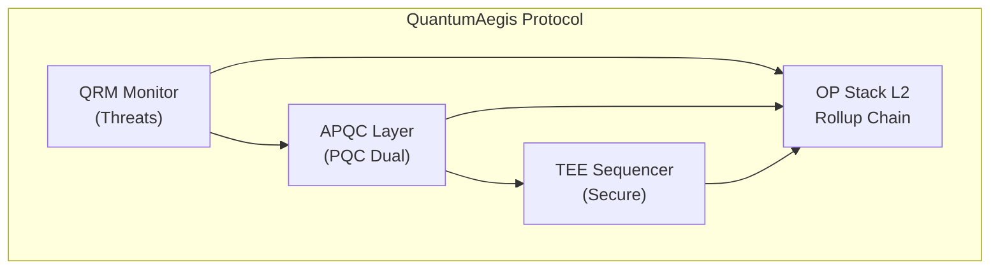

# QuantumAegis

Quantum-resistant blockchain protocol with adaptive PQC and TEE security.

L2 rollup protocol that monitors quantum threats and secures blockchain infrastructure with post-quantum cryptography, trusted execution environments, and algorithm rotation.

## Overview

QuantumAegis combines:

- **Quantum Resistance Monitor (QRM)**: Threat detection across 12 categories
- **Adaptive PQC Layer**: ML-DSA-87, SLH-DSA-256s, and hybrid ECDSA signatures
- **TEE Sequencer**: Intel SGX/TDX-secured transaction ordering
- **OP Stack L2**: EVM-compatible rollup with full L1 data availability

## Architecture



## Repository Structure

```
quantum-aegis/
├── services/              # Core QRMS Services (Rust)
│   └── qrms/             # Quantum Resistance Model System
├── contracts/             # Solidity Smart Contracts
│   ├── src/              # PQCVerifier, QRMSOracle, SequencerAttestation
│   └── script/           # Deployment scripts
├── rollup/               # OP Stack L2 Deployment
│   ├── opstack/          # OP Stack configuration
│   ├── docker/           # Container definitions
│   └── config/           # Generated configs
├── docs/                 # Documentation
│   ├── architecture/     # System architecture
│   ├── deployment/       # Deployment guides
│   └── api/              # API documentation
├── scripts/              # Utility scripts
└── tools/                # Development tools
```

See [DIRECTORY_TREE.md](./DIRECTORY_TREE.md) for complete structure.

## Quick Start

### Prerequisites

- Docker & Docker Compose
- Foundry (for contracts)
- Rust toolchain (for services)
- Sepolia ETH for L1 deployment

### 1. Deploy L2 Rollup

```bash
cd rollup/opstack
cp .example.env .env
# Edit .env with your L1_RPC_URL, L1_BEACON_URL, PRIVATE_KEY

make setup    # Deploy L1 contracts and generate L2 config
make up        # Start L2 chain
```

### 2. Deploy QRMS Contracts

```bash
cd ../../contracts
forge script script/Deploy.s.sol --rpc-url http://localhost:8545 --broadcast
```

### 3. Start QRMS Services

```bash
cd ../services/qrms
cargo run --release
```

## Service Endpoints

| Service | Endpoint | Description |
|---------|----------|-------------|
| **L2 RPC** | `http://localhost:8545` | L2 JSON-RPC |
| **QRMS API** | `http://localhost:5050` | QRMS REST API |
| **QRMS WS** | `ws://localhost:5050/ws` | Real-time events |
| **QRMS GUI** | `http://localhost:5050` | Web dashboard |

## Features

### PQC Cryptography
- **ML-DSA-87** (Dilithium-5): 2592-byte keys, 4595-byte signatures
- **SLH-DSA-256s** (SPHINCS+): 64-byte keys, 29792-byte signatures
- **Hybrid ECDSA**: Classical + PQC dual signatures

### Threat Monitoring
12 comprehensive categories:
1. Digital Signatures
2. ZK Proof Forgery
3. Decryption/HNDL
4. Hash Reversal
5. Consensus Attacks
6. Cross-Chain/Bridge
7. Network Layer
8. Key Management
9. MEV/Ordering
10. Smart Contracts
11. Side-Channel
12. Migration/Agility

### Algorithm Rotation
- **Scheduled**: Risk score ≥ 6000
- **Emergency**: Risk score ≥ 9000
- **Grace Period**: 1000 blocks for transition

## Deployment Status

- **L2 Testnet**: Operational (Chain ID: 42069)
- **QRMS Contracts**: Deployed on L2
- **PQC**: ML-DSA-87, SLH-DSA-256s integrated
- **Hybrid Signatures**: ECDSA + PQC implemented
- **Key Management**: Generation & rotation functional

See [DEPLOYMENT.md](./DEPLOYMENT.md) for contract addresses and status.

## Documentation

- [Architecture](./docs/architecture/README.md) - System design and components
- [Deployment](./docs/deployment/README.md) - Setup and deployment guides
- [Directory Tree](./DIRECTORY_TREE.md) - Repository structure

## Contributing

See [CONTRIBUTING.md](./CONTRIBUTING.md) for development guidelines.

## License

MIT License - see [LICENSE](./LICENSE) for details.

## Links

- **Protocol Name**: QuantumAegis
- **Chain ID**: 42069 (Testnet)
- **L1**: Sepolia Testnet
