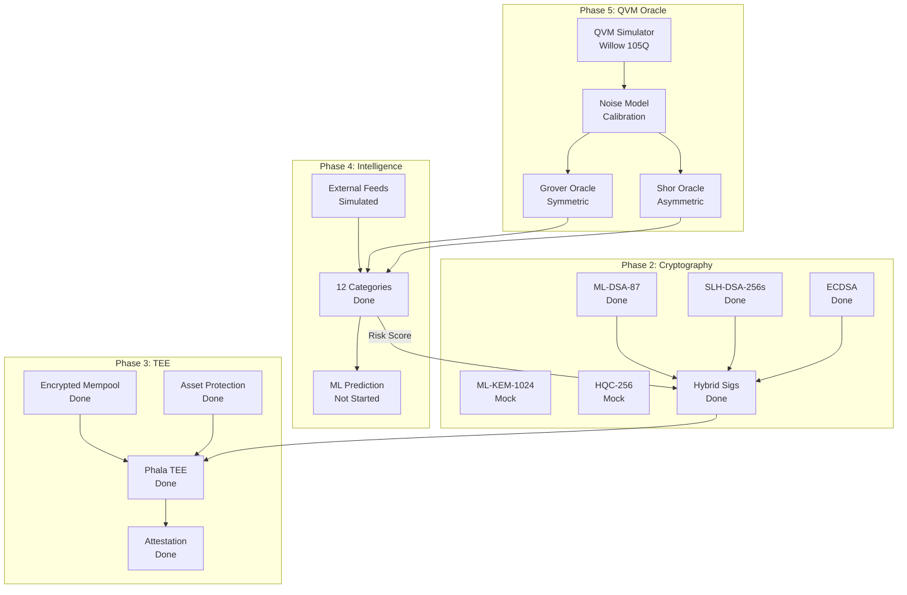

# QuantumAegis Roadmap

## Protocol Stack Architecture

```
┌─────────────────────────────────────────────────────────────────┐
│                    QUANTUM AEGIS PROTOCOL STACK                 │
├─────────────────────────────────────────────────────────────────┤
│  ┌─────────────────────────────────────────────────────────┐    │
│  │               QVM ORACLE LAYER (Phase 5)                │    │
│  │  Google Cirq • Willow 105Q • Grover/Shor Assessment     │    │
│  └─────────────────────────────────────────────────────────┘    │
│                              ▼                                  │
│  ┌─────────────────────────────────────────────────────────┐    │
│  │           QRMS LAYER (Phase 2 + 4)                      │    │
│  │  ML-DSA-87 • SLH-DSA-256s • ECDSA • 12 Threat Cats      │    │
│  └─────────────────────────────────────────────────────────┘    │
│                              ▼                                  │
│  ┌─────────────────────────────────────────────────────────┐    │
│  │           PHALA TEE LAYER (Phase 3)                     │    │
│  │  Encrypted Mempool • Asset Protection • Migration       │    │
│  └─────────────────────────────────────────────────────────┘    │
│                              ▼                                  │
│  ┌─────────────────────────────────────────────────────────┐    │
│  │           BLOCKCHAIN LAYER (Phase 1)                    │    │
│  │  OP Stack L2 • Smart Contracts • Rollup Settlement      │    │
│  └─────────────────────────────────────────────────────────┘    │
└─────────────────────────────────────────────────────────────────┘
```

## Phase 1: Foundation (Complete)

| Component | Status | Implementation |
|-----------|--------|----------------|
| OP Stack L2 | Done | `rollup/opstack/` - Full deployment scripts |
| QRMS Service | Done | `services/qrms/` - Rust async runtime |
| On-chain Contracts | Done | `contracts/` - PQCVerifier, QRMSOracle, SequencerAttestation |
| Web Dashboard | Done | `services/qrms/static/index.html` |
| 12 Threat Categories | Done | `qrm.rs` - Full taxonomy per `threat_taxonomy.md` |

## Phase 2: Real Cryptography (In Progress)

| Task | Priority | Status | Location |
|------|----------|--------|----------|
| ML-DSA-87 (Dilithium-5) | High | Done | `crypto.rs:12-55` |
| SLH-DSA-256s (SPHINCS+) | High | Done | `crypto.rs:57-100` |
| ECDSA (secp256k1) | High | Done | `crypto.rs:190-224` |
| Hybrid Signature Scheme | High | Done | `crypto.rs:226-245`, `apqc.rs:195-210` |
| ML-KEM-1024 | High | Mock | `crypto.rs:102-144` - AVX2 compilation issue |
| HQC-256 | High | Mock | `crypto.rs:146-188` - AVX2 compilation issue |
| Key Rotation | Medium | Done | `apqc.rs:311-340` |
| Public Key Export | Medium | Done | `apqc.rs:342-348` |

### Phase 2 Remaining Work

```
1. Resolve pqcrypto-kyber AVX2 compilation
   - Current: Mock implementation with correct sizes
   - Target: Real ML-KEM-1024 encapsulation/decapsulation

2. Resolve pqcrypto-hqc compilation  
   - Current: Mock implementation
   - Target: Real HQC-256 as backup KEM

3. Hardware acceleration
   - Add feature flags for AVX2/AVX512 detection
   - Fallback to portable implementations
```

## Phase 3: TEE Integration (Phala Network)

| Task | Priority | Status | Location |
|------|----------|--------|----------|
| Phala TEE Sequencer | High | Done | `phala_tee.rs` - Full implementation |
| Phala Attestation | High | Done | `phala_tee.rs:47-57` |
| Encrypted Mempool | High | Done | `phala_tee.rs:108-113` |
| Intelligence Ordering | High | Done | `phala_tee.rs:135-245` |
| Asset Protection | High | Done | `phala_tee.rs:59-88` |
| State Migration | High | Done | `phala_tee.rs:320-380` |
| Quantum-Resistant Batching | High | Done | `phala_tee.rs:247-318` |
| Phala Deployment Config | Medium | Done | `phala.toml`, `phala_deploy.rs` |
| Legacy SGX Sequencer | Low | Simulated | `sequencer.rs` - For reference |

### Phase 3 Phala Integration (Complete)

```
✅ Phala TEE Sequencer Implementation
   - Full Phala Network integration
   - TDX/SEV enclave support
   - Hardware attestation via Phala quotes

✅ Intelligence-Based Ordering
   - Risk-aware ordering
   - Asset protection prioritization
   - Migration-aware grouping
   - Hybrid strategy

✅ Asset Protection System
   - On-chain asset protection (tokens, NFTs, data)
   - Off-chain asset protection (databases, files, streams)
   - Cross-chain bridge protection
   - Access policy enforcement

✅ State Migration
   - Checkpoint creation
   - Asset state snapshots
   - PQC-signed migration state
   - Rollback support

✅ Deployment Infrastructure
   - Phala configuration (phala.toml)
   - Deployment utilities (phala_deploy.rs)
   - Example integration code
   - Comprehensive documentation
```

### Phase 3 Production Deployment

```
1. Phala Network Mainnet Deployment
   - Deploy to Phala Cloud
   - Configure TEE workers (3-10 workers)
   - Verify attestation chain

2. On-Chain Integration
   - Update SequencerAttestation.sol for Phala quotes
   - Verify Phala attestation on-chain
   - Integrate with QRMSOracle

3. Monitoring & Operations
   - Set up Phala worker monitoring
   - Configure alerting for high-risk events
   - Establish migration procedures
```

## Phase 4: Threat Intelligence (Simulated)

| Task | Priority | Status | Location |
|------|----------|--------|----------|
| 12 Threat Categories | Medium | Done | `qrm.rs:23-188` |
| Risk Scoring | Medium | Done | `qrm.rs:290-394` |
| Era-Based Severity | Medium | Done | `qrm.rs:74-135` |
| Simulated Threat Feeds | Medium | Done | `qrm.rs:396-725` |
| Category Weights | Medium | Done | `qrm.rs:48-72` |

### Phase 4 Remaining Work

```
1. External Data Feeds
   - NIST PQC announcements API
   - IBM Quantum roadmap scraping
   - Google Quantum AI publications
   - arXiv cs.CR/quant-ph monitoring
   - CVE database integration

2. ML Risk Prediction
   - Historical quantum progress dataset
   - Time-series forecasting model
   - Confidence intervals for threat timelines
   - Automated threshold adjustment

3. Real-time Alerting
   - WebSocket push for critical threats
   - Email/Slack webhook integration
   - On-chain oracle updates triggered by high-risk events
```

## Phase 5: QVM Integration (Complete)

| Task | Priority | Status | Location |
|------|----------|--------|----------|
| QVM Simulator | High | Done | `qvm.rs:900+` - State vector simulation |
| Noise Models | High | Done | `qvm.rs:183-229` - Willow/Weber/Rainbow |
| Qubit Picker | High | Done | `qvm.rs:231-870` - Hardware qubit selection |
| Grover Threat Oracle | High | Done | `qvm.rs:1300+` |
| Shor Threat Oracle | High | Done | `qvm.rs:1360+` |
| Protocol Stack | High | Done | `qvm.rs:1500+` - Full integration |
| TEE Bridge | High | Done | `qvm.rs:1650+` |
| QVM Configuration | Medium | Done | `qvm.toml` |

### Phase 5 Implementation Details

```
✅ Quantum Virtual Machine
   - Google Cirq-compatible circuit representation
   - State vector simulation with noise
   - Support for Willow (105Q), Weber (72Q), Rainbow (53Q)
   - Custom processor configurations

✅ Noise Model from Calibration
   - Depolarizing noise from 2Q error rates
   - Amplitude/phase damping from T1 coherence
   - Readout errors
   - Gate duration-based decoherence

✅ Qubit Picking for Hardware Execution
   - Per-qubit error characterization from calibration
   - Single-qubit Pauli, two-qubit Pauli, FSim errors
   - Readout error (0→1 excitation, 1→0 decay)
   - Multiple picking strategies (Balanced, MinimizeError, etc.)
   - Automatic bad qubit/pair avoidance
   - Circuit transformation to hardware qubits
   - Connectivity-aware qubit assignment

✅ Grover's Algorithm Threat Assessment
   - Symmetric crypto evaluation (AES, SHA)
   - Quadratic speedup modeling
   - Physical qubit estimation with error correction
   - Time-to-break estimation

✅ Shor's Algorithm Threat Assessment
   - Public key crypto evaluation (RSA, ECDSA, BLS)
   - Logical qubit requirements
   - T-gate count estimation
   - Error correction overhead

✅ Protocol Stack Integration
   - QVM Oracle → QRMS bridge
   - Automatic era transitions
   - Threat indicator generation
   - TEE sequencer bridge
```

### Supported Quantum Processors

| Processor | Qubits | 2Q Error | T1 (μs) | Status |
|-----------|--------|----------|---------|--------|
| Willow Pink | 105 | 0.34% | 70 | Default |
| Weber | 72 | 0.60% | 25 | Available |
| Rainbow | 53 | 0.90% | 20 | Available |
| Custom | N | Config | Config | Available |

### Threat Levels

| Level | Score Range | Era | Action |
|-------|-------------|-----|--------|
| None | 0 | PreQuantum | Continue classical |
| Theoretical | 0-1000 | PreQuantum | Monitor |
| Long-term | 1000-3000 | PreQuantum | Plan migration |
| Medium-term | 3000-5000 | Nisq | Schedule rotation |
| Near-term | 5000-7500 | Nisq | Begin migration |
| Imminent | 7500-10000 | FaultTolerant | Emergency rotation |

## Phase 6: Production Hardening (Future)

| Task | Priority | Status |
|------|----------|--------|
| Audit Preparation | High | Not Started |
| Gas Optimization | Medium | Not Started |
| Multi-chain Deployment | Low | Not Started |
| Decentralized Oracle Network | Low | Not Started |

## Architecture



## Current Algorithm Configuration

| Algorithm | Type | Security Level | Implementation |
|-----------|------|----------------|----------------|
| ML-DSA-87 | Signature | NIST Level 5 | Real (pqcrypto-dilithium) |
| SLH-DSA-256s | Signature | NIST Level 5 | Real (pqcrypto-sphincsplus) |
| ECDSA secp256k1 | Signature | Classical | Real (k256) |
| ML-KEM-1024 | KEM | NIST Level 5 | Mock (AVX2 issue) |
| HQC-256 | KEM | NIST Level 5 | Mock (compilation issue) |

## Dependencies

```toml
# Real PQC (working)
pqcrypto-dilithium = "0.5"
pqcrypto-sphincsplus = "0.5"
k256 = "0.13"

# PQC (disabled - AVX2 issues)
# pqcrypto-kyber = "0.5"
# pqcrypto-hqc = "0.2"
```

## Testing

```bash
# Unit tests
cd services/qrms && cargo test

# Verify weight sum
cargo test test_weights_sum_to_one

# Verify category count
cargo test test_category_count
```
