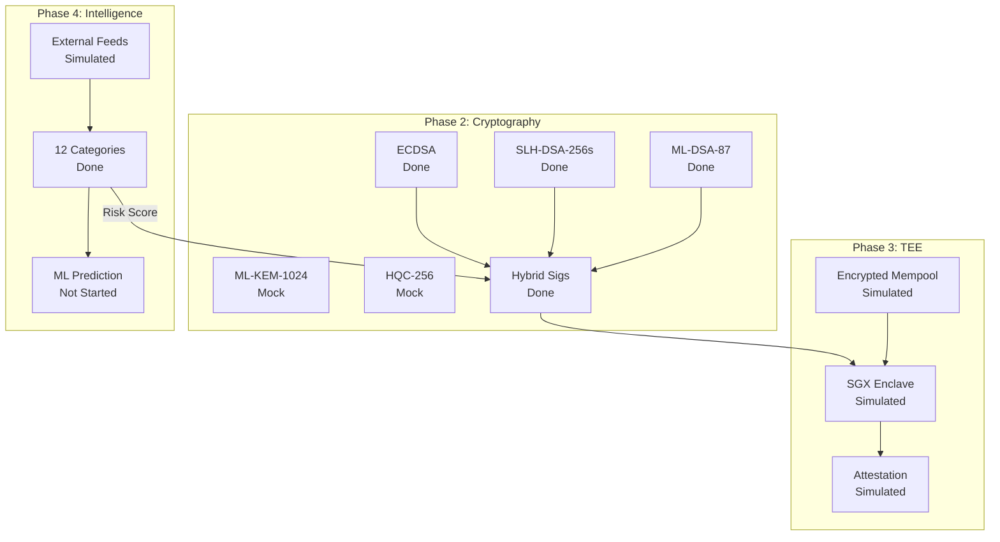

# QuantumAegis Roadmap

## Phase 1: Foundation (Complete)

| Component | Status | Implementation |
|-----------|--------|----------------|
| OP Stack L2 | Done | `rollup/opstack/` - Full deployment scripts |
| QRMS Service | Done | `services/qrms/` - Rust async runtime |
| On-chain Contracts | Done | `contracts/` - PQCVerifier, QRMSOracle, SequencerAttestation |
| Web Dashboard | Done | `services/qrms/static/index.html` |
| 12 Threat Categories | Done | `qrm.rs` - Full taxonomy per `threat_taxonomy.md` |

## Phase 2: Real Cryptography (In Progress)

| Task | Priority | Status | Location |
|------|----------|--------|----------|
| ML-DSA-87 (Dilithium-5) | High | Done | `crypto.rs:12-55` |
| SLH-DSA-256s (SPHINCS+) | High | Done | `crypto.rs:57-100` |
| ECDSA (secp256k1) | High | Done | `crypto.rs:190-224` |
| Hybrid Signature Scheme | High | Done | `crypto.rs:226-245`, `apqc.rs:195-210` |
| ML-KEM-1024 | High | Mock | `crypto.rs:102-144` - AVX2 compilation issue |
| HQC-256 | High | Mock | `crypto.rs:146-188` - AVX2 compilation issue |
| Key Rotation | Medium | Done | `apqc.rs:311-340` |
| Public Key Export | Medium | Done | `apqc.rs:342-348` |

### Phase 2 Remaining Work

```
1. Resolve pqcrypto-kyber AVX2 compilation
   - Current: Mock implementation with correct sizes
   - Target: Real ML-KEM-1024 encapsulation/decapsulation

2. Resolve pqcrypto-hqc compilation  
   - Current: Mock implementation
   - Target: Real HQC-256 as backup KEM

3. Hardware acceleration
   - Add feature flags for AVX2/AVX512 detection
   - Fallback to portable implementations
```

## Phase 3: TEE Integration (Simulated)

| Task | Priority | Status | Location |
|------|----------|--------|----------|
| TEE Sequencer Structure | Medium | Done | `sequencer.rs:78-106` |
| MRENCLAVE/MRSIGNER | Medium | Simulated | `sequencer.rs:92-104` |
| TEE Attestation | Medium | Simulated | `sequencer.rs:219-244` |
| Encrypted Mempool | Medium | Simulated | `sequencer.rs:80,108-113` |
| Batch Ordering (FCFS/Auction) | Medium | Done | `sequencer.rs:136-168` |
| PQC-Signed Batches | Medium | Done | `sequencer.rs:171-217` |

### Phase 3 Remaining Work

```
1. Intel SGX/TDX Integration
   - Replace simulation with real SGX SDK
   - Implement enclave entry points
   - Hardware attestation via DCAP

2. Remote Attestation
   - Intel Attestation Service integration
   - On-chain attestation verification in SequencerAttestation.sol
   - Quote verification logic

3. Encrypted Mempool
   - Threshold encryption for transaction privacy
   - Commit-reveal scheme for MEV protection
   - TEE-based decryption only after ordering
```

## Phase 4: Threat Intelligence (Simulated)

| Task | Priority | Status | Location |
|------|----------|--------|----------|
| 12 Threat Categories | Medium | Done | `qrm.rs:23-188` |
| Risk Scoring | Medium | Done | `qrm.rs:290-394` |
| Era-Based Severity | Medium | Done | `qrm.rs:74-135` |
| Simulated Threat Feeds | Medium | Done | `qrm.rs:396-725` |
| Category Weights | Medium | Done | `qrm.rs:48-72` |

### Phase 4 Remaining Work

```
1. External Data Feeds
   - NIST PQC announcements API
   - IBM Quantum roadmap scraping
   - Google Quantum AI publications
   - arXiv cs.CR/quant-ph monitoring
   - CVE database integration

2. ML Risk Prediction
   - Historical quantum progress dataset
   - Time-series forecasting model
   - Confidence intervals for threat timelines
   - Automated threshold adjustment

3. Real-time Alerting
   - WebSocket push for critical threats
   - Email/Slack webhook integration
   - On-chain oracle updates triggered by high-risk events
```

## Phase 5: Production Hardening (Future)

| Task | Priority | Status |
|------|----------|--------|
| Audit Preparation | High | Not Started |
| Gas Optimization | Medium | Not Started |
| Multi-chain Deployment | Low | Not Started |
| Decentralized Oracle Network | Low | Not Started |

## Architecture



## Current Algorithm Configuration

| Algorithm | Type | Security Level | Implementation |
|-----------|------|----------------|----------------|
| ML-DSA-87 | Signature | NIST Level 5 | Real (pqcrypto-dilithium) |
| SLH-DSA-256s | Signature | NIST Level 5 | Real (pqcrypto-sphincsplus) |
| ECDSA secp256k1 | Signature | Classical | Real (k256) |
| ML-KEM-1024 | KEM | NIST Level 5 | Mock (AVX2 issue) |
| HQC-256 | KEM | NIST Level 5 | Mock (compilation issue) |

## Dependencies

```toml
# Real PQC (working)
pqcrypto-dilithium = "0.5"
pqcrypto-sphincsplus = "0.5"
k256 = "0.13"

# PQC (disabled - AVX2 issues)
# pqcrypto-kyber = "0.5"
# pqcrypto-hqc = "0.2"
```

## Testing

```bash
# Unit tests
cd services/qrms && cargo test

# Verify weight sum
cargo test test_weights_sum_to_one

# Verify category count
cargo test test_category_count
```
