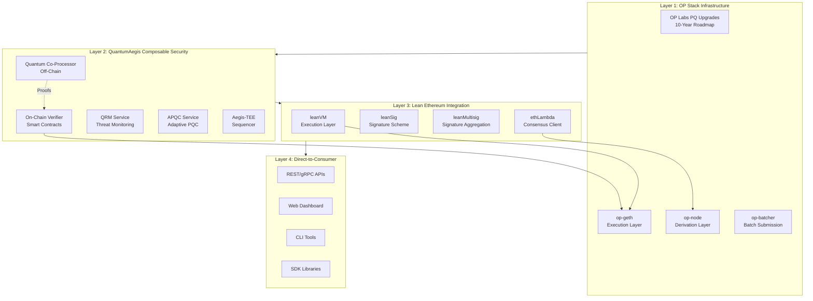
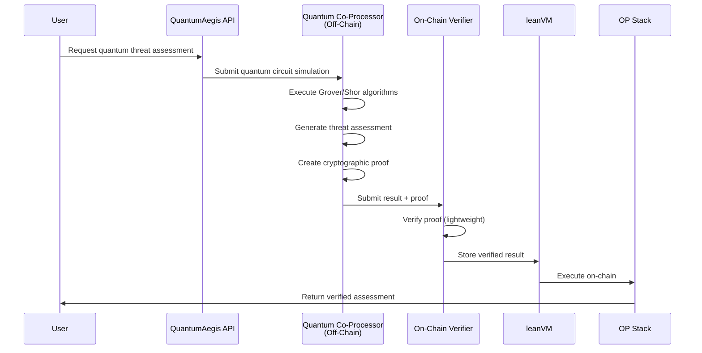
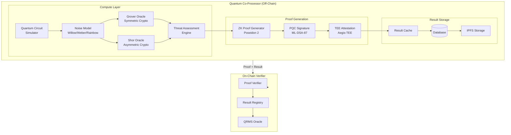
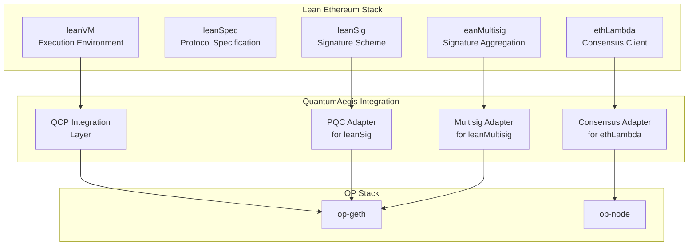
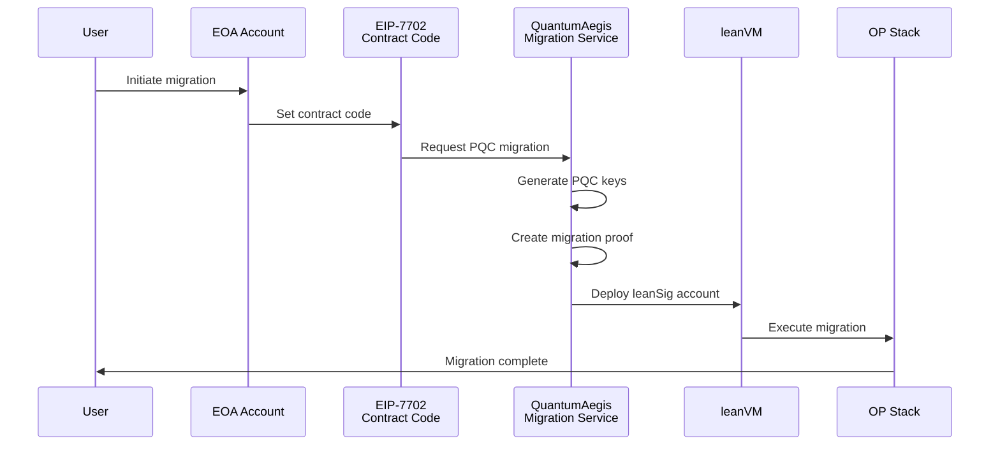
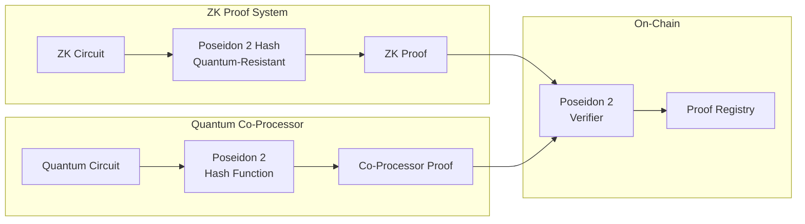

# Product Requirements Document: Quantum Co-Processing Architecture Upgrade

**Version:** 1.0  
**Date:** January 26, 2026  
**Status:** Draft  
**Author:** QuantumAegis Architecture Team

---

## Executive Summary

### Vision

QuantumAegis is evolving into a **composable security layer** that provides quantum-resistant infrastructure for the Ethereum ecosystem. This PRD outlines the architecture upgrade to implement **quantum co-processing** with off-chain computation and on-chain verification, enabling direct-to-consumer quantum resistance measurement and solutions while maintaining compatibility with OP Stack's future post-quantum (PQ) upgrades and the Lean Ethereum ecosystem.

### Core Principles

1. **Composable Security Layer**: Works alongside OP Stack's 10-year ECDSA deprecation roadmap
2. **Lean Ethereum Integration**: Native support for leanVM, leanSpec, leanMultisig, and ethLambda
3. **Quantum Co-Processing**: Heavy quantum circuit simulations off-chain, lightweight verification on-chain
4. **End-to-End Fortification**: On-chain and off-chain security guarantees
5. **Direct-to-Consumer APIs**: Quantum resistance measurement and solutions accessible via APIs

### Key Objectives

- **Off-Chain Quantum Co-Processor**: Execute heavy quantum circuit simulations, threat assessments, and cryptographic analysis
- **On-Chain Verifier**: Lightweight verification of co-processor results with cryptographic proofs
- **Lean Ethereum Native**: Full integration with leanVM execution, leanSig signatures, leanMultisig aggregation
- **OP Stack Alignment**: Seamless integration with OP Labs' future PQ upgrades
- **EIP-7702 Support**: Smart account migration and upgrade paths
- **Poseidon 2 Integration**: ZK-friendly hashing for quantum-resistant proofs

---

## Architecture Overview

### System Layers



### Quantum Co-Processing Flow



---

## Detailed Architecture Diagrams

### 1. Quantum Co-Processor Architecture



### 2. Lean Ethereum Integration Architecture



### 3. EIP-7702 Smart Account Migration



### 4. Poseidon 2 Hashing Integration



---

## API Specifications

### 1. Quantum Co-Processor API (gRPC)

#### Service: `QuantumCoProcessor`

```protobuf
syntax = "proto3";

package quantumaegis.qcp;

import "google/protobuf/timestamp.proto";

// Quantum Co-Processor Service
service QuantumCoProcessor {
  // Submit quantum circuit simulation request
  rpc SimulateCircuit(SimulateCircuitRequest) returns (SimulateCircuitResponse);
  
  // Get threat assessment for cryptographic algorithm
  rpc AssessThreat(ThreatAssessmentRequest) returns (ThreatAssessmentResponse);
  
  // Verify quantum circuit result
  rpc VerifyResult(VerifyResultRequest) returns (VerifyResultResponse);
  
  // Get co-processor status
  rpc GetStatus(GetStatusRequest) returns (GetStatusResponse);
  
  // Stream real-time threat assessments
  rpc StreamAssessments(StreamAssessmentsRequest) returns (stream ThreatAssessmentResponse);
}

// Circuit Simulation Request
message SimulateCircuitRequest {
  string circuit_id = 1;
  CircuitSpec circuit = 2;
  QuantumProcessor processor = 3;
  NoiseModel noise_model = 4;
  bool generate_proof = 5;
  ProofType proof_type = 6;
}

// Circuit Specification
message CircuitSpec {
  repeated Gate gates = 1;
  int32 qubit_count = 2;
  repeated int32 initial_state = 3;
  map<string, string> metadata = 4;
}

// Quantum Gate
message Gate {
  GateType type = 1;
  repeated int32 qubits = 2;
  repeated double parameters = 3;
}

enum GateType {
  GATE_UNKNOWN = 0;
  GATE_PAULI_X = 1;
  GATE_PAULI_Y = 2;
  GATE_PAULI_Z = 3;
  GATE_HADAMARD = 4;
  GATE_CNOT = 5;
  GATE_CPHASE = 6;
  GATE_TOFFOLI = 7;
  GATE_CUSTOM = 8;
}

enum QuantumProcessor {
  PROCESSOR_UNKNOWN = 0;
  PROCESSOR_WILLOW_PINK = 1;  // 105 qubits
  PROCESSOR_WEBER = 2;         // 72 qubits
  PROCESSOR_RAINBOW = 3;       // 53 qubits
  PROCESSOR_QUANTINUUM_H1 = 4; // 20 qubits
  PROCESSOR_QUANTINUUM_H2 = 5; // 32 qubits
  PROCESSOR_CUSTOM = 6;
}

enum NoiseModel {
  NOISE_NONE = 0;
  NOISE_DEPOLARIZING = 1;
  NOISE_AMPLITUDE_DAMPING = 2;
  NOISE_PHASE_DAMPING = 3;
  NOISE_READOUT = 4;
  NOISE_CALIBRATED = 5; // From hardware calibration
}

enum ProofType {
  PROOF_NONE = 0;
  PROOF_ZK_SNARK = 1;
  PROOF_ZK_STARK = 2;
  PROOF_POSEIDON2_HASH = 3;
  PROOF_PQC_SIGNATURE = 4;
}

// Circuit Simulation Response
message SimulateCircuitResponse {
  string result_id = 1;
  CircuitResult result = 2;
  Proof proof = 3;
  google.protobuf.Timestamp timestamp = 4;
  string co_processor_id = 5;
}

// Circuit Result
message CircuitResult {
  repeated double state_vector = 1;
  repeated Measurement measurements = 2;
  double fidelity = 3;
  double execution_time_ms = 4;
  map<string, string> metadata = 5;
}

// Measurement
message Measurement {
  repeated int32 qubits = 1;
  repeated int32 outcomes = 2;
  int32 count = 3;
  double probability = 4;
}

// Cryptographic Proof
message Proof {
  ProofType type = 1;
  bytes proof_data = 2;
  bytes public_inputs = 3;
  bytes verification_key = 4;
  Poseidon2Hash poseidon2_hash = 5;
  PqcSignature pqc_signature = 6;
}

// Poseidon 2 Hash
message Poseidon2Hash {
  bytes hash = 1;  // 32 bytes
  int32 rounds = 2;
  string domain_separation = 3;
}

// PQC Signature
message PqcSignature {
  Algorithm algorithm = 1;
  bytes signature = 2;
  bytes public_key = 3;
}

enum Algorithm {
  ALGORITHM_UNKNOWN = 0;
  ALGORITHM_ML_DSA_87 = 1;
  ALGORITHM_SLH_DSA_256 = 2;
  ALGORITHM_ECDSA = 3;
}

// Threat Assessment Request
message ThreatAssessmentRequest {
  Algorithm target_algorithm = 1;
  ThreatType threat_type = 2;
  QuantumProcessor processor = 3;
  int32 key_size_bits = 4;
  bool include_proof = 5;
}

enum ThreatType {
  THREAT_UNKNOWN = 0;
  THREAT_GROVER = 1;  // Symmetric crypto
  THREAT_SHOR = 2;    // Asymmetric crypto
  THREAT_CUSTOM = 3;
}

// Threat Assessment Response
message ThreatAssessmentResponse {
  string assessment_id = 1;
  ThreatLevel level = 2;
  double risk_score = 3;  // 0-10000 basis points
  int64 estimated_qubits_required = 4;
  int64 estimated_time_years = 5;
  double confidence = 6;
  Proof proof = 7;
  google.protobuf.Timestamp timestamp = 8;
  repeated ThreatIndicator indicators = 9;
}

enum ThreatLevel {
  THREAT_NONE = 0;
  THREAT_THEORETICAL = 1;
  THREAT_LONG_TERM = 2;
  THREAT_MEDIUM_TERM = 3;
  THREAT_NEAR_TERM = 4;
  THREAT_IMMINENT = 5;
}

// Threat Indicator
message ThreatIndicator {
  ThreatCategory category = 1;
  double severity = 2;
  string description = 3;
  google.protobuf.Timestamp detected_at = 4;
}

enum ThreatCategory {
  CATEGORY_UNKNOWN = 0;
  CATEGORY_DIGITAL_SIGNATURES = 1;
  CATEGORY_ZK_PROOF_FORGERY = 2;
  CATEGORY_DECRYPTION_HNDL = 3;
  CATEGORY_HASH_REVERSAL = 4;
  CATEGORY_CONSENSUS_ATTACKS = 5;
  CATEGORY_CROSS_CHAIN_BRIDGE = 6;
  CATEGORY_NETWORK_LAYER = 7;
  CATEGORY_KEY_MANAGEMENT = 8;
  CATEGORY_MEV_ORDERING = 9;
  CATEGORY_SMART_CONTRACTS = 10;
  CATEGORY_SIDE_CHANNEL = 11;
  CATEGORY_MIGRATION_AGILITY = 12;
}

// Verify Result Request
message VerifyResultRequest {
  string result_id = 1;
  Proof proof = 2;
}

// Verify Result Response
message VerifyResultResponse {
  bool valid = 1;
  string error_message = 2;
  google.protobuf.Timestamp verified_at = 3;
}

// Get Status Request
message GetStatusRequest {}

// Get Status Response
message GetStatusResponse {
  string co_processor_id = 1;
  CoProcessorStatus status = 2;
  int32 active_simulations = 3;
  double average_latency_ms = 4;
  int64 total_simulations = 5;
  google.protobuf.Timestamp uptime = 6;
}

enum CoProcessorStatus {
  STATUS_UNKNOWN = 0;
  STATUS_IDLE = 1;
  STATUS_PROCESSING = 2;
  STATUS_ERROR = 3;
  STATUS_MAINTENANCE = 4;
}

// Stream Assessments Request
message StreamAssessmentsRequest {
  repeated Algorithm algorithms = 1;
  double min_risk_score = 2;
  bool include_proofs = 3;
}
```

### 2. On-Chain Verifier API (Smart Contract)

#### Contract: `QuantumCoProcessorVerifier.sol`

```solidity
// SPDX-License-Identifier: MIT
pragma solidity ^0.8.20;

import "./PQCVerifier.sol";
import "./Poseidon2Verifier.sol";

/// @title Quantum Co-Processor Verifier
/// @notice Verifies off-chain quantum co-processor results on-chain
contract QuantumCoProcessorVerifier {
    PQCVerifier public immutable pqcVerifier;
    Poseidon2Verifier public immutable poseidon2Verifier;
    
    struct CoProcessorResult {
        bytes32 resultHash;
        bytes proof;
        bytes pqcSignature;
        bytes poseidon2Hash;
        uint256 timestamp;
        address coProcessorId;
        bool verified;
    }
    
    mapping(bytes32 => CoProcessorResult) public results;
    mapping(address => bool) public authorizedCoProcessors;
    
    event ResultVerified(
        bytes32 indexed resultHash,
        address indexed coProcessorId,
        uint256 timestamp
    );
    
    event CoProcessorAuthorized(address indexed coProcessor);
    event CoProcessorRevoked(address indexed coProcessor);
    
    constructor(address _pqcVerifier, address _poseidon2Verifier) {
        pqcVerifier = PQCVerifier(_pqcVerifier);
        poseidon2Verifier = Poseidon2Verifier(_poseidon2Verifier);
    }
    
    /// @notice Verify quantum co-processor result
    /// @param resultHash Hash of the result
    /// @param proof ZK proof or Poseidon 2 hash proof
    /// @param pqcSignature PQC signature from co-processor
    /// @param poseidon2Hash Poseidon 2 hash of the result
    function verifyResult(
        bytes32 resultHash,
        bytes calldata proof,
        bytes calldata pqcSignature,
        bytes calldata poseidon2Hash
    ) external returns (bool) {
        require(authorizedCoProcessors[msg.sender], "Unauthorized co-processor");
        
        // Verify Poseidon 2 hash
        require(
            poseidon2Verifier.verify(poseidon2Hash, resultHash),
            "Invalid Poseidon 2 hash"
        );
        
        // Verify PQC signature
        bytes memory message = abi.encodePacked(resultHash, proof, poseidon2Hash);
        require(
            pqcVerifier.verifyDual(message, pqcSignature, getCoProcessorPublicKey(msg.sender)),
            "Invalid PQC signature"
        );
        
        // Store verified result
        results[resultHash] = CoProcessorResult({
            resultHash: resultHash,
            proof: proof,
            pqcSignature: pqcSignature,
            poseidon2Hash: poseidon2Hash,
            timestamp: block.timestamp,
            coProcessorId: msg.sender,
            verified: true
        });
        
        emit ResultVerified(resultHash, msg.sender, block.timestamp);
        return true;
    }
    
    /// @notice Get verified result
    function getResult(bytes32 resultHash) external view returns (CoProcessorResult memory) {
        return results[resultHash];
    }
    
    /// @notice Authorize co-processor
    function authorizeCoProcessor(address coProcessor) external onlyOwner {
        authorizedCoProcessors[coProcessor] = true;
        emit CoProcessorAuthorized(coProcessor);
    }
    
    /// @notice Revoke co-processor authorization
    function revokeCoProcessor(address coProcessor) external onlyOwner {
        authorizedCoProcessors[coProcessor] = false;
        emit CoProcessorRevoked(coProcessor);
    }
    
    function getCoProcessorPublicKey(address coProcessor) internal view returns (PQCVerifier.DualPublicKey memory) {
        // Implementation to retrieve co-processor public key
        // This would be stored in a mapping or registry
    }
    
    modifier onlyOwner() {
        require(msg.sender == owner, "Not owner");
        _;
    }
    
    address public owner;
}
```

### 3. REST API Endpoints

#### Base URL: `https://api.quantumaegis.io/v1`

| Endpoint | Method | Description |
|----------|--------|-------------|
| `/qcp/simulate` | POST | Submit quantum circuit simulation |
| `/qcp/assess` | POST | Request threat assessment |
| `/qcp/verify` | POST | Verify co-processor result |
| `/qcp/status` | GET | Get co-processor status |
| `/qcp/results/{id}` | GET | Get simulation result |
| `/lean/accounts` | POST | Create leanSig account |
| `/lean/multisig` | POST | Create leanMultisig |
| `/lean/migrate` | POST | Migrate EOA to EIP-7702 |
| `/poseidon2/hash` | POST | Compute Poseidon 2 hash |
| `/poseidon2/verify` | POST | Verify Poseidon 2 hash |

---

## Integration Specifications

### 1. Lean Ethereum Integration

#### leanVM Execution Layer

```rust
// services/qrms/src/lean_vm.rs

use crate::qcp::QuantumCoProcessor;
use crate::apqc::AdaptivePqcLayer;

pub struct LeanVmIntegration {
    qcp: Arc<QuantumCoProcessor>,
    apqc: Arc<AdaptivePqcLayer>,
}

impl LeanVmIntegration {
    /// Execute transaction with quantum co-processing
    pub async fn execute_with_qcp(
        &self,
        tx: Transaction,
    ) -> Result<ExecutionResult, Error> {
        // 1. Submit transaction to leanVM
        // 2. If quantum operations detected, route to QCP
        // 3. Verify QCP result on-chain
        // 4. Execute transaction with verified result
    }
    
    /// Integrate with leanSpec protocol
    pub async fn apply_lean_spec(
        &self,
        spec: LeanSpec,
    ) -> Result<(), Error> {
        // Apply leanSpec protocol rules
        // Integrate quantum co-processing where needed
    }
}
```

#### leanSig Signature Scheme

```rust
// services/qrms/src/lean_sig.rs

use crate::apqc::AdaptivePqcLayer;

pub struct LeanSigIntegration {
    apqc: Arc<AdaptivePqcLayer>,
}

impl LeanSigIntegration {
    /// Sign message with leanSig + PQC hybrid
    pub async fn sign_hybrid(
        &self,
        message: &[u8],
    ) -> Result<HybridSignature, Error> {
        // Generate leanSig signature
        // Generate PQC signature (ML-DSA-87 + SLH-DSA-256)
        // Combine into hybrid signature
    }
    
    /// Verify hybrid signature
    pub async fn verify_hybrid(
        &self,
        message: &[u8],
        signature: &HybridSignature,
    ) -> Result<bool, Error> {
        // Verify leanSig component
        // Verify PQC component
        // Return AND/OR combination based on security model
    }
}
```

#### leanMultisig Aggregation

```rust
// services/qrms/src/lean_multisig.rs

use crate::apqc::AdaptivePqcLayer;

pub struct LeanMultisigIntegration {
    apqc: Arc<AdaptivePqcLayer>,
}

impl LeanMultisigIntegration {
    /// Aggregate signatures with PQC support
    pub async fn aggregate_signatures(
        &self,
        signatures: Vec<Signature>,
    ) -> Result<AggregatedSignature, Error> {
        // Aggregate leanSig signatures
        // Aggregate PQC signatures
        // Combine into aggregated multisig
    }
    
    /// Verify aggregated signature
    pub async fn verify_aggregated(
        &self,
        message: &[u8],
        aggregated: &AggregatedSignature,
        public_keys: &[PublicKey],
    ) -> Result<bool, Error> {
        // Verify aggregated leanSig
        // Verify aggregated PQC
        // Check threshold requirements
    }
}
```

#### ethLambda Consensus Client

```rust
// services/qrms/src/eth_lambda.rs

use crate::qcp::QuantumCoProcessor;

pub struct EthLambdaIntegration {
    qcp: Arc<QuantumCoProcessor>,
}

impl EthLambdaIntegration {
    /// Integrate quantum co-processing with ethLambda consensus
    pub async fn propose_block_with_qcp(
        &self,
        block: Block,
    ) -> Result<ProposedBlock, Error> {
        // Propose block via ethLambda
        // Submit quantum threat assessment via QCP
        // Include QCP proof in block header
    }
    
    /// Verify block with quantum co-processing
    pub async fn verify_block_with_qcp(
        &self,
        block: Block,
    ) -> Result<bool, Error> {
        // Verify block via ethLambda
        // Verify QCP proof
        // Check quantum threat indicators
    }
}
```

### 2. EIP-7702 Smart Account Migration

```rust
// services/qrms/src/eip7702.rs

use crate::apqc::AdaptivePqcLayer;
use crate::lean_sig::LeanSigIntegration;

pub struct Eip7702Migration {
    apqc: Arc<AdaptivePqcLayer>,
    lean_sig: Arc<LeanSigIntegration>,
}

impl Eip7702Migration {
    /// Migrate EOA to EIP-7702 contract with PQC
    pub async fn migrate_account(
        &self,
        eoa_address: Address,
    ) -> Result<MigrationResult, Error> {
        // 1. Generate PQC keys
        let pqc_keys = self.apqc.generate_keys().await?;
        
        // 2. Create EIP-7702 contract code
        let contract_code = self.create_eip7702_contract(pqc_keys.clone())?;
        
        // 3. Set contract code on EOA (EIP-7702)
        let tx = self.set_contract_code(eoa_address, contract_code).await?;
        
        // 4. Migrate assets to new PQC account
        let migration_tx = self.migrate_assets(eoa_address, pqc_keys.public_key()).await?;
        
        Ok(MigrationResult {
            eoa_address,
            contract_address: eoa_address, // Same address
            pqc_public_key: pqc_keys.public_key(),
            migration_tx,
        })
    }
    
    /// Create EIP-7702 contract with PQC support
    fn create_eip7702_contract(
        &self,
        pqc_keys: PqcKeyPair,
    ) -> Result<Vec<u8>, Error> {
        // Generate contract bytecode with:
        // - PQC signature verification
        // - leanSig integration
        // - Quantum co-processing hooks
    }
}
```

### 3. Poseidon 2 Hashing Integration

```rust
// services/qrms/src/poseidon2.rs

use poseidon2::Poseidon2;

pub struct Poseidon2Integration {
    poseidon2: Poseidon2,
}

impl Poseidon2Integration {
    /// Hash data with Poseidon 2
    pub fn hash(&self, data: &[u8]) -> [u8; 32] {
        self.poseidon2.hash(data)
    }
    
    /// Hash quantum circuit result
    pub fn hash_circuit_result(
        &self,
        result: &CircuitResult,
    ) -> [u8; 32] {
        let encoded = bincode::serialize(result).unwrap();
        self.hash(&encoded)
    }
    
    /// Verify Poseidon 2 hash
    pub fn verify(
        &self,
        data: &[u8],
        hash: &[u8; 32],
    ) -> bool {
        let computed = self.hash(data);
        computed == *hash
    }
}
```

---

## OP Stack Alignment

### 10-Year ECDSA Deprecation Roadmap

QuantumAegis aligns with OP Labs' 10-year ECDSA deprecation roadmap:

| Year | OP Stack Milestone | QuantumAegis Integration |
|------|-------------------|-------------------------|
| 2026 | ECDSA + PQC Hybrid | ✅ Current: ML-DSA-87 + SLH-DSA-256 + ECDSA |
| 2028 | PQC Precompiles | ✅ Current: PQC precompiles at 0x20, 0x21 |
| 2030 | PQC Native Signatures | 🔄 Planned: Full PQC native support |
| 2032 | ECDSA Deprecation Warning | 🔄 Planned: ECDSA deprecation notices |
| 2034 | ECDSA Soft Deprecation | 🔄 Planned: ECDSA optional, PQC required |
| 2036 | ECDSA Hard Deprecation | 🔄 Planned: ECDSA removed, PQC only |

### Integration Points

1. **op-geth**: PQC precompiles (0x20, 0x21) for ML-DSA-87 and SLH-DSA-256
2. **op-node**: PQC batch signature verification
3. **op-batcher**: Quantum co-processor integration for batch verification
4. **op-proposer**: PQC signatures on output proposals

---

## Implementation Roadmap

### Phase 1: Foundation (Q1 2026)

**Objectives:**
- Set up quantum co-processor infrastructure
- Implement basic off-chain computation
- Deploy on-chain verifier contracts

**Deliverables:**
- [ ] Quantum co-processor service (Rust)
- [ ] On-chain verifier smart contracts
- [ ] Basic gRPC API
- [ ] Proof generation (Poseidon 2 + PQC)
- [ ] Integration tests

**Timeline:** 3 months

### Phase 2: Lean Ethereum Integration (Q2 2026)

**Objectives:**
- Integrate with leanVM execution layer
- Implement leanSig + PQC hybrid signatures
- Support leanMultisig aggregation
- Integrate with ethLambda consensus

**Deliverables:**
- [ ] leanVM integration layer
- [ ] leanSig + PQC hybrid implementation
- [ ] leanMultisig aggregation with PQC
- [ ] ethLambda consensus integration
- [ ] End-to-end tests

**Timeline:** 3 months

### Phase 3: EIP-7702 Migration (Q3 2026)

**Objectives:**
- Implement EIP-7702 smart account migration
- Support PQC key generation and migration
- Create migration tooling and APIs

**Deliverables:**
- [ ] EIP-7702 migration service
- [ ] PQC key generation for migrated accounts
- [ ] Migration APIs and tooling
- [ ] Migration documentation
- [ ] Security audit

**Timeline:** 3 months

### Phase 4: Poseidon 2 Integration (Q4 2026)

**Objectives:**
- Integrate Poseidon 2 hashing throughout stack
- Optimize ZK proof generation with Poseidon 2
- Deploy Poseidon 2 verifier contracts

**Deliverables:**
- [ ] Poseidon 2 hashing implementation
- [ ] ZK proof optimization with Poseidon 2
- [ ] On-chain Poseidon 2 verifier
- [ ] Performance benchmarks
- [ ] Documentation

**Timeline:** 3 months

### Phase 5: Production Hardening (Q1 2027)

**Objectives:**
- Security audits
- Performance optimization
- Production deployment
- Monitoring and observability

**Deliverables:**
- [ ] Security audit report
- [ ] Performance optimization
- [ ] Production deployment
- [ ] Monitoring dashboards
- [ ] Incident response plan

**Timeline:** 3 months

---

## Technical Specifications

### 1. Quantum Co-Processor Specifications

**Hardware Requirements:**
- CPU: 16+ cores (AMD EPYC or Intel Xeon)
- RAM: 128GB+ for large circuit simulations
- GPU: Optional (NVIDIA A100/H100 for acceleration)
- Storage: 1TB+ NVMe SSD

**Software Stack:**
- Rust 1.75+ for co-processor service
- Google Cirq for quantum circuit simulation
- ZK proof libraries (arkworks, bellman)
- Poseidon 2 implementation (reference or optimized)

**Performance Targets:**
- Circuit simulation: < 1 second for 50-qubit circuits
- Threat assessment: < 5 seconds end-to-end
- Proof generation: < 10 seconds for ZK proofs
- Throughput: 100+ assessments/second

### 2. On-Chain Verifier Specifications

**Gas Costs (Estimated):**
- Poseidon 2 hash verification: ~5,000 gas
- PQC signature verification: ~15,000 gas (ML-DSA-87)
- Result storage: ~20,000 gas
- Total per verification: ~40,000 gas

**Smart Contract Size:**
- QuantumCoProcessorVerifier: < 24KB (EIP-170 limit)

### 3. Lean Ethereum Integration Specifications

**leanVM:**
- Execution environment compatible with EVM
- Support for quantum co-processing hooks
- Gas metering for co-processor calls

**leanSig:**
- Signature size: Variable (depends on algorithm)
- Verification cost: ~15,000-50,000 gas
- Support for ML-DSA-87, SLH-DSA-256, ECDSA

**leanMultisig:**
- Aggregation support for N signatures
- Threshold signatures (M-of-N)
- Gas cost: ~15,000 * M gas (M signatures)

**ethLambda:**
- Consensus client compatibility
- Block proposal with QCP proofs
- Block verification with QCP validation

### 4. EIP-7702 Migration Specifications

**Migration Process:**
1. Generate PQC keys (off-chain)
2. Create EIP-7702 contract code
3. Set contract code on EOA (single transaction)
4. Migrate assets (if needed)

**Gas Costs:**
- Set contract code: ~21,000 gas
- Migration transaction: Variable (depends on assets)

### 5. Poseidon 2 Specifications

**Hash Function:**
- Output size: 32 bytes (256 bits)
- Security level: 128 bits (quantum-resistant)
- Rounds: 8-12 (configurable)
- Field: Prime field (compatible with ZK circuits)

**On-Chain Verification:**
- Precompile address: TBD (0x22 proposed)
- Gas cost: ~5,000 gas per hash
- Input size: Variable (up to block gas limit)

---

## Security Considerations

### Threat Model

1. **Co-Processor Compromise**
   - Mitigation: TEE attestation, multiple co-processors, on-chain verification

2. **Proof Forgery**
   - Mitigation: Cryptographic proofs (ZK + PQC), on-chain verification

3. **Quantum Attack on Current Crypto**
   - Mitigation: PQC algorithms (ML-DSA-87, SLH-DSA-256), algorithm rotation

4. **Migration Attacks**
   - Mitigation: Multi-signature requirements, time locks, audit trails

### Security Guarantees

- **Quantum Resistance**: PQC algorithms provide security against quantum attacks
- **Verification Integrity**: On-chain verification ensures co-processor results are valid
- **Migration Safety**: EIP-7702 migration with PQC ensures account security
- **Composability**: Works with OP Stack's future PQ upgrades

---

## Success Metrics

### Technical Metrics

- **Co-Processor Uptime**: > 99.9%
- **Verification Latency**: < 1 second on-chain
- **Throughput**: 100+ assessments/second
- **Gas Efficiency**: < 50,000 gas per verification

### Business Metrics

- **API Adoption**: 1000+ API calls/day
- **Migration Rate**: 10% of eligible accounts migrated
- **Integration Partners**: 5+ Lean Ethereum projects integrated
- **Security Incidents**: 0 critical vulnerabilities

---

## Dependencies

### External Dependencies

- **OP Stack**: op-geth, op-node, op-batcher, op-proposer
- **Lean Ethereum**: leanVM, leanSpec, leanSig, leanMultisig, ethLambda
- **Quantum Libraries**: Google Cirq, Qiskit (optional)
- **ZK Libraries**: arkworks, bellman, halo2
- **PQC Libraries**: pqcrypto-dilithium, pqcrypto-sphincsplus

### Internal Dependencies

- **QRMS Service**: Quantum Resistance Monitor
- **APQC Service**: Adaptive PQC Layer
- **Aegis-TEE**: TEE Sequencer
- **Smart Contracts**: PQCVerifier, QRMSOracle

---

## Open Questions

1. **Co-Processor Decentralization**: How to decentralize quantum co-processors?
2. **Proof Standardization**: Which ZK proof system to standardize on?
3. **Gas Optimization**: Can we reduce on-chain verification costs?
4. **Migration Incentives**: How to incentivize EIP-7702 migrations?
5. **Lean Ethereum Timeline**: When will leanVM/leanSig be production-ready?

---

## References

1. [OP Stack Specifications](https://specs.optimism.io/)
2. [EIP-7702: Set EOA Code](https://eips.ethereum.org/EIP-7702)
3. [Lean Ethereum Documentation](https://github.com/leanethereum)
4. [Poseidon 2 Hash Function](https://eprint.iacr.org/2023/323)
5. [NIST PQC Standards](https://csrc.nist.gov/projects/post-quantum-cryptography)
6. [QuantumAegis Architecture](./README.md)
7. [QRMS Implementation](./qrms_implementation.md)

---

**Document Status:** Draft  
**Last Updated:** January 26, 2026  
**Next Review:** February 26, 2026
