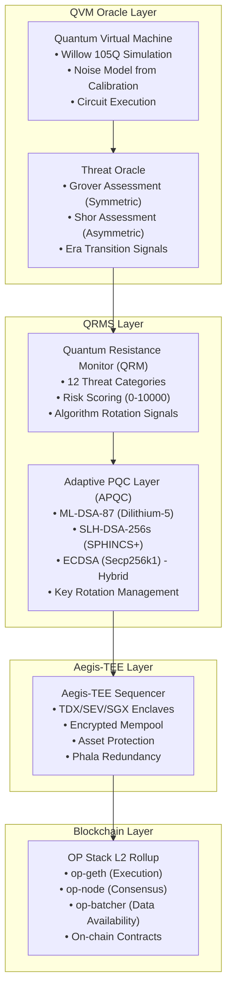

# QuantumAegis Architecture

## Overview

QuantumAegis is a quantum-resistant blockchain protocol that combines:

1. **Quantum Virtual Machine (QVM)**: Google Cirq-based oracle for quantum threat assessment
2. **Quantum Resistance Monitor (QRM)**: Proactive threat detection across 12 categories
3. **Adaptive PQC Layer (APQC)**: Dual signature scheme (ML-DSA-87 + SLH-DSA-256s) with hybrid ECDSA
4. **TEE Sequencer**: Aegis-TEE (TDX/SEV/SGX) with Phala Network redundancy
5. **OP Stack L2**: EVM-compatible rollup with full L1 data availability

## Protocol Stack

```
┌─────────────────────────────────────────────────────────────────┐
│                    QUANTUM AEGIS PROTOCOL STACK                 │
├─────────────────────────────────────────────────────────────────┤
│  QVM Oracle Layer     │ Quantum circuit simulation, threat oracle│
│  QRMS Layer          │ QRM + APQC, 12 threat categories          │
│  Aegis-TEE Layer     │ Encrypted mempool, Phala redundancy       │
│  Blockchain Layer    │ OP Stack L2, smart contracts              │
└─────────────────────────────────────────────────────────────────┘
```

## Development Phases

| Phase | Status | Documentation |
|-------|--------|---------------|
| Phase 2: Cryptography | In Progress | [phase2_cryptography.md](./phase2_cryptography.md) |
| Phase 3: TEE | Complete | [aegis_tee.md](./aegis_tee.md), [phala_integration.md](./phala_integration.md) |
| Phase 4: Threat Intelligence | Simulated | [phase4_threat_intelligence.md](./phase4_threat_intelligence.md) |
| Phase 5: QVM Integration | Complete | [qvm_integration.md](./qvm_integration.md) |

## QVM Oracle Layer

**Status:** Implementation Complete

- [QVM Summary](./QVM_SUMMARY.md) - Quick overview
- [QVM Integration Guide](./qvm_integration.md) - Full architecture and API

**Features:**
- Google Cirq-compatible circuit simulation
- Willow (105Q), Weber (72Q), Rainbow (53Q) processors
- Grover's algorithm threat assessment (symmetric crypto)
- Shor's algorithm threat assessment (public key crypto)
- Automatic quantum era transitions

## TEE Layer (Aegis-TEE + Phala Redundancy)

**Status:** Implementation Complete

- [Aegis-TEE Architecture](./aegis_tee.md) - Primary TEE implementation
- [Phala Redundancy](./phala_integration.md) - Phala Network fallback layer
- [TEE Deployment Guide](../deployment/PHALA_TEE.md) - Deployment instructions
- [TEE Summary](./PHALA_SUMMARY.md) - Quick overview

## Core Documents

- [Stack Architecture](./stack_architecture.md) - OP Stack integration decisions
- [QRMS Implementation](./qrms_implementation.md) - Detailed implementation spec
- [Quantum Resistance Model](./quantum_resistance_model.md) - QRM architecture
- [Threat Taxonomy](./threat_taxonomy.md) - 12-category threat framework
- [Post-Quantum Cryptography](./post_quantum_cryptography.md) - PQC algorithm details

## System Architecture



## Key Features

### Real PQC Cryptography
- **ML-DSA-87**: 2592-byte public keys, 4595-byte signatures
- **SLH-DSA-256s**: 64-byte public keys, 29792-byte signatures
- **Hybrid ECDSA**: Classical + PQC dual signatures

### Threat Monitoring
12 comprehensive categories:
1. Digital Signatures
2. ZK Proof Forgery
3. Decryption/HNDL
4. Hash Reversal
5. Consensus Attacks
6. Cross-Chain/Bridge
7. Network Layer
8. Key Management
9. MEV/Ordering
10. Smart Contracts
11. Side-Channel
12. Migration/Agility

### Algorithm Rotation
- **Scheduled**: Risk score ≥ 6000
- **Emergency**: Risk score ≥ 9000
- **Grace Period**: 1000 blocks for safe transition

## Deployment Status

- L2 testnet operational (Chain ID: 16584)
- QRMS contracts deployed
- PQC cryptography integrated (ML-DSA-87, SLH-DSA-256s real; ML-KEM, HQC mocked)
- Hybrid signatures implemented
- Key management functional
