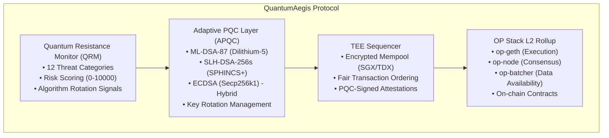

# QuantumAegis Architecture

## Overview

QuantumAegis is a quantum-resistant blockchain protocol that combines:

1. **Quantum Resistance Monitor (QRM)**: Proactive threat detection across 12 categories
2. **Adaptive PQC Layer (APQC)**: Dual signature scheme (ML-DSA-87 + SLH-DSA-256s) with hybrid ECDSA
3. **TEE Sequencer**: Trusted execution environment for secure transaction ordering
4. **OP Stack L2**: EVM-compatible rollup with full L1 data availability

## Core Documents

- [Stack Architecture](./stack_architecture.md) - OP Stack integration decisions
- [QRMS Implementation](./qrms_implementation.md) - Detailed implementation spec
- [Quantum Resistance Model](./quantum_resistance_model.md) - QRM architecture
- [Threat Taxonomy](./threat_taxonomy.md) - 12-category threat framework
- [Post-Quantum Cryptography](./post_quantum_cryptography.md) - PQC algorithm details

## System Architecture

## Key Features

### Real PQC Cryptography
- **ML-DSA-87**: 2592-byte public keys, 4595-byte signatures
- **SLH-DSA-256s**: 64-byte public keys, 29792-byte signatures
- **Hybrid ECDSA**: Classical + PQC dual signatures

### Threat Monitoring
12 comprehensive categories:
1. Digital Signatures
2. ZK Proof Forgery
3. Decryption/HNDL
4. Hash Reversal
5. Consensus Attacks
6. Cross-Chain/Bridge
7. Network Layer
8. Key Management
9. MEV/Ordering
10. Smart Contracts
11. Side-Channel
12. Migration/Agility

### Algorithm Rotation
- **Scheduled**: Risk score ≥ 6000
- **Emergency**: Risk score ≥ 9000
- **Grace Period**: 1000 blocks for safe transition

## Deployment Status

- L2 testnet operational (Chain ID: 42069)
- QRMS contracts deployed
- PQC cryptography integrated
- Hybrid signatures implemented
- Key management functional
