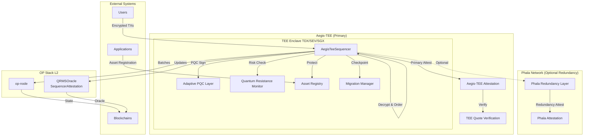
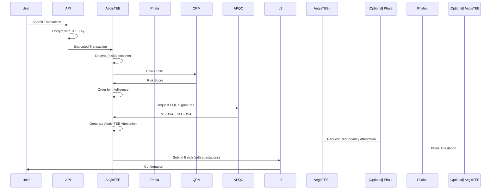

# Aegis-TEE: Primary TEE Architecture

## Overview

Aegis-TEE is the primary Trusted Execution Environment implementation for QuantumAegis. It provides secure, quantum-resistant transaction sequencing with optional Phala Network redundancy for enhanced reliability.

## Architecture



## Components

### AegisTeeSequencer

Primary sequencer running inside Aegis-TEE enclave.

**Features:**
- Encrypted mempool (decrypted only in TEE)
- Intelligence-based ordering
- Asset protection registry
- Migration checkpointing
- Quantum-resistant batch signing
- Optional Phala Network redundancy

**Location:** `services/qrms/src/aegis_tee.rs`

### Phala Network Redundancy

Optional redundancy layer that provides:
- Backup attestation for each batch
- Cross-validation with Aegis-TEE
- Fallback in case of Aegis-TEE issues
- Distributed security verification

## Usage

### Basic Initialization

```rust
use qrms::aegis_tee::AegisTeeSequencer;

// Without Phala redundancy
let mut sequencer = AegisTeeSequencer::new(
    "aegis_worker_0".to_string(),
    "aegis_enclave_0".to_string(),
    "TDX".to_string(),  // or "SEV", "SGX"
    None,  // No Phala redundancy
);
```

### With Phala Redundancy

```rust
// With Phala redundancy enabled
let mut sequencer = AegisTeeSequencer::new(
    "aegis_worker_0".to_string(),
    "aegis_enclave_0".to_string(),
    "TDX".to_string(),
    Some((
        "phala_worker_0".to_string(),
        "phala_enclave_0".to_string(),
    )),  // Phala redundancy
);
```

### Dynamic Redundancy Configuration

```rust
// Enable Phala redundancy at runtime
sequencer.set_phala_redundancy(
    true,
    Some("phala_worker_0".to_string()),
    Some("phala_enclave_0".to_string()),
);

// Disable Phala redundancy
sequencer.set_phala_redundancy(false, None, None);
```

## Attestation Model

### Primary Attestation

Each batch includes an Aegis-TEE attestation:

```rust
pub struct AegisTeeAttestation {
    pub worker_id: String,
    pub enclave_id: String,
    pub quote: Vec<u8>,              // TEE quote bytes
    pub quote_type: String,           // "TDX", "SEV", or "SGX"
    pub mr_enclave: String,           // Measurement of enclave code
    pub mr_signer: String,            // Measurement of signer
    pub report_data: Vec<u8>,         // Custom report data (batch hash)
    pub timestamp: DateTime<Utc>,
    pub aegis_verification: bool,     // Verified by Aegis-TEE infrastructure
    pub phala_redundancy: Option<PhalaRedundancyAttestation>, // Optional Phala redundancy
}
```

### Redundancy Attestation

When Phala redundancy is enabled, each batch also includes a Phala Network attestation:

```rust
pub struct PhalaRedundancyAttestation {
    pub worker_id: String,
    pub enclave_id: String,
    pub quote: Vec<u8>,
    pub quote_type: String,
    pub phala_verification: bool,
    pub timestamp: DateTime<Utc>,
}
```

## Security Model

### TEE Platforms

Aegis-TEE supports multiple TEE platforms:
- **Intel TDX**: Trust Domain Extensions
- **AMD SEV**: Secure Encrypted Virtualization
- **Intel SGX**: Software Guard Extensions

### Quantum Resistance

- **ML-DSA-87**: Primary signature (NIST Level 5)
- **SLH-DSA-256s**: Secondary signature (NIST Level 5)
- **Hybrid ECDSA**: Backward compatibility
- **Automatic Rotation**: Based on QRM risk scores

### Asset Encryption

- All asset data encrypted with TEE-protected keys
- Keys never leave enclave
- Access policies enforced at sequencer level

## Data Flow

### Transaction Submission



## Performance

### Batch Processing

- **Batch Size**: 10-50 transactions (configurable)
- **Mempool Capacity**: 10,000 transactions
- **Ordering Latency**: <100ms (inside TEE)
- **PQC Signing**: 1-3ms per signature

### Redundancy Overhead

- **Phala Redundancy**: Optional, adds ~50-100ms latency when enabled
- **Attestation Size**: ~1-2KB per batch (with redundancy)
- **Network Calls**: 1 additional call per batch (if Phala enabled)

## Configuration

Example configuration:

```rust
let mut sequencer = AegisTeeSequencer::new(
    "aegis_worker_0".to_string(),
    "aegis_enclave_0".to_string(),
    "TDX".to_string(),
    Some((
        "phala_worker_0".to_string(),
        "phala_enclave_0".to_string(),
    )),  // Enable Phala redundancy
);

// Configure intelligence ordering
sequencer.intelligence_mode = IntelligenceOrdering::Hybrid;

// Register assets
sequencer.register_asset(asset_protection);
```

## Migration from PhalaTeeSequencer

If you're using the deprecated `PhalaTeeSequencer`, migrate to `AegisTeeSequencer`:

```rust
// Old (deprecated)
use qrms::phala_tee::PhalaTeeSequencer;
let mut sequencer = PhalaTeeSequencer::new(...);

// New (recommended)
use qrms::aegis_tee::AegisTeeSequencer;
let mut sequencer = AegisTeeSequencer::new(
    "aegis_worker_0".to_string(),
    "aegis_enclave_0".to_string(),
    "TDX".to_string(),
    Some(("phala_worker_0".to_string(), "phala_enclave_0".to_string())), // Optional Phala redundancy
);
```

## References

- [Phala Network Integration (Redundancy)](./phala_integration.md)
- [TEE Architecture](./phase3_tee.md)
- [Quantum Cryptography](./phase2_cryptography.md)
- [Threat Intelligence](./phase4_threat_intelligence.md)
- [Aegis-TEE README](../../services/qrms/README_AEGIS_TEE.md)
