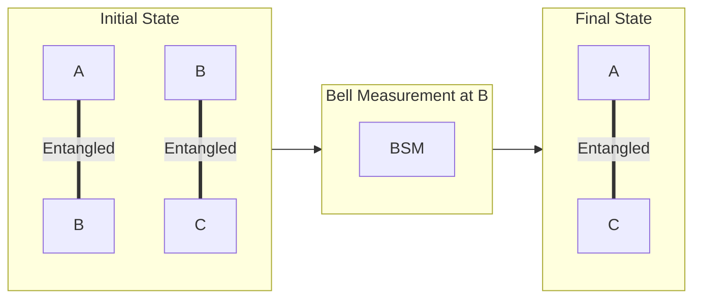
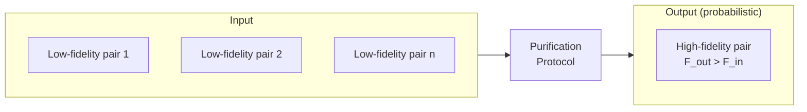
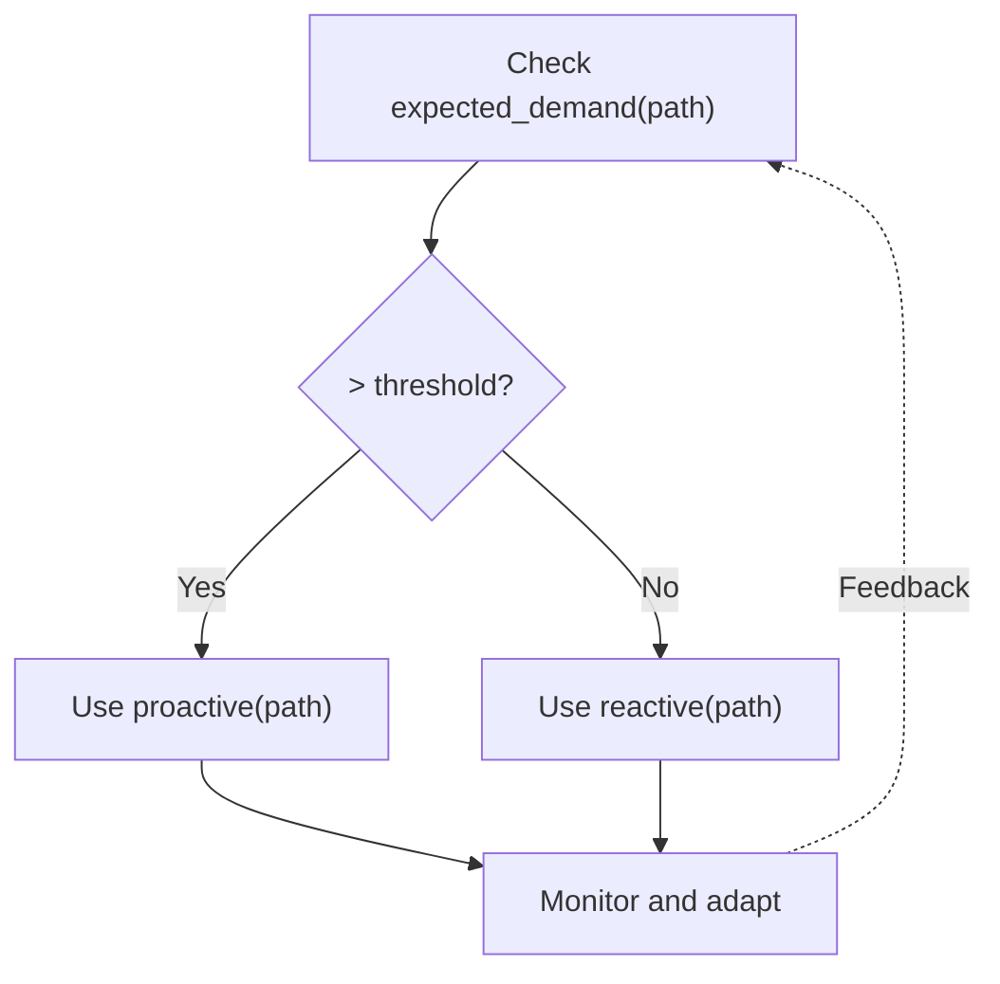
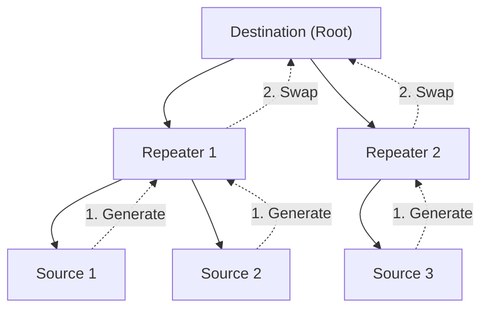

# Entanglement Routing in Quantum Networks

## Overview

Entanglement routing is the process of establishing end-to-end entanglement between distant quantum nodes through a network of intermediate nodes. Unlike classical routing, quantum routing must contend with decoherence, the no-cloning theorem, and the probabilistic nature of entanglement generation.

---

## Fundamental Concepts

### Entanglement as a Network Resource

Unlike classical bits that can be copied and stored, entanglement is:
- **Non-copyable**: No-cloning theorem
- **Fragile**: Degrades with time (decoherence)
- **Probabilistic**: Generation not deterministic
- **Consumable**: Destroyed upon measurement

### Entanglement Swapping

The fundamental operation for extending entanglement:



Mathematical: |Φ+⟩_AB ⊗ |Φ+⟩_BC → Bell measurement at B → |Φ+⟩_AC

### Entanglement Purification

Improving fidelity at the cost of success probability:



Trade-off: Higher fidelity but yield < 1

---

## Routing Strategy Taxonomy

Based on the NIST/Aliro comprehensive survey (2025):

### 1. Proactive Routing

**Concept**: Pre-establish entanglement before application requests

**Characteristics**:
- Low latency for end-user requests
- Higher resource consumption (unused entanglement decays)
- Predictable performance
- Best for known, stable demand patterns

**Protocols**:
- Static path establishment
- Periodic entanglement generation
- Background purification

**Trade-offs**:
| Advantage | Disadvantage |
|-----------|--------------|
| Fast delivery | Wasted resources if unused |
| Predictable timing | Inflexible to changes |
| Simpler scheduling | Requires traffic prediction |

### 2. Reactive Routing

**Concept**: Generate entanglement on-demand when requested

**Characteristics**:
- Efficient resource usage
- Variable latency (path finding + generation)
- Adapts to dynamic demand
- Best for unpredictable traffic

**Protocols**:
- On-demand path discovery
- Just-in-time entanglement generation
- Request-driven scheduling

**Trade-offs**:
| Advantage | Disadvantage |
|-----------|--------------|
| No wasted entanglement | Higher latency |
| Adapts to demand | Complex scheduling |
| Lower baseline resources | Unpredictable timing |

### 3. Hybrid Routing

**Concept**: Combine proactive and reactive based on conditions

**Strategies**:
1. **Demand-based switching**: Proactive for high-demand routes
2. **Layered approach**: Proactive core, reactive edges
3. **Adaptive**: Learn demand patterns and adjust

**Implementation**:



---

## Protocol Stack for Routing

### Network Layer Functions

1. **Path Finding**: Identify route through network
2. **Entanglement Generation**: Create link-level entanglement
3. **Swapping Coordination**: Orchestrate Bell measurements
4. **Purification Management**: Decide when/how to purify
5. **State Tracking**: Monitor fidelity, age of entanglement

### Control Plane Architecture

#### Centralized Control
- **Concept**: Single controller with global view
- **Advantage**: Optimal decisions, simpler algorithms
- **Disadvantage**: Single point of failure, scalability limits

#### Distributed Control
- **Concept**: Nodes make local decisions with partial information
- **Advantage**: Scalable, fault-tolerant
- **Disadvantage**: Suboptimal paths, coordination overhead

#### Software-Defined Quantum Networking (SDQN)
- Separate control and data planes
- Programmable quantum network behavior
- Centralized logic with distributed execution

---

## Key Protocols & Algorithms

### DODAG-X (2025)

**Concept**: Efficient multipartite entanglement routing using embedded tree structures

**Key Features**:
- Destination-Oriented DAG with X-form extensions
- Scalable to large networks
- Optimized for multipartite distribution
- Reduced measurement overhead

**Algorithm**:



### GEM (Global Entanglement Module)

**Concept**: Network-wide entanglement state management

**Architecture**:
- Centralized view of all entanglement in network
- Adaptive heuristics for distribution
- ~20% improvement over static approaches

**Functions**:
1. Track all link-level entanglement
2. Predict demand based on history
3. Pre-position entanglement
4. Optimize purification decisions

### Link-Layer Protocol (Dahlberg et al., 2019)

**Focus**: Physical and link layer for NV-center based networks

**Components**:
1. **Entanglement generation** scheduling
2. **Classical messaging** for coordination
3. **Heralding** for success detection
4. **Retry mechanisms** for failures

**Key Paper**: arXiv:1903.09778

---

## Performance Metrics

### Fidelity

```
F = ⟨Φ+|ρ|Φ+⟩

Target fidelity depends on application:
- QKD: F > 0.81 (CHSH violation)
- Distributed computing: F > 0.99
- Sensing: Application dependent
```

### Throughput

```
Rate = (successful e2e entanglements) / time

Factors:
- Link generation rate
- Swapping success probability
- Purification yield
- Network topology
```

### Latency

```
Latency = path_finding + generation + swapping + purification

Components:
- Classical communication delays
- Quantum operation times
- Queueing delays
- Retry delays
```

### Resource Efficiency

```
Efficiency = (delivered entanglement value) / (resources consumed)

Resources:
- Quantum memory time
- Number of qubits
- Classical communication
- Energy
```

---

## Challenges & Solutions

### Decoherence

**Problem**: Quantum states degrade over time

**Solutions**:
1. Fast operations (reduce storage time)
2. Purification (restore fidelity)
3. Better memories (longer coherence)
4. Cut-off policies (discard old entanglement)

### Probabilistic Generation

**Problem**: Link entanglement succeeds with probability p << 1

**Solutions**:
1. Parallel attempts
2. Buffering successful pairs
3. Scheduling algorithms accounting for variability
4. Hierarchical networks (fewer hops)

### Synchronization

**Problem**: Operations across nodes must be coordinated

**Solutions**:
1. Precise timing protocols (GPS, optical)
2. Heralding signals
3. Asynchronous protocols where possible
4. Time-bin encoding for natural synchronization

### Scalability

**Problem**: Exponential state space as network grows

**Solutions**:
1. Hierarchical network architecture
2. Distributed algorithms
3. Approximate optimization
4. Domain decomposition

---

## Comparison with Classical Routing

| Aspect | Classical | Quantum |
|--------|-----------|---------|
| Resource | Replicable bits | Non-copyable entanglement |
| Persistence | Indefinite | Limited by decoherence |
| Generation | Deterministic | Probabilistic |
| Operations | Digital | Analog + digital |
| Path reuse | Multiple packets | Single entanglement |
| Caching | Effective | Limited by memory coherence |
| Routing metrics | Latency, bandwidth | Fidelity, rate, decoherence |

---

## Recent Research (2025-2026)

### Quantum Repeater Advances

#### Gate-Based Microwave Quantum Repeater
- **Paper**: arXiv:2512.19896
- **Approach**: Grid-state encoding with autonomous error correction
- **Type**: Second-generation repeater
- **Innovation**: Extends logical qubit lifetime without feedback measurements

#### Hybrid Repeater Chains
- **Paper**: arXiv:2512.21655
- **Architecture**: Atom-based quantum processing units + quantum memory multiplexers
- **Benefit**: Addresses practical implementation challenges

#### Telecom-Compatible Quantum Memory
- **Paper**: arXiv:2510.11585
- **Method**: Cross-band memory via dual photon modes dark-state polaritons
- **Importance**: Enables integration with existing telecom infrastructure

### Routing Algorithm Advances

#### Non-Isotonic Network Routing
- **Paper**: arXiv:2511.20628
- **Problem**: Optimal routing in networks where fidelity varies non-linearly
- **Contribution**: New algorithms for realistic network conditions
- **Authors**: Tang, Hinkley, Goodenough, Krastanov, Avis

#### Quality of Service in Aggregated Networks
- **Paper**: arXiv:2501.18846
- **Focus**: Multi-path routing for QoS guarantees
- **Challenge**: Managing multiple entanglement paths with varying quality

#### Resource Estimation
- **Paper**: arXiv:2410.10512
- **Contribution**: Comprehensive resource estimation framework for entanglement routing
- **Application**: Network planning and dimensioning

### Entanglement Distribution & Purification

#### Adaptive Error Correction
- **Paper**: arXiv:2504.11670
- **Method**: Adaptive error correction for entanglement distillation
- **Trade-off**: Balances fidelity improvement with resource consumption

#### Distribution and Purification Framework
- **Paper**: arXiv:2503.14712
- **Focus**: High-fidelity entanglement distribution across network nodes
- **Contribution**: Joint optimization of distribution and purification

### Deterministic Entanglement Distribution

#### Entanglement-Swapping Measurements
- **Paper**: arXiv:2601.08581
- **Innovation**: Deterministic (vs. probabilistic) entanglement distribution
- **Impact**: Improved predictability and scheduling

#### Heralded Entanglement Generation
- **Paper**: arXiv:2502.00982
- **Review**: Comprehensive survey of heralded generation techniques
- **Published**: Rep. Prog. Phys. 88 086002 (2025)

---

## Future Directions

### Quantum Repeaters

**First Generation**: Entanglement swapping + purification
- Current technology approach
- Limited by purification overhead

**Second Generation**: Quantum error correction
- Encoded logical qubits
- Deterministic but resource intensive
- Gate-based microwave approaches emerging (arXiv:2512.19896)

**Third Generation**: Fault-tolerant
- Full error correction
- Arbitrary distance scaling

### Machine Learning for Routing

- Traffic prediction
- Adaptive scheduling
- Fidelity estimation
- Path optimization

### Multipartite Entanglement Distribution

- GHZ states for multi-party protocols
- Graph states for measurement-based computing
- Cluster states for one-way quantum computing
- W-class states for robust distribution (arXiv:2512.24274)

---

## References

1. NIST/Aliro "Entanglement Routing in Quantum Networks: A Comprehensive Survey" (2025)
2. Dahlberg et al. "A Link Layer Protocol for Quantum Networks" arXiv:1903.09778 (2019)
3. "DODAG-X: Efficient Entanglement Routing" APS SMT (2025)
4. "GEM: Global Entanglement Module" arXiv:2509.16817 (2025)
5. Van Meter & Devitt "Local and Distributed Quantum Computation" (2016)
