# Quantum-Classical Hybrid Integration: Practical Deployment

## Overview

Deploying quantum protocols requires seamless integration with existing classical infrastructure. This document covers hybrid protocol designs, co-existence strategies, and practical considerations for transitioning to quantum-enhanced networks.

---

## Integration Paradigms

### 1. Parallel Operation

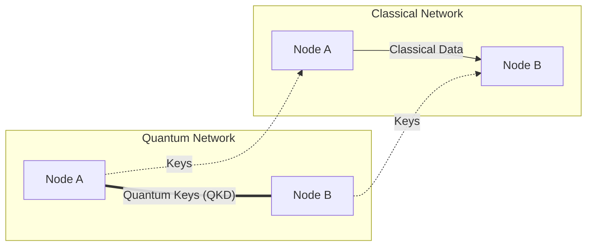

**Characteristics**:
- Independent operation
- Classical channel for data
- Quantum channel for key exchange
- Simplest integration model

### 2. Wavelength Division Multiplexing (WDM)

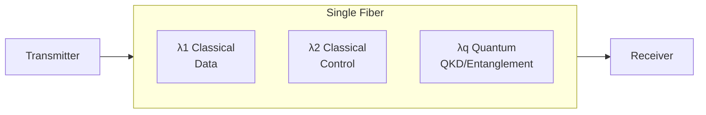

**Advantages**:
- Uses existing fiber infrastructure
- Efficient spectrum utilization
- Single cable deployment

**Challenges**:
- Raman scattering from classical channels
- Four-wave mixing interference
- Careful wavelength allocation needed

### 3. Time Division Multiplexing (TDM)

```mermaid
gantt
    title Time Division Multiplexing
    dateFormat X
    axisFormat %s
    
    section Channel
    Classical   :0, 1
    Quantum     :1, 2
    Classical   :2, 3
    Quantum     :3, 4
    Classical   :4, 5
    Quantum     :5, 6
```

**Advantages**:
- Complete isolation during quantum slots
- Simpler filtering requirements
- Flexible allocation

**Challenges**:
- Reduced bandwidth for each type
- Synchronization requirements
- Latency introduced by time slots

### 4. IP-Compatible Quantum (Q-Chip Model)

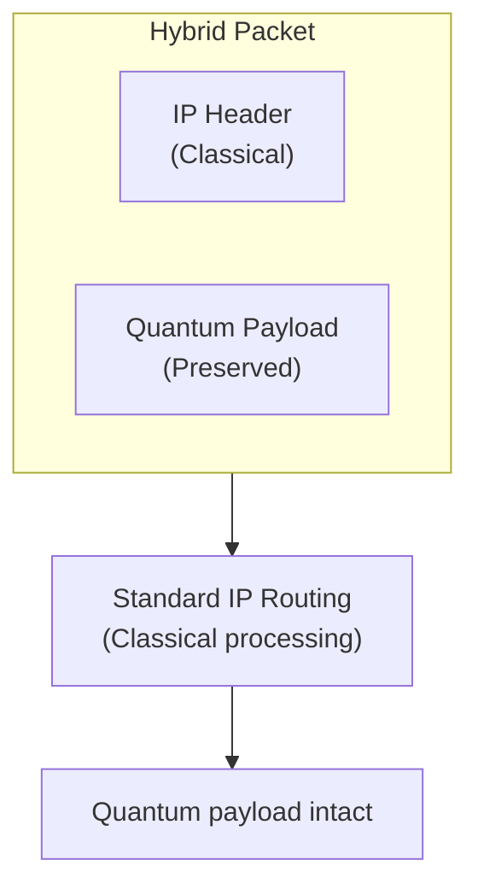

**Innovation**: Penn Q-Chip (2025)
- First demonstration of quantum over standard IP
- Uses classical headers for routing
- Quantum information preserved through routing
- Compatible with existing network infrastructure

---

## Co-Existence Challenges

### Noise and Interference

| Source | Impact on Quantum | Mitigation |
|--------|-------------------|------------|
| Raman scattering | Background noise | Wavelength separation |
| Four-wave mixing | Spurious photons | Wavelength planning |
| Amplifier ASE | Noise floor | Bypass amplifiers |
| Crosstalk | Bit errors | Isolation, filtering |

### Filtering Requirements

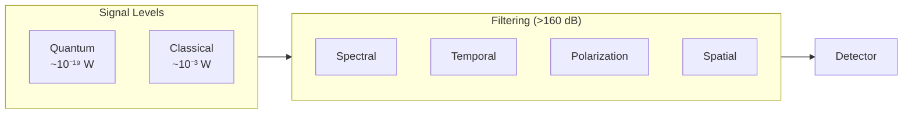

### Synchronization

**Requirements**:
- Timing precision: picosecond to nanosecond
- Clock distribution across network
- Coordinated operations for entanglement

**Methods**:
1. GPS/GNSS timing
2. White Rabbit protocol (sub-ns over fiber)
3. Optical frequency distribution
4. Dedicated timing channels

---

## Practical Deployment Architectures

### Metro Network Integration

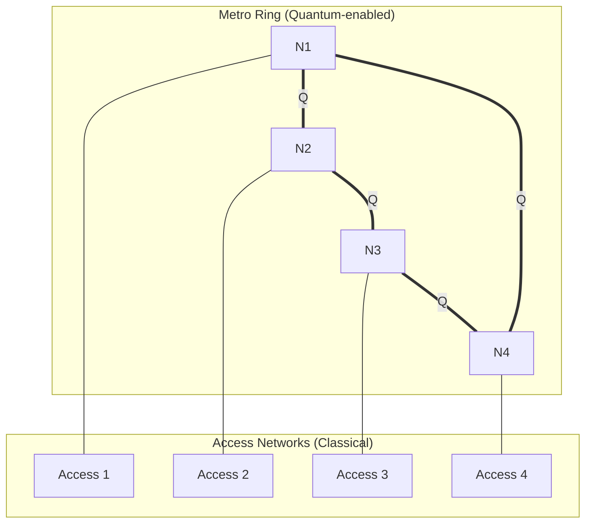

**Strategy**:
- Quantum-enable backbone ring
- Classical access networks
- Key distribution to edge via PQC

### Data Center Interconnect

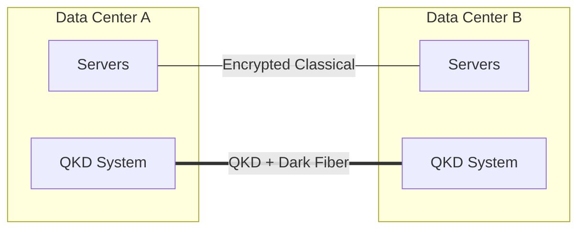

**Use Case**:
- High-value data protection
- Dedicated quantum channel
- Point-to-point initially

### Hybrid Cloud Security

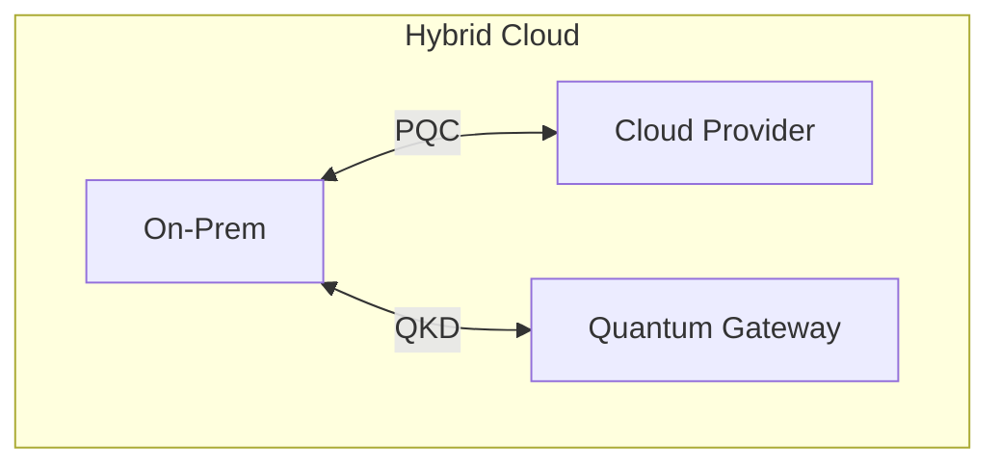

**Layers**:
1. QKD for local key distribution
2. PQC for cloud connectivity
3. Hybrid encryption for data

---

## SQCC: Simultaneous Quantum-Classical Communication

### Protocol Overview

**Concept**: Adaptive modulation for quantum-classical co-existence

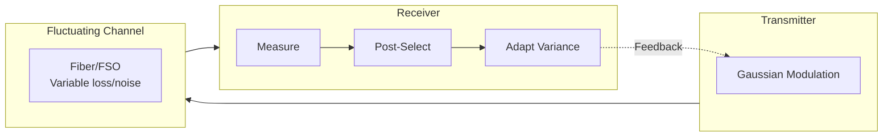

### Advantages

- No hardware changes required
- Adapts to channel fluctuations
- Works in noisy environments
- Software-based optimization

### Applications

- Free-space optical links
- Satellite-ground channels
- Legacy fiber with varying conditions

---

## Control Plane Integration

### Classical Control for Quantum Operations

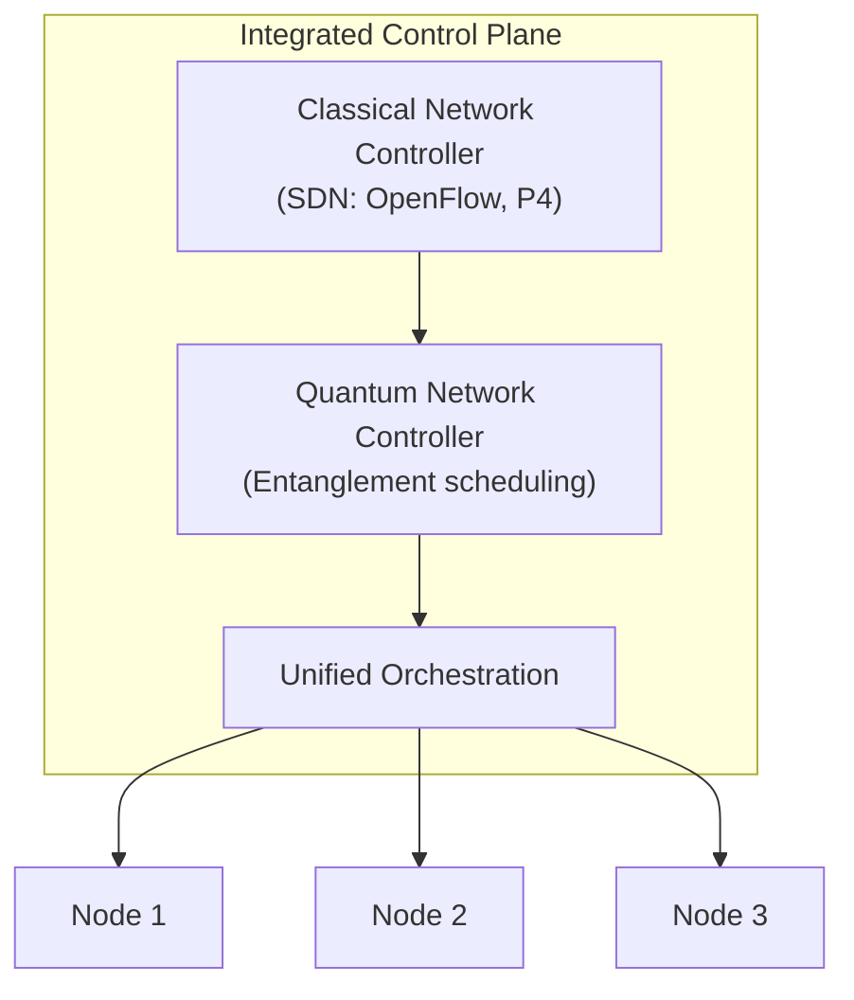

### Security Considerations

**Control Plane Threats**:
1. Header leakage (metadata analysis)
2. Timing attacks (operation patterns)
3. Denial of service (resource exhaustion)
4. Man-in-the-middle (control messages)

**Mitigations**:
1. Encrypt control traffic (PQC)
2. Anonymize headers where possible
3. Rate limiting and authentication
4. Redundant control paths

---

## Migration Strategies

```mermaid
timeline
    title Quantum Network Migration
    
    section Phase 1: Overlay (Year 1-2)
        QKD point-to-point : Classical unchanged
        Quantum as security layer
    
    section Phase 2: Hybrid Backbone (Year 2-5)
        Quantum-enable core : WDM integration
        Centralized key management
    
    section Phase 3: Distributed (Year 5-10)
        Quantum repeaters : Entanglement protocols
        Network-wide services
    
    section Phase 4: Full Internet (Year 10+)
        Global connectivity : Distributed QC
        Quantum sensing
```

---

## Standards for Integration

### ETSI QKD

| Standard | Focus |
|----------|-------|
| GS QKD 004 | Application interface |
| GS QKD 008 | QKD module security |
| GS QKD 014 | Protocol and data format |
| GS QKD 015 | Control interface for SDN |

### ITU-T Y.3800 Series

- Y.3800: Framework overview
- Y.3801: Functional requirements
- Y.3802: Control and management
- Y.3804: Key management

### IETF

- RFC 9340: Quantum Internet architecture
- Ongoing: Quantum routing protocols

---

## Case Studies

### 1. Beijing-Shanghai Backbone (China)

**Deployment**: 2,000+ km fiber backbone
**Technology**: QKD with trusted nodes
**Integration**: Dedicated dark fiber
**Status**: Operational since 2017

### 2. DARPA QuANET

**Deployment**: Prototype quantum-augmented network
**Technology**: Hybrid quantum-classical
**Integration**: IP-compatible approach
**Status**: Active development

### 3. European QCI

**Deployment**: Pan-European quantum communication
**Technology**: QKD with satellite links
**Integration**: National network interconnect
**Status**: Rolling out

---

---

## Recent Advances (2025-2026)

### Quantum-Safe Blockchain Integration

#### QLink Bridge Architecture
- **Paper**: arXiv:2512.18488
- **Focus**: Quantum-safe blockchain interoperability
- **Innovation**: Secure cross-chain communication with PQ cryptography

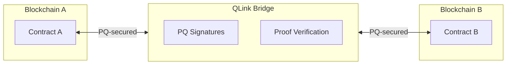

#### High-Dimensional Quantum Blockchain
- **Paper**: arXiv:2512.20489
- **Method**: Time-entanglement based protocol
- **Advantage**: Enhanced security against quantum and ML attacks

### Privacy-Preserving Protocols

#### Device-Independent Anonymous Communication
- **Paper**: arXiv:2512.21047
- **Feature**: Hides sender and receiver identities
- **Security**: Device-independent guarantees

### Quantum Cloud Security

#### Homomorphic Encryption Integration
- **Paper**: arXiv:2512.17748
- **Focus**: Secure quantum cloud computing
- **Method**: HE for quantum computation delegation

### Adaptive Security Frameworks

#### Extending Quantum-Safe Communications
- **Paper**: arXiv:2511.22416
- **Contribution**: Framework for real-world network deployment
- **Feature**: Adaptive security level selection

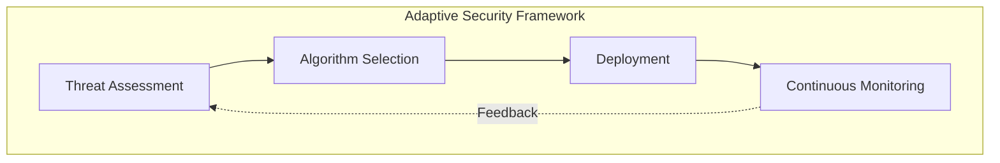

### Combined Quantum + Post-Quantum Security

#### Finite-Key Analysis
- **Paper**: arXiv:2512.04429
- **Analysis**: Combined Q/PQ performance under realistic conditions
- **Finding**: Optimal combination strategies for defense-in-depth

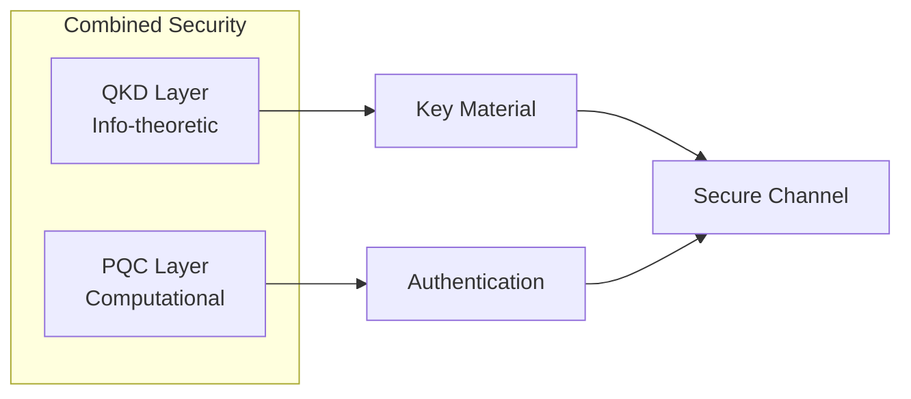

---

## References

1. Q-Chip: Penn Engineers demonstration (2025)
2. SQCC Protocol: arXiv:2510.13138
3. DARPA QuANET Program (2025)
4. ETSI QKD Standards Series
5. ITU-T Y.3800 Framework
6. QLink Bridge: arXiv:2512.18488
7. HD Quantum Blockchain: arXiv:2512.20489
8. DI Anonymous Communication: arXiv:2512.21047
9. Adaptive Security: arXiv:2511.22416
10. Combined Q+PQ Security: arXiv:2512.04429