# Quantum Network Architecture: Protocol Stacks & Integration

## Overview

Building a quantum internet requires new architectural paradigms that account for the unique properties of quantum information. This document covers quantum network protocol stacks, integration with classical infrastructure, and emerging architectural frameworks.

---

## The Need for New Architecture

### Why Classical Internet Stack Doesn't Work

| Classical Assumption | Quantum Reality |
|---------------------|-----------------|
| Bits can be copied | No-cloning theorem |
| Data persists indefinitely | Decoherence degrades states |
| Transmission is deterministic | Generation is probabilistic |
| Amplification is possible | Amplification destroys quantum info |
| Store-and-forward works | Quantum memory is limited |

### Fundamental Differences

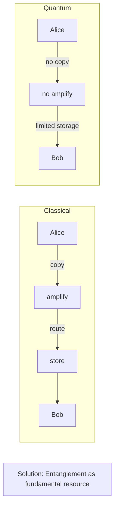

---

## Quantum Network Protocol Stack

### Layer Model (based on RFC 9340)

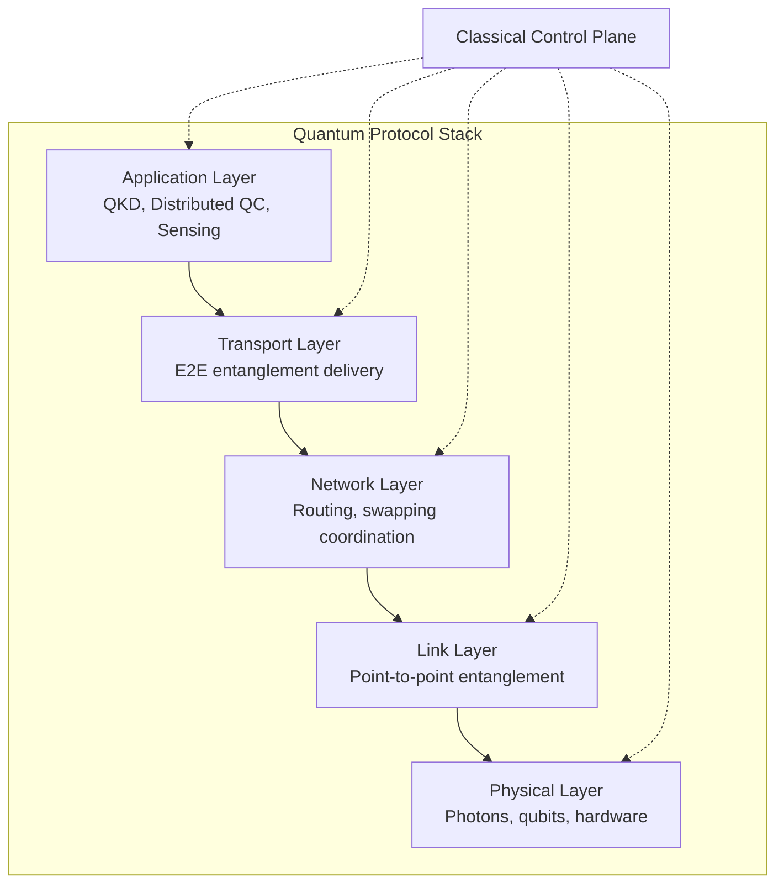

### Physical Layer

**Functions**:
- Qubit encoding (polarization, time-bin, frequency)
- Photon transmission
- Detection and measurement
- Hardware interface

**Technologies**:
- Single-photon sources
- Quantum memories
- Detectors (SNSPDs, APDs)
- Fiber/free-space channels

**Key Metrics**:
- Photon loss rate
- Detection efficiency
- Memory coherence time
- Gate fidelity

### Link Layer

**Functions**:
- Entanglement generation between adjacent nodes
- Heralding and success detection
- Classical communication for coordination
- Retry mechanisms

**Protocol Elements**:

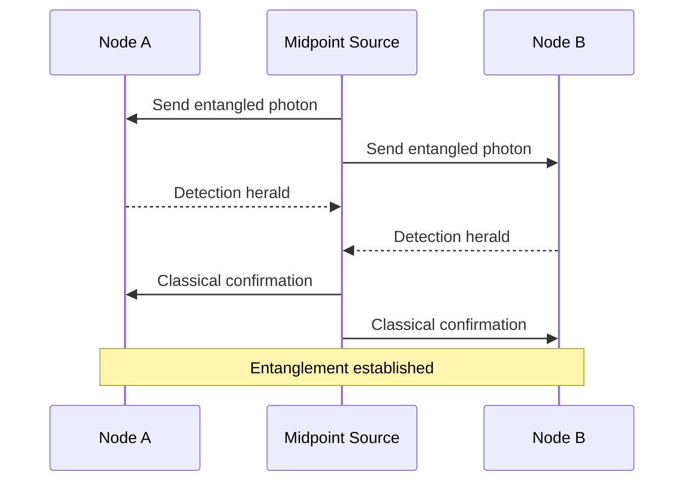

**Key Paper**: Dahlberg et al. "A Link Layer Protocol for Quantum Networks" (2019)

### Network Layer

**Functions**:
- Path finding/routing
- Entanglement swapping coordination
- Resource allocation
- Network state management

**Routing Approaches**:
1. **Source routing**: Path decided at source
2. **Hop-by-hop routing**: Decisions at each node
3. **Centralized**: Controller decides all paths
4. **Distributed**: Nodes decide collaboratively

**Entanglement Swapping**:

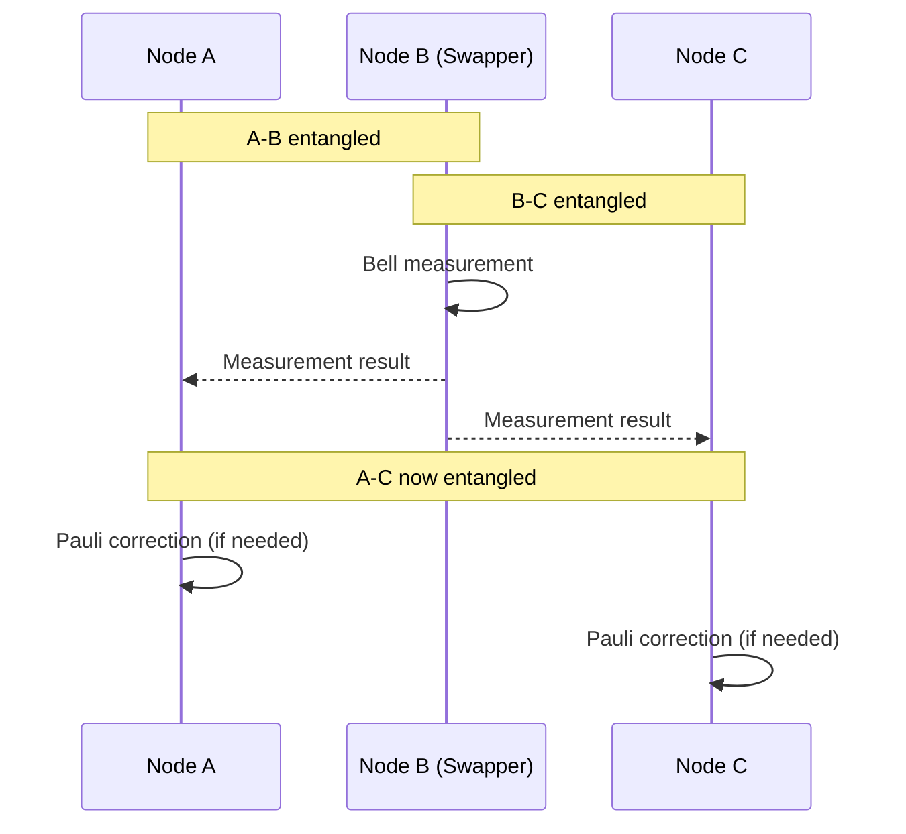

### Transport Layer

**Functions**:
- End-to-end entanglement delivery
- Fidelity management
- Purification decisions
- Application interface

**Service Models**:
1. **Best effort**: Deliver entanglement ASAP
2. **Fidelity guaranteed**: Meet minimum fidelity
3. **Rate guaranteed**: Meet minimum throughput
4. **Deadline-constrained**: Deliver within time limit

### Application Layer

**Quantum Applications**:
- Quantum Key Distribution (QKD)
- Distributed quantum computing
- Quantum sensing networks
- Blind quantum computing
- Quantum secret sharing

**Interface Requirements**:
- Request entanglement with target node
- Specify fidelity/rate requirements
- Perform local quantum operations
- Receive classical measurement outcomes

---

## Classical-Quantum Integration

### The Q-Chip Approach (Penn, 2025)

**Innovation**: Send quantum signals with standard IP headers

**Architecture**:

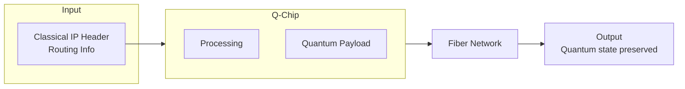

**Key Features**:
- Uses existing router infrastructure
- Classical headers for routing decisions
- Quantum payload untouched
- Compatible with current fiber networks

### DARPA QuANET

**Program Goals**:
- Prototype quantum-augmented network
- Combine quantum and classical links
- Real-world deployment and testing

**Architecture Components**:
1. Quantum link nodes
2. Classical control plane
3. Hybrid routers
4. Management and orchestration

### Hybrid Network Design Patterns

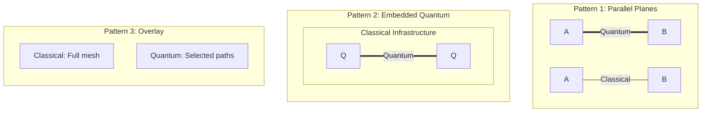

---

## Emerging Architectural Frameworks

### GEM (Global Entanglement Module)

**Concept**: Centralized management of network-wide entanglement state

**Components**:

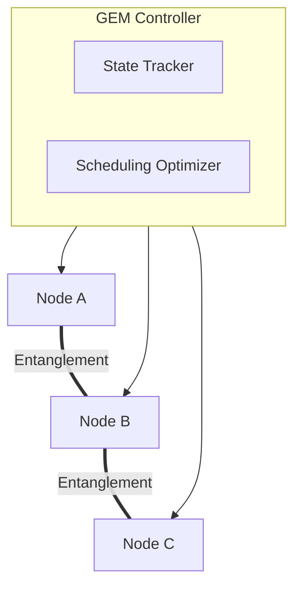

**Functions**:
1. Track all entanglement in network
2. Predict demand patterns
3. Optimize resource allocation
4. Coordinate swapping operations

**Performance**: ~20% improvement over static approaches

### QuIP Framework (P4-based)

**Concept**: Platform-agnostic protocol definition using P4 language

**Benefits**:
- Protocol definition separate from implementation
- Portable across simulators and hardware
- Modular protocol composition
- Easier protocol development and testing

**Structure**:

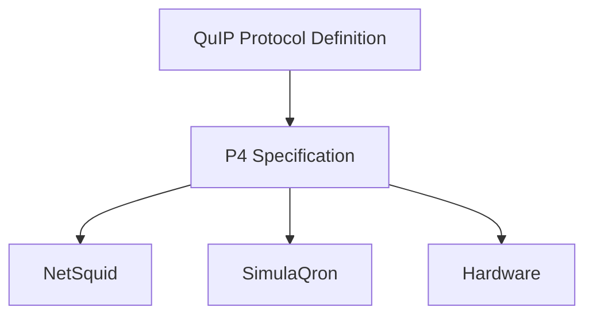

### Software-Defined Quantum Networking (SDQN)

**Concept**: Separate control plane from data plane

**Architecture**:

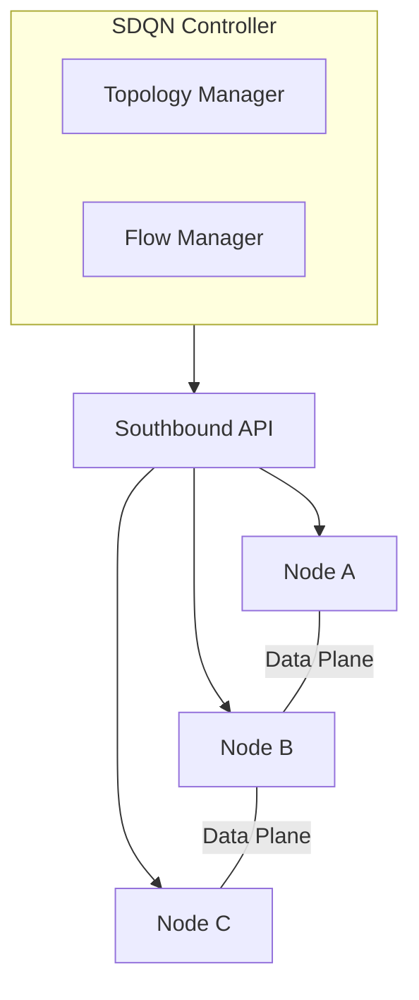

**Advantages**:
- Centralized optimization
- Programmable behavior
- Easier management
- Flexible policy implementation

---

## Network Topology Considerations

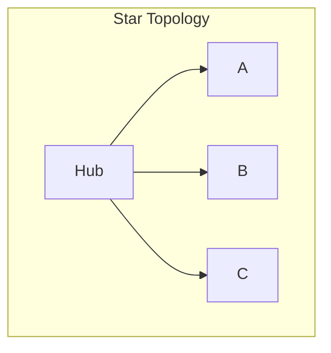

**Star**: Simple management, hub bottleneck, good for small networks

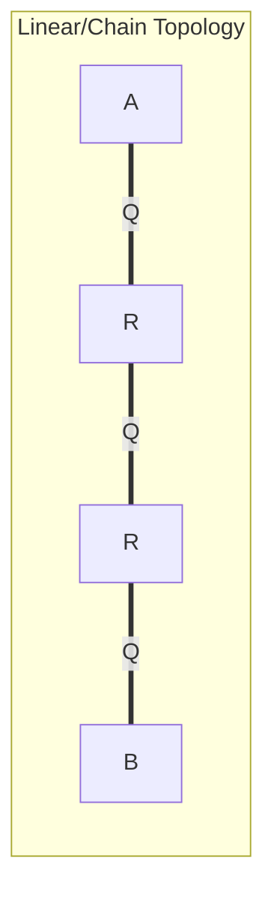

**Linear**: Natural for repeaters, sequential swapping, limited scalability

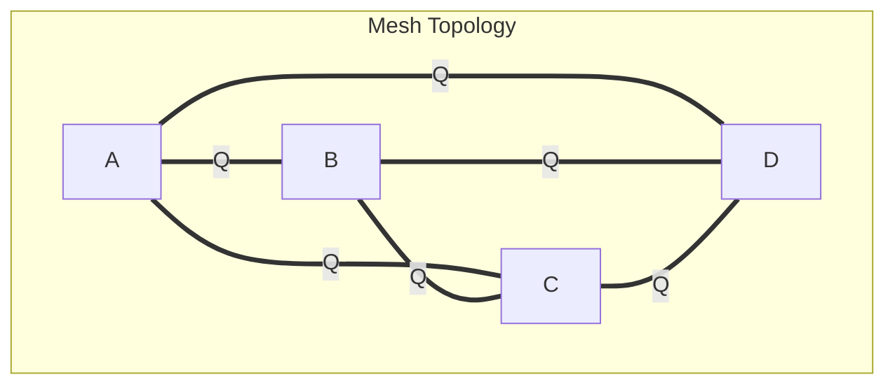

**Mesh**: Multiple paths, fault tolerance, complex routing

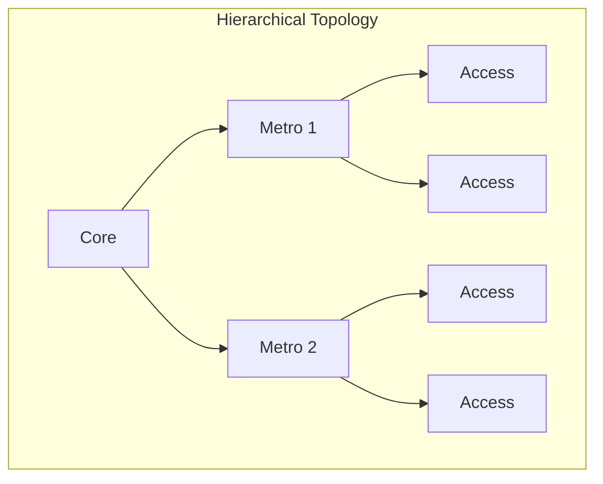

**Hierarchical**: Scalable, different requirements per tier, matches classical design

---

## Standards & Specifications

### RFC 9340: Architectural Principles for a Quantum Internet

**Key Points**:
1. Entanglement as fundamental resource
2. Need for new protocol stack
3. Integration with classical infrastructure
4. Incremental deployment path

### ITU-T Y.3800 Series

**Y.3800**: Framework for networks supporting QKD
**Y.3801**: Functional requirements
**Y.3802**: Control and management
**Y.3803**: Key management

### ETSI QKD Standards

- **ETSI GS QKD 004**: Application interface
- **ETSI GS QKD 014**: Protocol and data format
- **ETSI GS QKD 015**: Control interface

---

## Recent Architectural Advances (2025-2026)

### Distributed Quantum Computing Frameworks

#### Linear Optical Distributed QC
- **Paper**: arXiv:2601.08389
- **Approach**: Dataflow programming framework for photonic systems
- **Innovation**: Scalable interconnection of quantum processors

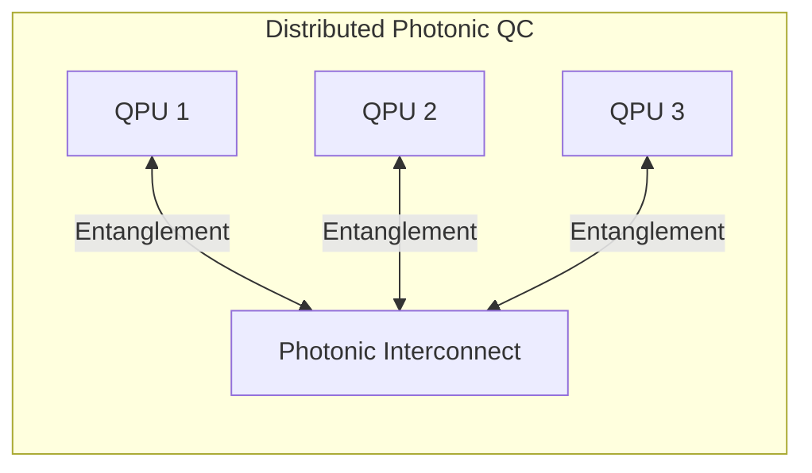

#### Fault-Tolerant Modular QC
- **Paper**: arXiv:2601.07241
- **Approach**: Surface codes with single-shot emission-based hardware
- **Feature**: Stabilizer measurements across modules in distributed setting

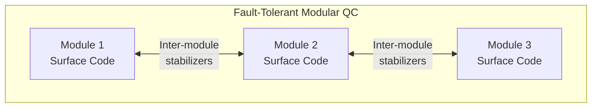

### Teleported Gate Operations

- **Paper**: arXiv:2601.04848
- **Achievement**: Unconditional teleported gates between remote solid-state qubit registers
- **Significance**: Key primitive for distributed quantum computing

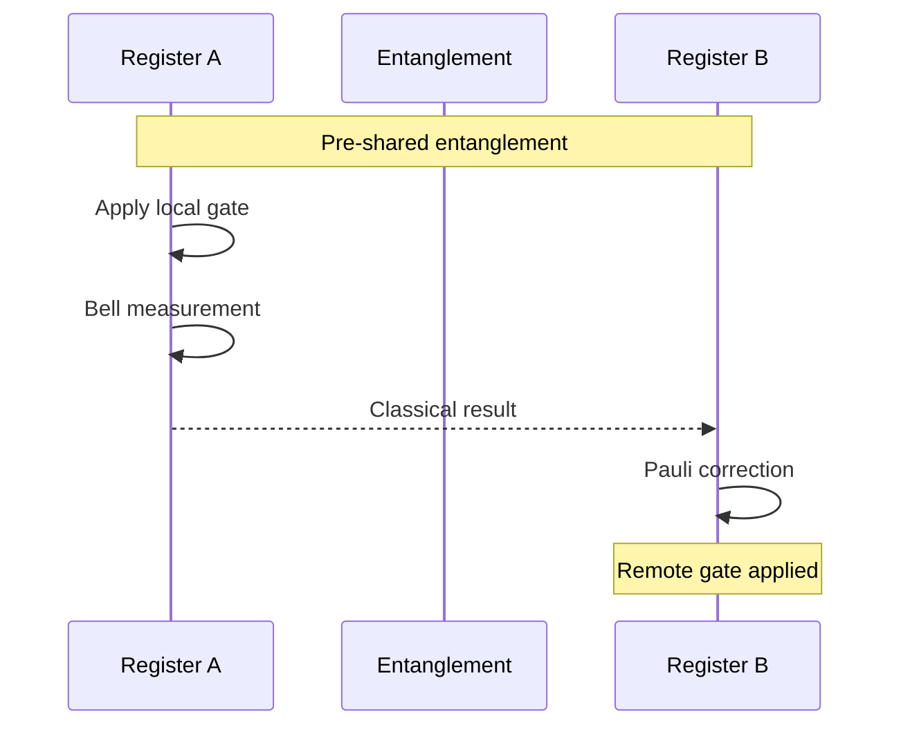

### Photonic Cluster State Generation

- **Paper**: arXiv:2505.14628
- **Method**: Recurrent quantum photonic neural networks
- **Output**: Large-scale tree-type photonic cluster states
- **Application**: Resources for measurement-based quantum computing

---

## Future Architecture Directions

### Quantum Repeater Networks

**Evolution Path**:

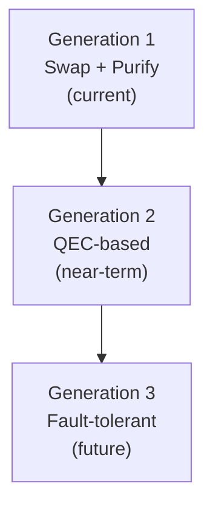

**Recent Advances**:
- Gate-based microwave repeaters (arXiv:2512.19896)
- Hybrid atom-based + memory multiplexers (arXiv:2512.21655)
- Telecom-compatible cross-band memory (arXiv:2510.11585)

### Global Quantum Network

**Components**:
1. **Ground segment**: Fiber-based metro/regional networks
2. **Space segment**: Satellite links for continental/global
3. **Interworking**: Hybrid protocols for space-ground

### Quantum Internet of Things

- Lightweight quantum protocols for constrained devices
- Quantum-classical hybrid for edge devices
- Quantum sensing networks

### Emerging Design Patterns

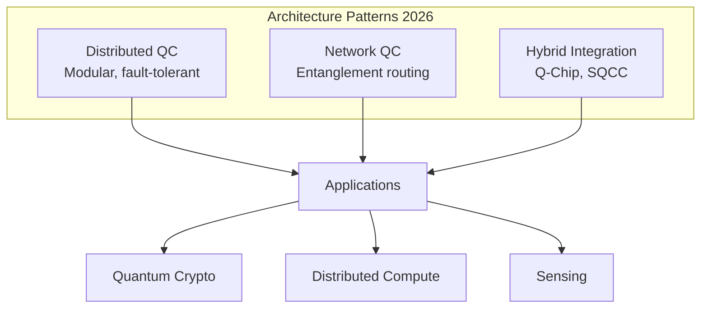

---

## References

1. RFC 9340: "Architectural Principles for a Quantum Internet"
2. "Quantum Internet protocol stack: A comprehensive survey" (2022)
3. QuIP Framework: arXiv:2406.14597
4. GEM Architecture: arXiv:2509.16817
5. ITU-T Y.3800 Series
6. ETSI QKD Standards
