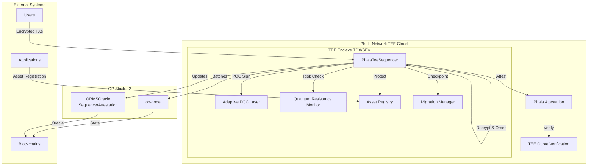
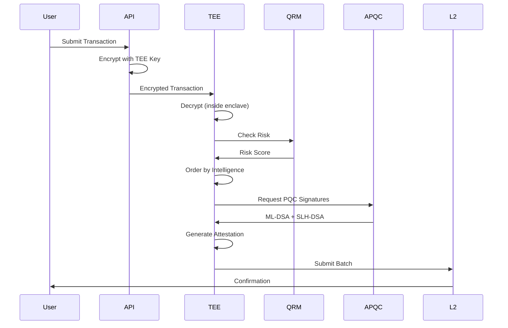
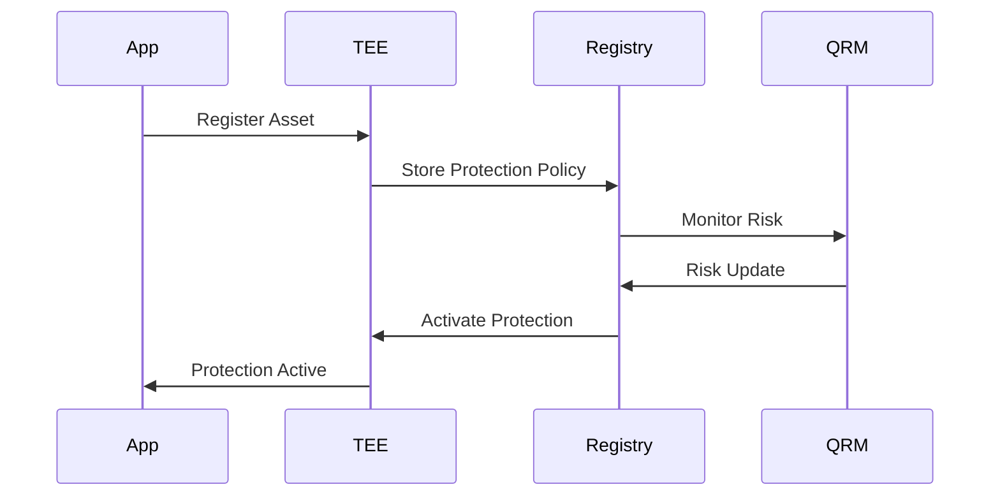
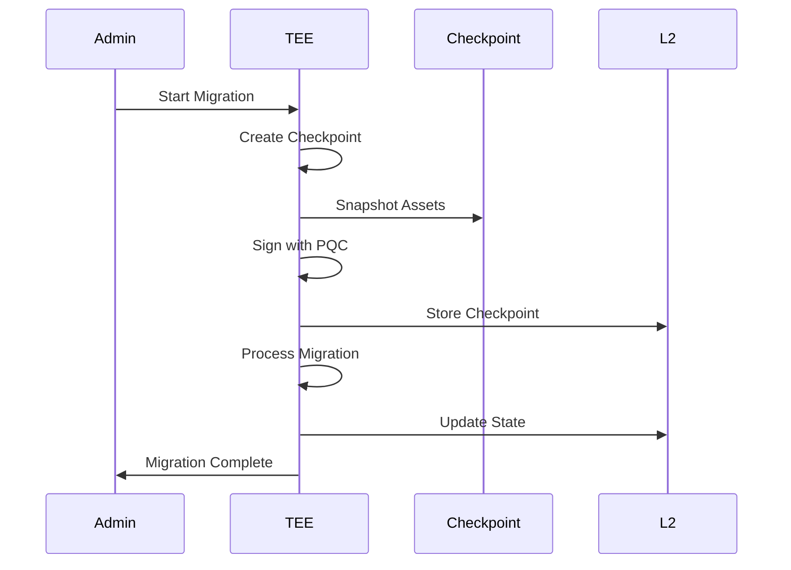

# Phala Network TEE Integration

## Overview

QuantumAegis integrates with Phala Network's TEE Cloud to provide hardware-backed security for quantum-resistant transaction sequencing.

## Architecture



## Components

### PhalaTeeSequencer

Core sequencer running inside Phala TEE enclave.

**Features:**
- Encrypted mempool (decrypted only in TEE)
- Intelligence-based ordering
- Asset protection registry
- Migration checkpointing
- Quantum-resistant batch signing

**Location:** `services/qrms/src/phala_tee.rs`

### Asset Protection

Protects both on-chain and off-chain assets:

```rust
pub enum AssetType {
    OnChainToken,      // ERC-20, ERC-721
    OnChainNFT,
    OnChainData,       // Smart contract state
    OffChainDatabase,  // External databases
    OffChainFile,      // File storage
    OffChainStream,    // Data streams
    CrossChainBridge,  // Bridge assets
}
```

### Intelligence Ordering

Four ordering strategies:

1. **Risk-Aware**: High-risk transactions first
2. **Asset Protection**: Protected assets prioritized
3. **Migration-Aware**: Migration transactions grouped
4. **Hybrid**: Combines all strategies

### Migration System

State migration with checkpointing:

```rust
pub struct MigrationCheckpoint {
    pub checkpoint_id: String,
    pub block_number: u64,
    pub state_hash: String,
    pub asset_snapshots: Vec<AssetSnapshot>,
    pub pqc_signature: String,  // ML-DSA-87
}
```

## Data Flow

### Transaction Submission



### Asset Protection



### State Migration



## Security Model

### TEE Attestation

```rust
pub struct PhalaAttestation {
    pub worker_id: String,
    pub enclave_id: String,
    pub quote: Vec<u8>,              // TEE quote
    pub quote_type: String,           // "TDX" or "SEV"
    pub mr_enclave: String,          // Code measurement
    pub mr_signer: String,           // Signer measurement
    pub report_data: Vec<u8>,        // Batch hash
    pub phala_verification: bool,    // Network verified
}
```

### Quantum Resistance

- **ML-DSA-87**: Primary signature (NIST Level 5)
- **SLH-DSA-256s**: Secondary signature (NIST Level 5)
- **Hybrid ECDSA**: Backward compatibility
- **Automatic Rotation**: Based on QRM risk scores

### Asset Encryption

- All asset data encrypted with TEE-protected keys
- Keys never leave enclave
- Access policies enforced at sequencer level

## Performance

### Batch Processing

- **Batch Size**: 10-50 transactions (configurable)
- **Mempool Capacity**: 10,000 transactions
- **Ordering Latency**: <100ms (inside TEE)
- **PQC Signing**: 1-3ms per signature

### Scalability

- **Multi-Worker**: 3-10 TEE workers (redundancy)
- **Load Balancing**: Automatic across workers
- **State Sync**: Checkpoint-based synchronization

## Deployment

See [Phala TEE Deployment Guide](../deployment/PHALA_TEE.md) for detailed deployment instructions.

## Configuration

Example `phala.toml`:

```toml
[phala]
network = "mainnet"

[worker]
id = "quantumaegis-sequencer"
enclave_type = "TDX"
min_workers = 3
max_workers = 10

[quantum]
signature_algorithms = ["ML-DSA-87", "SLH-DSA-256s"]
hybrid_ecdsa = true
risk_scheduled = 6000
risk_emergency = 9000

[intelligence]
mode = "hybrid"
enable_asset_protection = true
enable_migration = true
```

## References

- [Phala Network](https://phala.network)
- [TEE Architecture](./phase3_tee.md)
- [Quantum Cryptography](./phase2_cryptography.md)
- [Threat Intelligence](./phase4_threat_intelligence.md)
