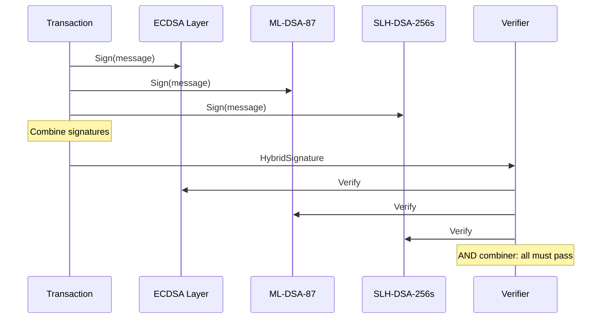

# Phase 2: Real Cryptography

## Overview

Phase 2 integrates real post-quantum cryptographic primitives using the `pqcrypto` crate family, replacing all simulated cryptography with NIST-standardized algorithms.

## Implemented Algorithms

### ML-DSA-87 (Dilithium-5)

NIST FIPS 204 standard. Lattice-based digital signature.

| Property | Value |
|----------|-------|
| Security Level | NIST Level 5 |
| Public Key Size | 2592 bytes |
| Signature Size | 4595 bytes |
| Implementation | `pqcrypto-dilithium` |
| Status | **Production Ready** |

```rust
// services/qrms/src/crypto.rs:12-55
pub struct MldsaKeyPair {
    pub public_key: dilithium5_mod::PublicKey,
    pub secret_key: dilithium5_mod::SecretKey,
}

impl MldsaKeyPair {
    pub fn generate() -> Self {
        let (pk, sk) = dilithium5_mod::keypair();
        Self { public_key: pk, secret_key: sk }
    }

    pub fn sign(&self, message: &[u8]) -> (Vec<u8>, f64) {
        let start = Instant::now();
        let sig = dilithium5_mod::detached_sign(message, &self.secret_key);
        let elapsed = start.elapsed().as_secs_f64() * 1000.0;
        (sig.as_bytes().to_vec(), elapsed)
    }
}
```

### SLH-DSA-256s (SPHINCS+)

NIST FIPS 205 standard. Hash-based digital signature.

| Property | Value |
|----------|-------|
| Security Level | NIST Level 5 |
| Public Key Size | 64 bytes |
| Signature Size | 29792 bytes |
| Implementation | `pqcrypto-sphincsplus` |
| Status | **Production Ready** |

```rust
// services/qrms/src/crypto.rs:57-100
pub struct SlhDsaKeyPair {
    pub public_key: sphincs_mod::PublicKey,
    pub secret_key: sphincs_mod::SecretKey,
}
```

### ECDSA (secp256k1)

Classical elliptic curve signature for hybrid schemes.

| Property | Value |
|----------|-------|
| Curve | secp256k1 |
| Public Key Size | 33 bytes (compressed) |
| Signature Size | 64 bytes |
| Implementation | `k256` |
| Status | **Production Ready** |

```rust
// services/qrms/src/crypto.rs:190-224
pub struct EcdsaKeyPair {
    pub signing_key: SigningKey,
    pub verifying_key: VerifyingKey,
}
```

## Hybrid Signature Scheme

All transactions use ECDSA + ML-DSA + SLH-DSA triple signatures:



```rust
// services/qrms/src/crypto.rs:226-245
pub struct HybridSignature {
    pub ecdsa_sig: Vec<u8>,
    pub mldsa_sig: Vec<u8>,
    pub slhdsa_sig: Vec<u8>,
}
```

## Key Management

### Key Generation

```rust
// services/qrms/src/apqc.rs:144-160
impl AdaptivePqcLayer {
    pub fn new() -> Self {
        Self {
            mldsa_keys: Arc::new(Mutex::new(MldsaKeyPair::generate())),
            slhdsa_keys: Arc::new(Mutex::new(SlhDsaKeyPair::generate())),
            mlkem_keys: Arc::new(Mutex::new(MlKemKeyPair::generate())),
            hqc_keys: Arc::new(Mutex::new(HqcKeyPair::generate())),
            ecdsa_keys: Arc::new(Mutex::new(EcdsaKeyPair::generate())),
            pending_mldsa_keys: Arc::new(Mutex::new(None)),
            pending_slhdsa_keys: Arc::new(Mutex::new(None)),
            // ...
        }
    }
}
```

### Key Rotation

Scheduled rotation with grace period:

```rust
// services/qrms/src/apqc.rs:311-340
pub async fn generate_rotation_keys(&mut self) {
    *self.pending_mldsa_keys.lock().await = Some(MldsaKeyPair::generate());
    *self.pending_slhdsa_keys.lock().await = Some(SlhDsaKeyPair::generate());
}

pub async fn execute_rotation(&mut self) -> RotationResult {
    if let Some(new_mldsa) = self.pending_mldsa_keys.lock().await.take() {
        *self.mldsa_keys.lock().await = new_mldsa;
    }
    if let Some(new_slhdsa) = self.pending_slhdsa_keys.lock().await.take() {
        *self.slhdsa_keys.lock().await = new_slhdsa;
    }
    // ...
}
```

### Public Key Export

For on-chain registration:

```rust
// services/qrms/src/apqc.rs:342-348
pub async fn get_public_keys(&self) -> (Vec<u8>, Vec<u8>, Vec<u8>) {
    let mldsa = self.mldsa_keys.lock().await.public_key_bytes();
    let slhdsa = self.slhdsa_keys.lock().await.public_key_bytes();
    let ecdsa = self.ecdsa_keys.lock().await.public_key_bytes();
    (mldsa, slhdsa, ecdsa)
}
```

## Pending Work

### ML-KEM-1024

Currently mocked due to AVX2 compilation issues on some platforms.

| Property | Value |
|----------|-------|
| Security Level | NIST Level 5 |
| Public Key Size | 1568 bytes |
| Ciphertext Size | 1568 bytes |
| Shared Secret | 32 bytes |
| Status | **Mock Implementation** |

Target: Enable `pqcrypto-kyber` when compilation issues resolved.

### HQC-256

Currently mocked. Backup KEM algorithm.

| Property | Value |
|----------|-------|
| Security Level | NIST Level 5 |
| Public Key Size | 6730 bytes |
| Ciphertext Size | 6730 bytes |
| Shared Secret | 64 bytes |
| Status | **Mock Implementation** |

## Dependencies

```toml
# Cargo.toml
[dependencies]
# Real PQC (working)
pqcrypto-dilithium = "0.5"
pqcrypto-sphincsplus = "0.5"
pqcrypto-traits = "0.3"
k256 = "0.13"
ecdsa = { version = "0.17.0-rc.13", package = "ecdsa" }
signature = "2.2"

# Disabled due to compilation issues
# pqcrypto-kyber = "0.5"
# pqcrypto-hqc = "0.2"
```

## Performance

Typical operation times (measured on M1 MacBook):

| Operation | Algorithm | Time (ms) |
|-----------|-----------|-----------|
| Sign | ML-DSA-87 | 1-3 |
| Verify | ML-DSA-87 | 0.5-1 |
| Sign | SLH-DSA-256s | 50-100 |
| Verify | SLH-DSA-256s | 5-10 |
| Sign | ECDSA | <0.1 |
| Verify | ECDSA | <0.1 |
