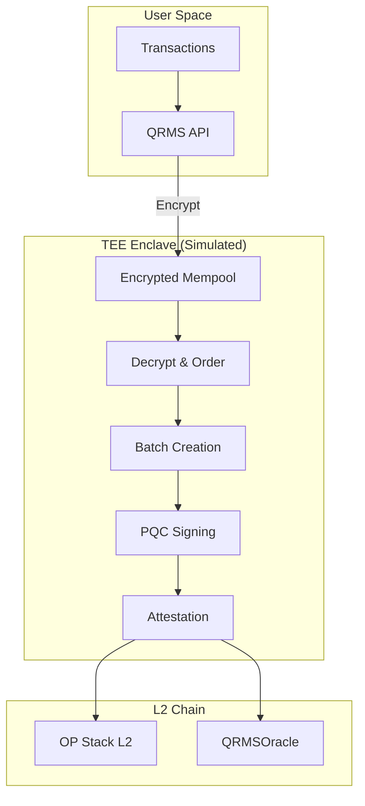
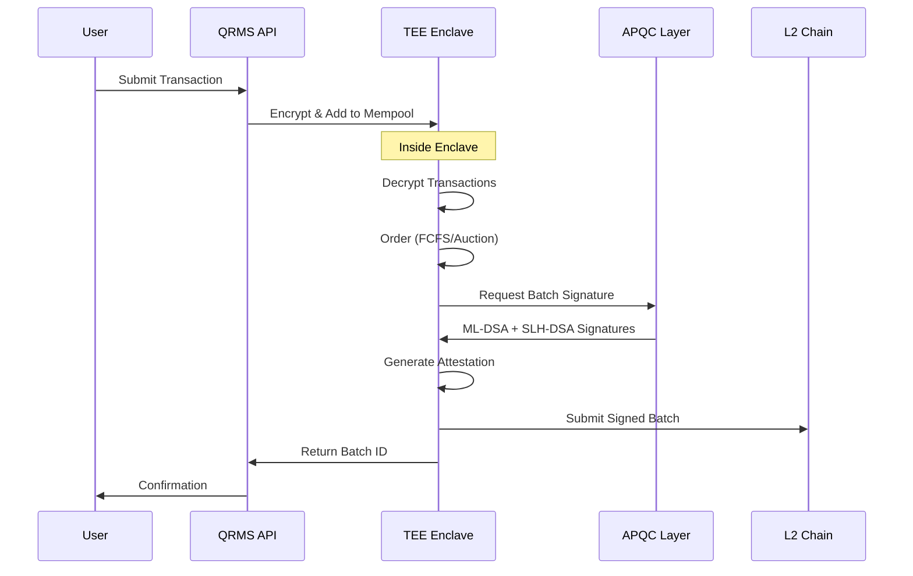
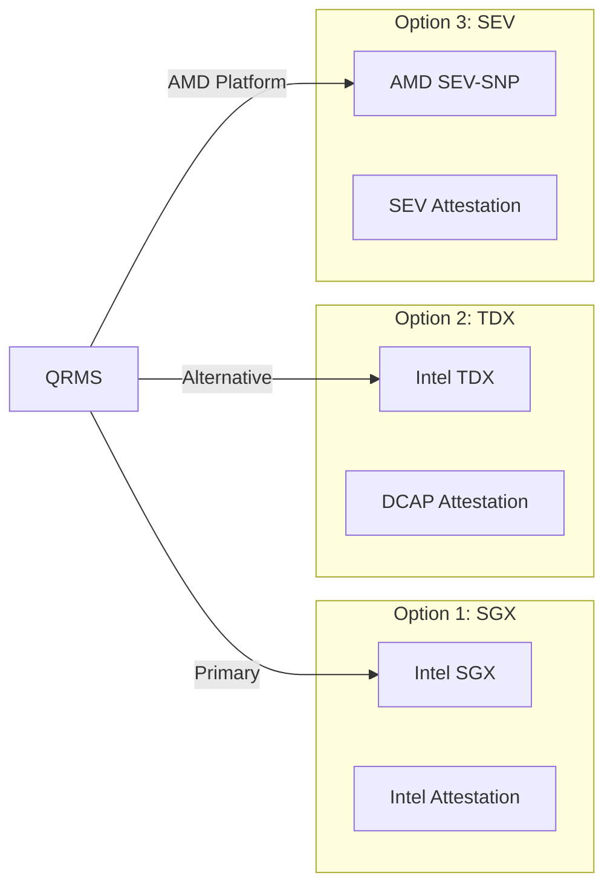

# Phase 3: TEE Integration

## Overview

Phase 3 integrates Trusted Execution Environments (TEE) for secure transaction ordering, protecting the sequencer mempool from MEV extraction and ensuring fair ordering.

## Current Implementation (Simulated)

### TEE Sequencer Structure

```rust
// services/qrms/src/sequencer.rs:78-106
pub struct TeeSequencer {
    encrypted_mempool: VecDeque<Transaction>,
    ordered_queue: VecDeque<Transaction>,
    batches: Vec<Batch>,
    pub current_block: u64,
    pub batch_size: usize,
    pub ordering_mode: OrderingMode,
    pub tee_platform: String,      // "SGX" simulated
    pub mrenclave: String,         // Enclave measurement
}
```

### Attestation Data

```rust
// services/qrms/src/sequencer.rs:47-57
pub struct TeeAttestation {
    pub platform: String,      // SGX, TDX, SEV
    pub mrenclave: String,     // Enclave code measurement
    pub mrsigner: String,      // Signer measurement
    pub report_data: String,   // Custom report data
    pub nonce: String,         // Freshness nonce
    pub timestamp: DateTime<Utc>,
    pub pqc_signed: bool,      // Attestation signed with PQC
}
```

### Ordering Modes

```rust
// services/qrms/src/sequencer.rs:71-76
pub enum OrderingMode {
    Fcfs,           // First-come-first-served
    BatchAuction,   // Periodic batch with uniform price
}
```

## Architecture



## Transaction Flow



## Simulated Attestation Generation

```rust
// services/qrms/src/sequencer.rs:219-244
fn generate_attestation(&self, batch_id: &str) -> TeeAttestation {
    let mut hasher = Sha256::new();
    hasher.update(format!("{}", Utc::now().timestamp_nanos_opt().unwrap_or(0)).as_bytes());
    let nonce = hex::encode(&hasher.finalize()[..8]);

    let mut report_hasher = Sha256::new();
    report_hasher.update(batch_id.as_bytes());
    report_hasher.update(nonce.as_bytes());
    report_hasher.update(self.mrenclave.as_bytes());
    let report_data = hex::encode(&report_hasher.finalize()[..16]);

    TeeAttestation {
        platform: self.tee_platform.clone(),
        mrenclave: self.mrenclave.clone(),
        mrsigner,
        report_data,
        nonce,
        timestamp: Utc::now(),
        pqc_signed: true,
    }
}
```

## Batch Structure

```rust
// services/qrms/src/sequencer.rs:59-68
pub struct Batch {
    pub batch_id: String,
    pub transactions: Vec<Transaction>,
    pub ml_dsa_sig: String,      // ML-DSA-87 signature
    pub slh_dsa_sig: String,     // SLH-DSA-256s signature
    pub attestation: TeeAttestation,
    pub timestamp: DateTime<Utc>,
}
```

## Remaining Work

### 1. Intel SGX/TDX Integration

Replace simulation with real SGX SDK:

```rust
// Target implementation
use sgx_tstd::*;
use sgx_types::*;

#[no_mangle]
pub extern "C" fn ecall_process_transactions(
    sealed_txs: *const u8,
    sealed_len: usize,
) -> sgx_status_t {
    // Unseal transactions inside enclave
    // Order transactions
    // Sign with enclave-protected keys
    // Generate attestation
}
```

### 2. Remote Attestation

Integrate Intel Attestation Service (IAS) or DCAP:

```rust
// Target implementation
pub async fn verify_attestation(quote: &[u8]) -> AttestationResult {
    // Parse SGX quote
    // Verify MRENCLAVE matches expected value
    // Check MRSIGNER
    // Validate signature chain
    // Return verification result
}
```

### 3. On-Chain Attestation Verification

Extend `SequencerAttestation.sol`:

```solidity
// Target implementation
contract SequencerAttestation {
    bytes32 public expectedMrenclave;
    bytes32 public expectedMrsigner;
    
    function verifyAttestation(
        bytes calldata quote,
        bytes calldata signature
    ) external view returns (bool) {
        // Verify quote structure
        // Check MRENCLAVE
        // Verify signature against Intel root
        // Return validity
    }
}
```

### 4. Encrypted Mempool

Implement threshold encryption:

```rust
// Target implementation
pub struct ThresholdEncryption {
    pub threshold: usize,
    pub parties: Vec<PublicKey>,
}

impl ThresholdEncryption {
    pub fn encrypt(&self, tx: &Transaction) -> EncryptedTx {
        // Encrypt with threshold scheme
        // Requires t-of-n parties to decrypt
    }
    
    pub fn decrypt_share(&self, ctx: &EncryptedTx, share: &DecryptionShare) -> Result<()> {
        // Combine shares inside TEE
        // Decrypt only after ordering
    }
}
```

## Security Properties

| Property | Current | Target |
|----------|---------|--------|
| Mempool Privacy | Simulated | Threshold encryption |
| Fair Ordering | Implemented (FCFS/Auction) | TEE-enforced |
| Attestation | Mock | Intel DCAP |
| Key Protection | Software | Hardware enclave |
| Side-Channel Resistance | None | SGX mitigations |

## Deployment Options



## References

- [Intel SGX Developer Guide](https://download.01.org/intel-sgx/sgx-dcap/1.15/linux/docs/Intel_SGX_DCAP_ECDSA_QVL_API_Guide.pdf)
- [Intel TDX White Paper](https://www.intel.com/content/www/us/en/developer/articles/technical/intel-trust-domain-extensions.html)
- [MEV Protection via TEE](https://arxiv.org/abs/2305.01620)
