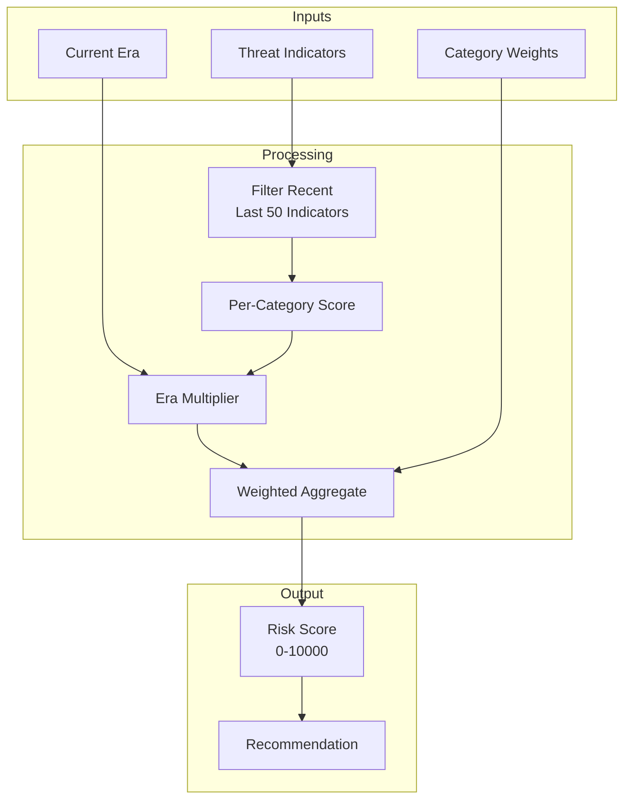

# Phase 4: Threat Intelligence

## Overview

Phase 4 implements real-time quantum threat monitoring with external data feeds and ML-based risk prediction.

## Current Implementation

### 12 Threat Categories

```rust
// services/qrms/src/qrm.rs:23-46
pub enum ThreatCategory {
    // Cryptographic Threats
    DigitalSignatures,      // ECDSA, EdDSA, BLS, Multi-sig, HD Wallets
    ZkProofForgery,         // SNARKs, Plonk, Rollup state, Private tx
    DecryptionHndl,         // Encrypted mempools, P2P, HNDL active threat
    HashReversal,           // SHA-256, Keccak, Poseidon (low risk)
    
    // Infrastructure Threats
    ConsensusAttacks,       // PoS keys, VRF, Finality sigs
    CrossChainBridge,       // Light clients, Relayers, IBC, Rollup sequencer
    NetworkLayer,           // Node discovery, Gossip, TLS, Libp2p
    
    // Operational Threats
    KeyManagement,          // HD wallets, MPC/TSS, Rotation, Custody
    MevOrdering,            // Encrypted mempool bypass, PBS, Auctions
    SmartContracts,         // ecrecover, CREATE2, Access control, Governance
    
    // Implementation Threats
    SideChannel,            // Timing, Power, Cache, Fault injection, TEE
    MigrationAgility,       // Downgrade, Hybrid bypass, Incomplete migration
}
```

### Category Weights

Weights sum to 1.0 for normalized risk scoring:

```rust
// services/qrms/src/qrm.rs:48-72
impl ThreatCategory {
    pub fn weight(&self) -> f64 {
        match self {
            // Cryptographic - 38%
            Self::DigitalSignatures => 0.12,
            Self::ZkProofForgery => 0.10,
            Self::DecryptionHndl => 0.12,  // Elevated due to HNDL
            Self::HashReversal => 0.04,
            
            // Infrastructure - 24%
            Self::ConsensusAttacks => 0.10,
            Self::CrossChainBridge => 0.08,
            Self::NetworkLayer => 0.06,
            
            // Operational - 26%
            Self::KeyManagement => 0.10,
            Self::MevOrdering => 0.08,
            Self::SmartContracts => 0.08,
            
            // Implementation - 12%
            Self::SideChannel => 0.06,
            Self::MigrationAgility => 0.06,
        }
    }
}
```

### Quantum Era Scaling

Risk severity scales based on quantum computing era:

```rust
// services/qrms/src/qrm.rs:74-135
pub fn era_multiplier(&self, era: QuantumEra) -> f64 {
    match (self, era) {
        // HNDL is ALREADY ACTIVE
        (Self::DecryptionHndl, QuantumEra::PreQuantum) => 0.8,
        (Self::DecryptionHndl, QuantumEra::Nisq) => 0.9,
        (Self::DecryptionHndl, QuantumEra::FaultTolerant) => 1.0,
        
        // Digital signatures become critical with fault-tolerant QC
        (Self::DigitalSignatures, QuantumEra::PreQuantum) => 0.2,
        (Self::DigitalSignatures, QuantumEra::Nisq) => 0.6,
        (Self::DigitalSignatures, QuantumEra::FaultTolerant) => 1.0,
        // ...
    }
}
```

### Risk Assessment

```rust
// services/qrms/src/qrm.rs:232-241
pub struct RiskAssessment {
    pub score: u32,  // 0-10000 basis points
    pub recommendation: RiskRecommendation,
    pub category_breakdown: Vec<CategoryRisk>,
    pub indicators: Vec<ThreatIndicator>,
    pub current_era: QuantumEra,
    pub timestamp: DateTime<Utc>,
}
```

## Risk Scoring Algorithm



### Calculation

```rust
// services/qrms/src/qrm.rs:331-394
pub fn calculate_risk(&mut self) -> RiskAssessment {
    // Use recent indicators (last 50)
    let recent: Vec<_> = self.indicators.iter().rev().take(50).cloned().collect();

    // Calculate per-category risk
    let category_risks: Vec<CategoryRisk> = ThreatCategory::all()
        .iter()
        .map(|cat| self.calculate_category_risk(*cat, &recent))
        .collect();

    // Weighted aggregate score
    let mut weighted_sum = 0.0;
    let mut weight_total = 0.0;

    for cat_risk in &category_risks {
        let w = cat_risk.category.weight();
        weighted_sum += (cat_risk.score as f64) * w;
        weight_total += w;
    }

    let score = (weighted_sum / weight_total) as u32;

    // Determine recommendation
    let recommendation = if score >= self.threshold_emergency {
        RiskRecommendation::EmergencyRotation
    } else if score >= self.threshold_scheduled {
        RiskRecommendation::ScheduleRotation
    } else if score >= self.threshold_scheduled / 2 {
        RiskRecommendation::MonitorClosely
    } else {
        RiskRecommendation::Continue
    };
    // ...
}
```

## Simulated Threat Feeds

Current sources (simulated):

| Source | Type | Update Frequency |
|--------|------|------------------|
| arXiv | Research papers | Per indicator |
| NIST | Standards updates | Per indicator |
| IACR | Cryptography research | Per indicator |
| IBM Quantum | Hardware progress | Per indicator |
| Google AI | Quantum research | Per indicator |
| CVE Database | Vulnerabilities | Per indicator |
| GitHub Security | Code vulnerabilities | Per indicator |
| Industry Report | Market analysis | Per indicator |

## Remaining Work

### 1. External Data Feeds

#### NIST PQC Announcements

```rust
// Target implementation
pub struct NistFeed {
    api_url: String,
    last_check: DateTime<Utc>,
}

impl NistFeed {
    pub async fn check_announcements(&mut self) -> Vec<ThreatIndicator> {
        // Fetch NIST PQC status page
        // Parse algorithm updates
        // Generate indicators for deprecations/recommendations
    }
}
```

#### arXiv Monitoring

```rust
// Target implementation
pub struct ArxivFeed {
    categories: Vec<String>,  // cs.CR, quant-ph
    keywords: Vec<String>,    // shor, grover, lattice attack
}

impl ArxivFeed {
    pub async fn search_recent(&self) -> Vec<ThreatIndicator> {
        // Query arXiv API
        // Filter by keywords
        // Parse abstracts for severity assessment
        // Generate threat indicators
    }
}
```

#### IBM Quantum Roadmap

```rust
// Target implementation
pub struct IbmQuantumFeed {
    roadmap_url: String,
}

impl IbmQuantumFeed {
    pub async fn check_progress(&self) -> Vec<ThreatIndicator> {
        // Fetch roadmap updates
        // Track qubit counts, error rates
        // Generate indicators based on milestones
    }
}
```

### 2. ML Risk Prediction

#### Time-Series Forecasting

```rust
// Target implementation
pub struct RiskPredictor {
    model: TimeSeriesModel,
    history: Vec<RiskDataPoint>,
}

impl RiskPredictor {
    pub fn predict(&self, horizon_days: u32) -> PredictionResult {
        // Extract features from history
        // Run through trained model
        // Return prediction with confidence intervals
    }
    
    pub fn retrain(&mut self, new_data: &[RiskDataPoint]) {
        // Add new data
        // Retrain model
        // Update weights
    }
}
```

#### Features

| Feature | Description |
|---------|-------------|
| Historical risk scores | Time series of past assessments |
| Quantum hardware progress | Qubit counts, error rates |
| Research publication rate | Papers per category per month |
| Industry investment | Funding announcements |
| Vulnerability disclosures | CVE count trends |

### 3. Real-Time Alerting

#### WebSocket Push

```rust
// Target implementation
pub async fn alert_critical_threat(
    state: &AppState,
    indicator: &ThreatIndicator,
) {
    if indicator.severity >= 0.9 {
        // Push to all connected WebSocket clients
        state.broadcast(AlertMessage::Critical(indicator.clone())).await;
        
        // Trigger webhook
        state.webhooks.notify_all(indicator).await;
        
        // Update on-chain oracle
        state.oracle.update_risk(indicator).await;
    }
}
```

#### Webhook Integration

```rust
// Target implementation
pub struct WebhookConfig {
    pub slack_url: Option<String>,
    pub discord_url: Option<String>,
    pub email_endpoint: Option<String>,
    pub pagerduty_key: Option<String>,
}

impl WebhookConfig {
    pub async fn notify(&self, indicator: &ThreatIndicator) {
        // Format message
        // Send to configured endpoints
    }
}
```

## Threat Indicator Structure

```rust
// services/qrms/src/qrm.rs:199-211
pub struct ThreatIndicator {
    pub category: ThreatCategory,
    pub sub_category: String,       // Specific threat type
    pub severity: f64,              // 0.0 - 1.0
    pub confidence: f64,            // 0.0 - 1.0
    pub source: String,
    pub timestamp: DateTime<Utc>,
    pub description: String,
    pub era_relevance: QuantumEra,  // When this threat becomes critical
    pub references: Vec<String>,    // arXiv, CVE, etc.
}
```

## Thresholds

| Threshold | Value | Action |
|-----------|-------|--------|
| Continue | < 3000 | Normal operation |
| Monitor Closely | 3000-5999 | Increased logging |
| Schedule Rotation | 6000-8999 | Prepare new keys |
| Emergency Rotation | ≥ 9000 | Immediate key swap |

## Testing

```bash
# Verify weight sum
cargo test test_weights_sum_to_one

# Verify category count
cargo test test_category_count

# Run full test suite
cargo test
```

## References

- [NIST Post-Quantum Cryptography](https://csrc.nist.gov/projects/post-quantum-cryptography)
- [IBM Quantum Roadmap](https://www.ibm.com/quantum/roadmap)
- [arXiv Quantum Physics](https://arxiv.org/list/quant-ph/recent)
- [IACR Cryptology ePrint](https://eprint.iacr.org/)
