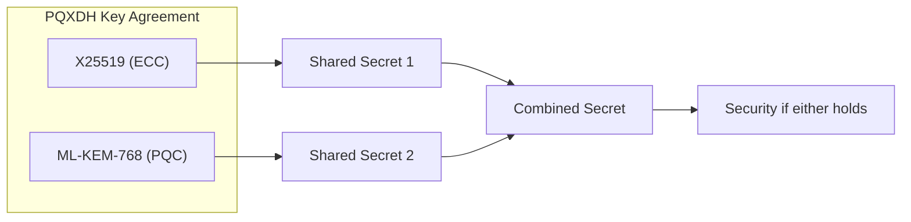
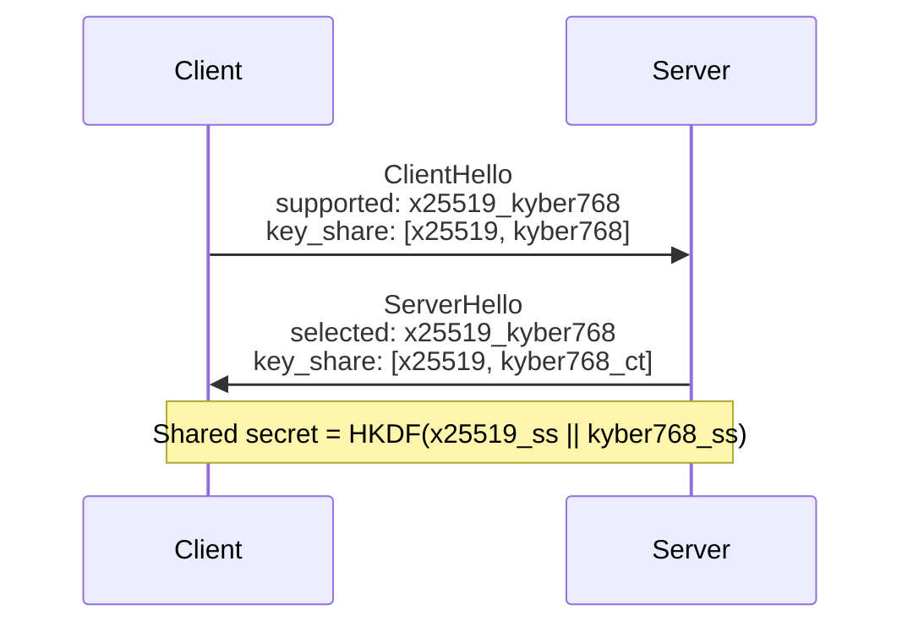
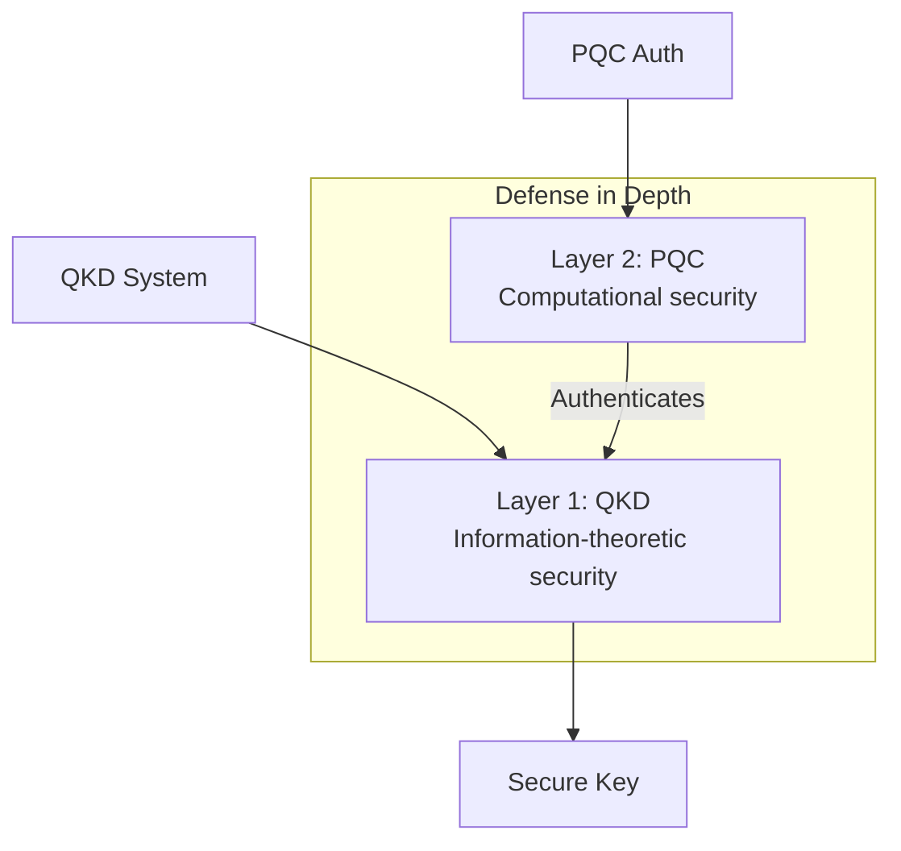

# Post-Quantum Cryptography (PQC): Comprehensive Review

## Overview

Post-Quantum Cryptography encompasses cryptographic algorithms designed to be secure against attacks by both classical and quantum computers. With the threat of quantum computers breaking current public-key cryptography (RSA, ECC, DH), PQC provides a migration path for classical systems.

---

## The Quantum Threat

### Vulnerable Algorithms

| Algorithm | Security Basis | Quantum Attack |
|-----------|---------------|----------------|
| RSA | Integer factorization | Shor's algorithm |
| ECC | Discrete logarithm | Shor's algorithm |
| DH/ECDH | Discrete logarithm | Shor's algorithm |
| DSA/ECDSA | Discrete logarithm | Shor's algorithm |

### Quantum-Resistant Primitives

| Primitive | Quantum Speedup | Status |
|-----------|-----------------|--------|
| AES-256 | Grover: √N | Secure (double key length) |
| SHA-256 | Grover: √N | Secure |
| SHA-3 | Grover: √N | Secure |

### Timeline Concerns

- **Harvest now, decrypt later**: Adversaries storing encrypted data today
- **Crypto-agility**: Systems must be ready to switch algorithms
- **Transition period**: Estimated 10-20 years for full migration

---

## NIST Standardization (2024-2025)

### Finalized Standards (August 2024)

#### FIPS 203: ML-KEM (CRYSTALS-Kyber)

**Type**: Key Encapsulation Mechanism (KEM)
**Basis**: Module Learning with Errors (MLWE)

| Parameter Set | Security Level | Public Key | Ciphertext | Shared Secret |
|---------------|---------------|------------|------------|---------------|
| ML-KEM-512 | 1 (AES-128) | 800 B | 768 B | 32 B |
| ML-KEM-768 | 3 (AES-192) | 1,184 B | 1,088 B | 32 B |
| ML-KEM-1024 | 5 (AES-256) | 1,568 B | 1,568 B | 32 B |

**Advantages**:
- Relatively small keys/ciphertexts
- Fast operations
- Well-studied security

#### FIPS 204: ML-DSA (CRYSTALS-Dilithium)

**Type**: Digital Signature Algorithm
**Basis**: Module Learning with Errors (MLWE)

| Parameter Set | Security Level | Public Key | Signature |
|---------------|---------------|------------|-----------|
| ML-DSA-44 | 2 | 1,312 B | 2,420 B |
| ML-DSA-65 | 3 | 1,952 B | 3,293 B |
| ML-DSA-87 | 5 | 2,592 B | 4,595 B |

**Advantages**:
- Balanced performance
- Deterministic signing option
- No need for secure randomness during signing

#### FIPS 205: SLH-DSA (SPHINCS+)

**Type**: Digital Signature Algorithm
**Basis**: Hash functions only

| Parameter Set | Security Level | Public Key | Signature |
|---------------|---------------|------------|-----------|
| SLH-DSA-128s | 1 | 32 B | 7,856 B |
| SLH-DSA-128f | 1 | 32 B | 17,088 B |
| SLH-DSA-256s | 5 | 64 B | 29,792 B |

**Advantages**:
- Conservative security assumptions
- Small public keys
- Stateless (unlike XMSS/LMS)

**Trade-offs**:
- Large signatures
- Slower signing/verification

### Selected for Standardization (March 2025)

#### HQC (Hamming Quasi-Cyclic)

**Type**: Key Encapsulation Mechanism
**Basis**: Quasi-cyclic codes (Hamming metric)

**Rationale for Selection**:
- Different mathematical basis than Kyber
- Backup in case of lattice breaks
- Code-based cryptography well-studied

---

## Algorithm Families

### 1. Lattice-Based

**Mathematical Basis**: Hardness of lattice problems (LWE, MLWE, Ring-LWE)

**Standardized**: ML-KEM, ML-DSA

**Other Notable**:
- **NTRU**: Original lattice-based encryption
- **FALCON**: Signature with smaller sizes (complex implementation)

**Security Assumption**:
```
LWE Problem:
Given (A, b = As + e mod q) where s is secret, e is small error
Find s

Believed hard for both classical and quantum computers
```

### 2. Code-Based

**Mathematical Basis**: Hardness of decoding random linear codes

**Selected**: HQC

**Other Notable**:
- **Classic McEliece**: Very large keys, long-studied
- **BIKE**: Quasi-cyclic codes

**Security Assumption**:
```
Syndrome Decoding Problem:
Given parity-check matrix H and syndrome s = He
Find error vector e with small Hamming weight
```

### 3. Hash-Based

**Mathematical Basis**: Security of hash functions only

**Standardized**: SLH-DSA (SPHINCS+)

**Other Notable**:
- **XMSS**: Stateful, in RFC 8391
- **LMS**: Stateful, in RFC 8554

**Security Assumption**:
```
Second preimage resistance of hash function
Collision resistance of hash function

Most conservative assumptions in PQC
```

### 4. Isogeny-Based

**Mathematical Basis**: Hardness of computing isogenies between elliptic curves

**Notable**:
- **SQIsign**: Compact signatures
- **SIKE**: Broken in 2022

**Current Status**:
- Active research area
- SQIsign variants (2D-East, 2D-West) improving
- Compact key/signature sizes attractive

### 5. Multivariate

**Mathematical Basis**: Solving systems of multivariate polynomials

**Status**: Most schemes broken or impractical

**Historical**:
- Rainbow: Broken in 2022
- GeMSS: Large signatures

---

## Hybrid Protocols

### PQXDH (Post-Quantum Extended Diffie-Hellman)

**Used by**: Signal Protocol

**Structure**:



**Advantages**:
- Graceful degradation
- Compatible with existing infrastructure
- Forward secrecy maintained

### TLS 1.3 Hybrid Key Exchange

**Approach**: Concatenate classical and PQ key shares



### Migration Strategies

1. **Hybrid only**: Always use classical + PQ
2. **PQ-first with fallback**: Prefer PQ, fall back to classical
3. **Gradual rollout**: Critical systems first
4. **Crypto-agility**: Design for algorithm switching

---

## Implementation Considerations

### Performance Comparison

| Algorithm | KeyGen | Encaps/Sign | Decaps/Verify |
|-----------|--------|-------------|---------------|
| ML-KEM-768 | 0.03 ms | 0.04 ms | 0.03 ms |
| ML-DSA-65 | 0.05 ms | 0.15 ms | 0.05 ms |
| SLH-DSA-128f | 3 ms | 50 ms | 3 ms |
| RSA-2048 | 50 ms | 0.1 ms | 3 ms |
| ECDSA-P256 | 0.1 ms | 0.2 ms | 0.5 ms |

### Bandwidth Impact

```
TLS Handshake Size Increase:
- Classical (ECDHE + ECDSA): ~1 KB
- Hybrid (X25519 + Kyber768 + Dilithium65): ~5 KB
- Increase: ~4x bandwidth for handshake
```

### Side-Channel Considerations

**Vulnerabilities**:
- Timing attacks on polynomial operations
- Power analysis on decapsulation
- Cache timing in hash computations

**Mitigations**:
- Constant-time implementations
- Masking for decapsulation
- Platform-specific hardening

---

## Integration with Quantum Protocols

### QKD + PQC Hybrid



### Quantum Random Number Generation

- **Application**: Seed generation for PQC algorithms
- **Benefit**: True randomness from quantum processes
- **Integration**: QRNG hardware modules

### Timeline Considerations

| Timeframe | Recommendation |
|-----------|----------------|
| Now | Deploy hybrid classical + PQC |
| 2025-2030 | Migrate to PQC-only for new systems |
| 2030+ | Full quantum networks available |

---

## Open Challenges

### Algorithm Maturity

- Lattice problems less studied than factoring
- New attacks possible (cf. SIKE break)
- Parameter selection may need adjustment

### Implementation Security

- Side-channel attacks on PQC less explored
- Fault injection attacks
- Hardware acceleration still developing

### Standards Evolution

- Additional algorithms may be standardized
- Parameter recommendations may change
- Interoperability standards needed

### Deployment

- Legacy system compatibility
- Performance impact on constrained devices
- Key management for larger keys

---

## Recent Research (2025-2026)

### Side-Channel Security

#### Timing Variability Analysis
- **Paper**: arXiv:2512.22301
- **Focus**: Statistical side-channel risk model for timing variability in lattice-based PQC
- **Contribution**: Framework for assessing timing leakage in implementations

### Implementation Optimizations

#### HQC Optimization
- **Paper**: arXiv:2512.12904 (OptHQC)
- **Focus**: High-performance HQC implementation
- **Target**: Production-ready code-based cryptography

#### SHA-3/SHAKE Architecture
- **Paper**: arXiv:2512.03616
- **Innovation**: Lightweight unified architecture with fault resilience
- **Application**: Hash functions for PQC schemes (SPHINCS+)

### Application-Specific PQC

#### Intelligent Transportation Systems
- **Paper**: arXiv:2601.01068
- **Scope**: Implementation-focused review for ITS
- **Coverage**: V2X communication, traffic management, autonomous vehicles

#### Vehicular Quantum Federated Learning
- **Paper**: arXiv:2512.02301 (vQFL)
- **Innovation**: Quantum-safe federated learning for vehicles
- **Application**: Privacy-preserving ML in automotive

### Hybrid Quantum-Classical Security

#### Combined Q/PQ Security
- **Paper**: arXiv:2512.04429
- **Analysis**: Performance under finite keys
- **Finding**: Optimal combination strategies for QKD + PQC

#### Adaptive Security Framework
- **Paper**: arXiv:2511.22416
- **Contribution**: Framework for extending quantum-safe communications to real networks
- **Focus**: Practical deployment strategies

### Zero-Knowledge Proofs (PQ-Compatible)

#### zk-SNARKs vs zk-STARKs
- **Paper**: arXiv:2512.10020
- **Analysis**: Comparative implementation-level analysis
- **Relevance**: STARKs are post-quantum secure (hash-based)

### Quantum-Safe Blockchain

#### QLink Bridge Architecture
- **Paper**: arXiv:2512.18488
- **Focus**: Quantum-safe blockchain interoperability
- **Application**: Secure cross-chain communication

### Secure Quantum Clouds

#### Homomorphic Encryption Integration
- **Paper**: arXiv:2512.17748
- **Focus**: Methods for secure quantum cloud computing
- **Case Study**: Homomorphic encryption with quantum systems

---

## Recommendations

### For New Systems

1. Use ML-KEM for key encapsulation
2. Use ML-DSA for signatures (or SLH-DSA for conservative security)
3. Implement in hybrid mode with classical algorithms
4. Design for crypto-agility

### For Existing Systems

1. Inventory current cryptographic usage
2. Prioritize based on data sensitivity and lifespan
3. Develop migration roadmap
4. Test hybrid implementations

### For High-Security Applications

1. Use SLH-DSA (hash-based) for maximum confidence
2. Consider defense-in-depth with QKD where feasible
3. Plan for algorithm agility
4. Monitor cryptanalysis developments

---

## References

1. NIST "Post-Quantum Cryptography Standardization" (2024-2025)
2. "PQXDH Key Agreement Protocol" Signal Specification
3. "Exploring Post-Quantum Cryptography: Review and Directions" MDPI (2024)
4. "A Comprehensive Review of Post-Quantum Cryptography" ePrint 2024/1940
5. RFC 8391: XMSS, RFC 8554: LMS
