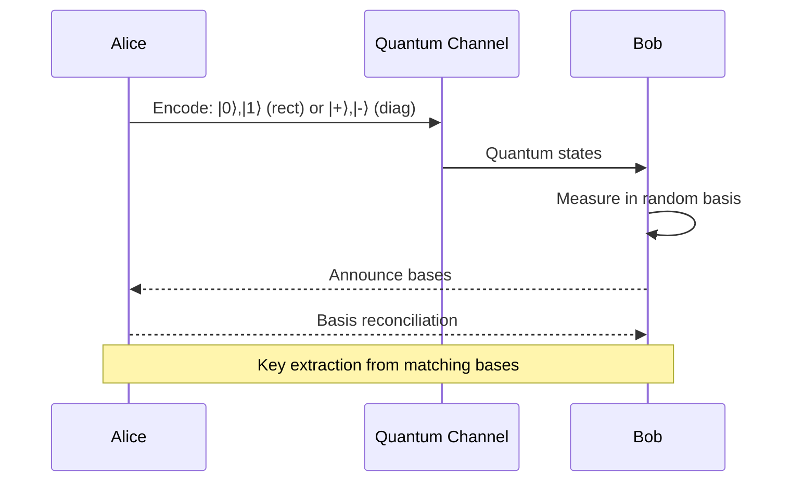
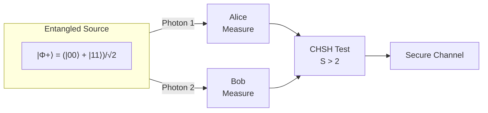
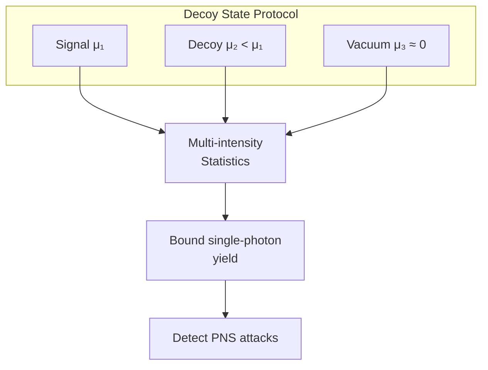

# Quantum Key Distribution (QKD) Protocols: Deep Dive

## Overview

Quantum Key Distribution enables two parties to establish a shared secret key with information-theoretic security, guaranteed by the laws of quantum mechanics. This document provides an in-depth analysis of QKD protocol families, security proofs, and practical implementations.

---

## Protocol Classification

### 1. Prepare-and-Measure Protocols

#### BB84 (Bennett-Brassard 1984)
- **States**: 4 polarization states in 2 conjugate bases (rectilinear: |0⟩, |1⟩; diagonal: |+⟩, |-⟩)
- **Security**: Based on no-cloning theorem and Heisenberg uncertainty
- **Key Rate**: ~50% sifting efficiency
- **Advantages**: Simple implementation, well-understood security



#### B92 (Bennett 1992)
- **States**: Only 2 non-orthogonal states
- **Security**: Derived from BB84 security
- **Efficiency**: Lower than BB84, but simpler
- **Use case**: Resource-constrained implementations

#### SARG04
- **Modification**: Different classical post-processing
- **Advantage**: More robust against photon-number splitting attacks
- **Trade-off**: Lower key rate than BB84

### 2. Entanglement-Based Protocols

#### E91 (Ekert 1991)
- **Resource**: Shared entangled pairs (Bell states)
- **Security**: Based on Bell inequality violations
- **Advantage**: Device-independent security possible
- **Detection**: CHSH inequality test



#### BBM92
- **Simplified E91**: Uses only 2 measurement bases
- **Equivalent**: To BB84 with entangled source in middle
- **Practical**: Easier implementation than full E91

### 3. Continuous-Variable Protocols

#### GG02 (Grosshans-Grangier 2002)
- **Encoding**: Gaussian modulation of coherent states
- **Detection**: Homodyne (single quadrature) or heterodyne (both)
- **Advantage**: Standard telecom components
- **Challenge**: Limited range due to loss sensitivity

#### Discrete-Modulated CV-QKD
- **States**: Finite constellation (e.g., QPSK)
- **Security**: Composable finite-key proofs available
- **Practical**: Better for real implementations
- **Key Paper**: Hajomer et al. arXiv:2410.13702

### 4. Twin-Field QKD (TF-QKD)

#### Concept
- **Innovation**: Single-photon interference at central node
- **Advantage**: Beats √η scaling → achieves η scaling
- **Range**: 500-600+ km demonstrated

#### Variants
1. **Phase-Matching (PM-TF-QKD)**
   - Global phase tracking required
   - Higher key rate

2. **Sending-or-Not-Sending (SNS)**
   - Simplified phase requirements
   - Robust against practical imperfections

3. **Mode-Pairing**
   - Combines benefits of both approaches

**Key Paper**: Arslan et al. "Twin-Field QKD: Protocols, Security, Open Problems" arXiv:2510.26320

### 5. Device-Independent QKD (DI-QKD)

#### Concept
- **Trust**: No assumptions on internal device workings
- **Security**: Derived from Bell inequality violation
- **Certification**: Randomness and privacy from nonlocality

#### Challenges
- **Detection loophole**: Requires high detection efficiency (>~82%)
- **Key rate**: Very low compared to prepare-and-measure
- **Distance**: Limited by Bell test requirements

#### Semi-Device-Independent Variants
- **MDI-QKD**: Measurement-device-independent
- **One-sided DI**: Partial device independence
- **Trade-off**: Security vs. practicality

---

## Security Analysis Framework

### Asymptotic Security

```
Key Rate (asymptotic) = 1 - H(E_x) - H(E_z)

Where:
- H(·) = binary entropy
- E_x, E_z = error rates in X and Z bases
```

### Finite-Key Security

Accounts for:
1. **Statistical fluctuations** in parameter estimation
2. **Smoothing parameter** ε for security definition
3. **Failure probability** in privacy amplification

```
Key Rate (finite) = n × [1 - H(E_x + δ) - leak_EC - Δ(ε)]

Where:
- n = number of signals
- δ = statistical correction
- leak_EC = error correction leakage
- Δ(ε) = finite-key correction
```

### Composable Security

- **Definition**: Security maintained when composed with other protocols
- **Framework**: Universal composability (UC) or Abstract Cryptography (AC)
- **Requirement**: Trace distance from ideal ≤ ε_sec

---

## Practical Attacks & Countermeasures

### Quantum Attacks

| Attack | Target | Countermeasure |
|--------|--------|----------------|
| Intercept-resend | Quantum channel | Error rate monitoring |
| PNS (Photon Number Splitting) | Multi-photon pulses | Decoy states |
| USD (Unambiguous State Discrimination) | Non-orthogonal states | Decoy states |
| Beam-splitting | Multi-photon pulses | Decoy states |

### Side-Channel Attacks

| Attack | Target | Countermeasure |
|--------|--------|----------------|
| Detector blinding | APD detectors | Active quenching, monitoring |
| Trojan horse | Source/detector | Optical isolators, filters |
| Timing | Classical processing | Constant-time implementations |
| Backflash | Detectors | Spectral filtering |

### Decoy State Method

- **Concept**: Send decoy pulses with different intensities
- **Detection**: PNS attacks cause intensity-dependent statistics
- **Implementation**: 2-3 decoy intensities typical



---

## Implementation Technologies

### Single-Photon Sources

1. **Attenuated lasers**: Most common, requires decoy states
2. **Quantum dots**: True single photons, developing
3. **SPDC**: Heralded single photons, complex setup
4. **NV centers**: Room temperature possible

### Single-Photon Detectors

| Technology | Efficiency | Dark Count | Timing | Temperature |
|------------|-----------|------------|--------|-------------|
| Si-APD | ~65% | 100 Hz | 50 ps | -20°C |
| InGaAs APD | ~25% | 1 kHz | 100 ps | -40°C |
| SNSPD | >90% | <1 Hz | <20 ps | <4 K |
| TES | >95% | <0.1 Hz | 100 ns | <100 mK |

### Fiber vs. Free-Space

| Aspect | Fiber | Free-Space |
|--------|-------|------------|
| Loss | 0.2 dB/km (1550nm) | Variable (weather) |
| Range | ~100 km (direct) | Limited by atmosphere |
| Infrastructure | Existing telecom | Line of sight |
| Satellite | Not applicable | Global reach |

---

## Current Records & Milestones

| Metric | Achievement | Method | Year |
|--------|-------------|--------|------|
| Distance (fiber) | 830 km | TF-QKD | 2024 |
| Distance (satellite) | 7,600 km | Micius | 2021 |
| Key rate | >10 Mbps | Short distance | 2023 |
| Network nodes | 46+ | Chinese backbone | 2023 |

---

## Recent Advances (2025-2026)

### Experimental Demonstrations

#### Coherent One-Way QKD (COW-QKD)
- **Paper**: arXiv:2601.06772 (Sci. Adv. 2026)
- **Achievement**: Practical security with simplified implementation
- **Key Features**: Simplified setup, improved key rates
- **Extension**: Point-to-multipoint capabilities (arXiv:2601.04543)

#### Source-Independent Protocols
- **SI-QCKA**: arXiv:2512.20038 - Efficient source-independent quantum conference key agreement
- **SI-QSS**: arXiv:2512.18325 - Source-independent quantum secret sharing against coherent attacks
- **Benefit**: Immunity against hacking attacks targeting source devices

#### High-Dimensional QKD
- **Paper**: arXiv:2512.20489 - Time-entanglement based quantum blockchain protocol
- **Application**: Quantum-secure blockchain systems
- **Innovation**: HD encoding for increased key rates

#### Quantum Secret Sharing (QSS)
- **Paper**: arXiv:2601.06919 - High-capacity dual DOF protocol
- **Achievement**: Beyond linear rate-distance bound
- **Method**: Dual degrees of freedom encoding

### Teleported Quantum Gates
- **Paper**: arXiv:2601.04848
- **Achievement**: Unconditionally teleported gates between remote solid-state qubits
- **Implication**: Foundation for distributed quantum computing

---

## Protocol Selection Guide

### For Maximum Security
→ **Device-Independent QKD** or **MDI-QKD**
- Accept lower key rates
- Suitable for highest-security applications

### For Maximum Distance
→ **Twin-Field QKD**
- Requires phase stabilization
- Best for backbone links

### For Practical Deployment
→ **BB84 with Decoy States** or **CV-QKD**
- Well-understood security
- Available commercial systems

### For Integration with Telecom
→ **Continuous-Variable QKD**
- Standard components
- Wavelength division multiplexing compatible

---

## References

1. Bennett, C.H., Brassard, G. "Quantum cryptography: Public key distribution and coin tossing" (1984)
2. Ekert, A.K. "Quantum cryptography based on Bell's theorem" (1991)
3. Lo, H.K., Curty, M., Qi, B. "Measurement-device-independent quantum key distribution" (2012)
4. Lucamarini, M. et al. "Overcoming the rate-distance limit of quantum key distribution" (2018)
5. Jha et al. "QKD: Bridging Theoretical Security Proofs..." arXiv:2511.20602 (2025)
