# Comprehensive Survey: Quantum Protocol Development

## Overview

This survey synthesizes the latest research in quantum protocol development, covering quantum key distribution (QKD), entanglement routing, post-quantum cryptography (PQC), network architectures, and hybrid classical-quantum integration. The goal is to inform the development of the next-generation quantum protocol network.

---

## Survey Structure

```mermaid
mindmap
  root((Quantum Protocol Development))
    QKD
      BB84/E91/B92
      Twin-Field QKD
      Device-Independent
      Continuous-Variable
    Networking
      Entanglement Routing
      Protocol Stack
      Repeaters
    PQC
      Lattice ML-KEM/DSA
      Code-based HQC
      Hash-based SPHINCS+
    Integration
      Q-Chip
      SQCC
      Hybrid Protocols
    Security
      Verification
      Side-channels
      Composability
    Hardware
      Photonics
      Memories
      Testbeds
```

## Table of Contents

- [1. Quantum Key Distribution (QKD) Protocols](#1-quantum-key-distribution-qkd-protocols)
- [2. Entanglement Routing & Network Architecture](#2-entanglement-routing--network-architecture)
- [3. Post-Quantum Cryptography (PQC)](#3-post-quantum-cryptography-pqc)
- [4. Quantum-Classical Hybrid Integration](#4-quantum-classical-hybrid-integration)
- [5. Protocol Verification & Security](#5-protocol-verification--security)
- [6. Hardware & Implementation](#6-hardware--implementation)
- [7. Open Challenges & Research Directions](#7-open-challenges--research-directions)

---

## 1. Quantum Key Distribution (QKD) Protocols

### Foundational Protocols

- **BB84** (Bennett-Brassard 1984): The original QKD protocol using four quantum states. Foundation for discrete-variable QKD.
- **E91** (Ekert 1991): Entanglement-based QKD using Bell inequality violations for security verification.
- **B92**: Simplified two-state protocol with reduced implementation complexity.

### Advanced QKD Variants

#### Twin-Field QKD (TF-QKD)
- Overcomes fundamental rate-distance limits of single-photon QKD
- Variants: Phase-Matching, Sending-or-Not-Sending
- Enables QKD over 500-600+ km without quantum repeaters
- **Key Paper**: "Twin-Field Quantum Key Distribution: Protocols, Security, and Open Problems" (Arslan et al., 2025) - arXiv:2510.26320

#### Continuous-Variable QKD (CV-QKD)
- Uses continuous quantum variables (quadratures of light)
- Compatible with existing telecom infrastructure
- Squeezed/coherent states with homodyne/heterodyne detection
- **Key Paper**: "A Survey on Continuous Variable Quantum Key Distribution" (Motaharifar et al., 2025)

#### Device-Independent QKD (DI-QKD)
- Security based on Bell inequality violations
- No trust assumptions on quantum devices
- Currently limited by low key rates
- **Key Paper**: "Device-Independent Quantum Key Distribution: Protocols, Quantum Games, and Security" (2025) - arXiv:2505.14243

#### High-Dimensional QKD (HD-QKD)
- Encodes multiple bits per photon using spatial modes, time-bins, or orbital angular momentum
- Improved noise resilience and channel capacity
- Trade-offs in complexity and channel loss

### QKD Security Analysis

- **Finite-key security**: Realistic analysis for limited communication rounds
- **Composable security**: Protocols secure when composed with other cryptographic primitives
- **Side-channel attacks**: Detector blinding, trojan horse attacks, photon-number splitting
- **Key Paper**: "Quantum Key Distribution: Bridging Theoretical Security Proofs, Practical Attacks, and Error Correction" (Jha et al., 2025) - arXiv:2511.20602

---

## 2. Entanglement Routing & Network Architecture

### Entanglement Routing Strategies

#### Taxonomy (NIST/Aliro Survey 2025)
1. **Proactive Routing**: Pre-established entanglement paths
2. **Reactive Routing**: On-demand entanglement generation
3. **Hybrid Routing**: Combination based on network conditions

#### Key Protocols
- **DODAG-X**: Efficient multipartite entanglement routing using embedded tree structures
- **GEM (Global Entanglement Module)**: Network-wide entanglement state management with adaptive heuristics

### Quantum Network Stack

#### Layers (analogous to OSI model)
1. **Physical Layer**: Photon sources, detectors, quantum memories
2. **Link Layer**: Entanglement generation, heralding
3. **Network Layer**: Entanglement routing, swapping
4. **Transport Layer**: End-to-end entanglement delivery
5. **Application Layer**: QKD, distributed computing, sensing

#### Key References
- RFC 9340: "Architectural Principles for a Quantum Internet"
- ITU-T Y.3800: Framework for networks supporting QKD
- **Key Paper**: "Quantum Internet protocol stack: A comprehensive survey" (ScienceDirect, 2022)

### Quantum Repeaters

- **Challenge**: Quantum memory coherence times, gate fidelities

---

## 3. Post-Quantum Cryptography (PQC)

### NIST Standardized Algorithms (2024-2025)

| Algorithm | Type | Standard |
|-----------|------|----------|
| ML-KEM (Kyber) | Lattice-based KEM | FIPS 203 |
| ML-DSA (Dilithium) | Lattice-based Signature | FIPS 204 |
| SLH-DSA (SPHINCS+) | Hash-based Signature | FIPS 205 |
| HQC | Code-based KEM | Selected March 2025 |

### PQC Algorithm Families

1. **Lattice-based**: CRYSTALS suite, NTRU
2. **Code-based**: HQC, BIKE, Classic McEliece
3. **Hash-based**: SPHINCS+, XMSS, LMS
4. **Isogeny-based**: SQIsign (compact signatures)
5. **Multivariate**: Rainbow (broken), GeMSS

### Hybrid Protocols

- **PQXDH**: Combines X25519 (ECC) + Kyber (PQ-KEM)
- Used in Signal protocol for forward secrecy
- **Key Paper**: "Exploring Post-Quantum Cryptography: Review and Directions for the Transition Process" (MDPI, 2024)

### PQC Integration Challenges

- Performance overhead (CPU, memory, bandwidth)
- Cryptographic agility for algorithm updates
- Backward compatibility with existing systems
- Side-channel resistance in implementations

---

## 4. Quantum-Classical Hybrid Integration

### Q-Chip (University of Pennsylvania, 2025)

- Sends quantum signals with classical IP headers
- Enables routing through existing network infrastructure
- Preserves quantum state integrity during transit
- **Impact**: Bridges quantum and classical networks

### DARPA QuANET

- Quantum-Augmented Network prototype
- Combines quantum and classical links
- Metrics: throughput, latency, security
- Real-world experimental deployments

### Simultaneous Quantum-Classical Communication (SQCC)

- Gaussian post-selection for dynamic channel adaptation
- Improved performance in fluctuating channels
- No hardware changes required
- **Key Paper**: arXiv:2510.13138

### Integration Challenges

1. **Synchronization**: Precise timing (ns/ps) for quantum operations
2. **Noise isolation**: Protecting quantum signals from classical interference
3. **Multiplexing**: Efficient use of shared fiber channels
4. **Control plane security**: Protecting classical headers and metadata

---

## 5. Protocol Verification & Security

### Formal Verification

- **CDQL (Concurrent Dynamic Quantum Logic)**: Logic framework for verifying concurrent quantum protocols
- Automated verification with "lazy rewriting" optimization
- **Key Paper**: "Automated Quantum Protocol Verification Based on CDQL" (ACM TOSEM, 2024)

### State Verification

- Classical shadow tomography for efficient state checking
- Improved sample complexity for GHZ, stabilizer states
- **Key Paper**: arXiv:2410.15870

### On-Device Verification

- Cryptographic protocols for self-verifying quantum computers
- Detects tampering and errors even with noisy gates
- Demonstrated on Quantinuum H1-1 processor

### Security Considerations

1. **Device-independent security**: Bell test-based verification
2. **Finite-key effects**: Security in realistic scenarios
3. **Composable security**: Integration with other protocols
4. **Side-channel resistance**: Implementation security

---

## 6. Hardware & Implementation

### Photonic Systems

- **Single-photon sources**: Quantum dots, spontaneous parametric down-conversion
- **Detectors**: Superconducting nanowire (SNSPD), avalanche photodiodes
- **Integrated photonics**: Chip-scale quantum devices

### Quantum Memories

- **Atomic ensembles**: Rubidium, cesium vapor cells
- **Solid-state**: NV centers in diamond, rare-earth ions
- **Key metric**: Coherence time vs. efficiency

### Telecom Integration

#### PhotonSync Technology
- Converts standard fiber to quantum-grade channels
- Active phase/frequency stabilization
- Enables TF-QKD over 1000+ km

#### Erbium Molecular Qubits
- Telecom-band compatible (1550 nm)
- Direct fiber-optic interfacing
- Spin-photon hybrid systems

### Testbeds & Demonstrations

1. **Quantum Internet Alliance** (Europe): Full-stack prototype networks
2. **NIST NG-QNet**: US quantum network testbed
3. **China Quantum Network**: Micius satellite + ground backbone
4. **KIT Karlsruhe**: Long-distance QKD facility

---

## 7. Open Challenges & Research Directions

### Scalability

- Efficient quantum repeaters for continental distances
- Multipartite entanglement distribution at scale
- Resource optimization in large networks

### Security

- Practical device-independent protocols
- Side-channel resistant implementations
- Security proofs for hybrid systems

### Integration

- Standardized quantum-classical interfaces
- Protocol stack interoperability
- Legacy infrastructure migration

### Performance

- Key rate improvements for QKD
- Latency optimization for routing
- Fidelity vs. throughput trade-offs

### Standardization

- International protocol standards
- Certification frameworks
- Vendor interoperability

---

## Key Research Groups & Initiatives

| Organization | Focus Area |
|-------------|------------|
| QuTech (TU Delft) | Quantum internet, network simulation |
| NIST | Standards, entanglement routing |
| Aliro Technologies | Commercial quantum networks |
| Open Quantum Safe | PQC library development |
| Quantum Internet Alliance | European quantum infrastructure |
| DARPA | QuANET, military applications |
| McKinsey QTM | Market analysis, trends |

---

---

## Quantum-Secure Blockchain Reference: Quantus Network

Quantus Network represents a production-grade implementation of quantum-secure blockchain principles.

### Key Design Principles

1. **Post-Quantum Signatures**: ML-DSA-87 (FIPS 204) for all transaction signatures
2. **ZK-Compressed Verification**: Recursive proofs reduce validation overhead
3. **Reversible Transactions**: Task-master enables secure transaction recovery
4. **Hardware Wallet Support**: Keystone3 firmware integration

---

## Synthesis: Next-Generation Protocol Network

### Design Requirements

| Component | Requirement | Reference Implementation |
|-----------|-------------|-------------------------|
| Signatures | ML-DSA-87 or SPHINCS+ | qp-rusty-crystals |
| Key Exchange | ML-KEM-1024 or hybrid | liboqs |
| Hash Functions | Poseidon2 (ZK-friendly) | qp-poseidon |
| ZK Proofs | Plonky2 recursive | qp-plonky2 |
| Networking | PQ-secure P2P | qp-libp2p-identity |
| Threshold Crypto | MPC-based | near-mpc |

---

---

## Latest Research Synthesis (January 2026)

### QKD & Quantum Communication

| Paper | Focus | Key Innovation |
|-------|-------|----------------|
| arXiv:2601.06772 | COW-QKD | Practical security, simplified implementation |
| arXiv:2601.04543 | COW-QKD extension | Point-to-multipoint |
| arXiv:2601.06919 | QSS | Beyond linear rate-distance bound |
| arXiv:2512.20038 | SI-QCKA | Source-independent conference key |
| arXiv:2512.18325 | SI-QSS | Coherent attack resistance |
| arXiv:2512.20489 | HD-QKD | Time-entanglement blockchain |

### Entanglement Routing & Repeaters

| Paper | Topic | Contribution |
|-------|-------|--------------|
| arXiv:2512.19896 | Microwave repeater | Grid-state encoding, autonomous QEC |
| arXiv:2512.21655 | Hybrid repeaters | Atom-based QPU + memory multiplexers |
| arXiv:2511.20628 | Routing | Non-isotonic network algorithms |
| arXiv:2510.11585 | Memory | Telecom-compatible cross-band |
| arXiv:2504.11670 | Distillation | Adaptive error correction |
| arXiv:2503.14712 | Distribution | Joint distribution/purification |
| arXiv:2601.08581 | Swapping | Deterministic entanglement |

### Post-Quantum Cryptography

| Paper | Focus | Application |
|-------|-------|-------------|
| arXiv:2512.22301 | Timing side-channels | Lattice implementation security |
| arXiv:2512.12904 | OptHQC | High-performance code-based |
| arXiv:2601.01068 | ITS | Transportation systems |
| arXiv:2512.04429 | Q+PQ hybrid | Finite-key security |
| arXiv:2512.10020 | ZK comparison | STARKs for PQ security |
| arXiv:2512.18488 | QLink | Blockchain interoperability |

### Distributed Quantum Computing

| Paper | Focus | Achievement |
|-------|-------|-------------|
| arXiv:2601.04848 | Teleported gates | Unconditional remote gates |
| arXiv:2601.08389 | Photonic framework | Linear optical distributed QC |
| arXiv:2601.07241 | Fault-tolerant | Surface codes with single-shot emission |

### Privacy & Anonymous Communication

| Paper | Topic | Innovation |
|-------|-------|------------|
| arXiv:2512.21047 | Anonymous communication | Device-independent anonymity in quantum networks |

---

## References

### Surveys & Reviews
1. Jha et al. "QKD: Bridging Theoretical Security Proofs..." arXiv:2511.20602 (2025)
2. NIST/Aliro "Entanglement Routing Survey" (2025)
3. "Quantum Internet protocol stack" ScienceDirect (2022)
4. "Twin-Field QKD: Protocols, Security, Open Problems" arXiv:2510.26320 (2025)
5. "Post-Quantum Cryptography and Quantum-Safe Security" arXiv:2510.10436 (2025)
6. Forbes et al. "Heralded generation of entanglement with photons" Rep. Prog. Phys. 88 (2025)

### Standards
1. RFC 9340: Architectural Principles for Quantum Internet
2. NIST FIPS 203-205: PQC Standards
3. ITU-T Y.3800: QKD Network Framework
4. ETSI QKD Standards Series

### Key Papers (2025-2026)
1. QuIP Framework: arXiv:2406.14597
2. GEM Architecture: arXiv:2509.16817
3. SQCC Protocol: arXiv:2510.13138
4. Quantum Blockchain: arXiv:2512.20489
5. Quantum Conference Key Agreement: arXiv:2503.24318
6. Gate-Based Microwave Repeater: arXiv:2512.19896
7. Non-Isotonic Routing: arXiv:2511.20628
8. Combined Q+PQ Security: arXiv:2512.04429
9. Teleported Quantum Gates: arXiv:2601.04848
10. COW-QKD Experimental: arXiv:2601.06772

### Reference Implementations
1. Quantus Network: https://github.com/Quantus-Network
2. Open Quantum Safe: https://github.com/open-quantum-safe
3. QuNetSim: https://github.com/tqsd/QuNetSim
4. SeQUeNCe: https://github.com/sequence-toolbox/SeQUeNCe
5. SimulaQron: https://github.com/SoftwareQuTech/SimulaQron
6. NetSquid: https://netsquid.org/