# Quantum Resistance Model: Adaptive PQC + Sequencer + TEE Architecture

## Abstract

A protocol architecture combining quantum-level threat monitoring, concurrent redundant post-quantum cryptography, and TEE-secured sequencer consensus. Designed for chain development kit compatibility (Substrate, Cosmos SDK, OP Stack).

---

## Architecture Overview

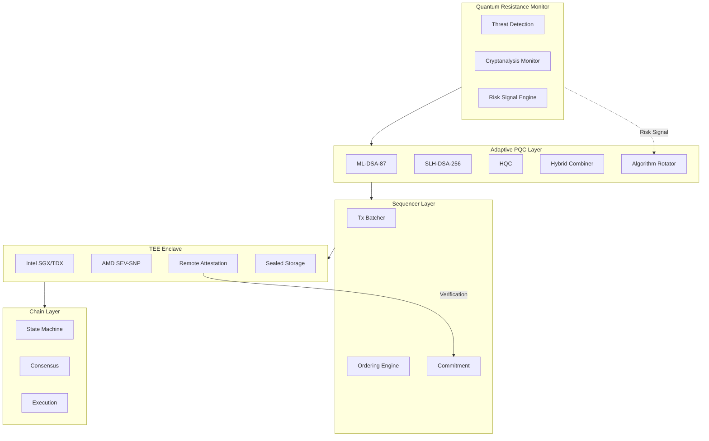

---

## Component 1: Quantum Resistance Monitor (QRM)

### Purpose

Continuous monitoring of quantum threat landscape with automated risk assessment and algorithm rotation signals.

### Architecture

```mermaid
flowchart LR
    subgraph Input["Input Sources"]
        ARXIV["arXiv/IACR Feed"]
        NIST["NIST Announcements"]
        QHARDWARE["Quantum HW Metrics"]
        ATTACKS["Attack Reports"]
    end
    
    subgraph QRM["QRM Core"]
        INGEST["Ingestion Layer"]
        PARSE["Semantic Parser"]
        CLASSIFY["Threat Classifier"]
        RISK["Risk Scorer"]
        POLICY["Policy Engine"]
    end
    
    subgraph Output["Output Signals"]
        ALERT["Alert Queue"]
        ROTATE["Rotation Trigger"]
        AUDIT["Audit Log"]
    end
    
    Input --> INGEST
    INGEST --> PARSE
    PARSE --> CLASSIFY
    CLASSIFY --> RISK
    RISK --> POLICY
    POLICY --> Output
```

### Threat Classification Matrix

| Threat Class | Indicators | Response |
|--------------|------------|----------|
| **Q-Day Imminent** | Fault-tolerant QC announced, >4000 logical qubits | Emergency algorithm rotation |
| **Algorithm Compromise** | Practical attack published, NIST deprecation | Scheduled rotation, increased redundancy |
| **Side-Channel** | Implementation vulnerability, timing leak | Patch cycle, TEE hardening |
| **Cryptanalytic Advance** | Reduced security margin, new attack technique | Monitoring escalation |

### Risk Scoring Model

```
RiskScore = Σ(wi × ti) / Σwi

Where:
  ti = Threat indicator score [0,1]
  wi = Indicator weight
  
Indicators:
  - Quantum hardware progress (qubit count, coherence time, gate fidelity)
  - Cryptanalysis publications (attack complexity reduction)
  - NIST/standards body guidance
  - Industry compromise reports
```

### Data Sources

| Source | Type | Polling |
|--------|------|---------|
| arXiv cs.CR, quant-ph | Papers | Daily |
| NIST CSRC | Announcements | Hourly |
| IACR ePrint | Cryptanalysis | Daily |
| IBM/Google Quantum | Hardware metrics | Weekly |
| CVE Database | Vulnerabilities | Continuous |

---

## Component 2: Adaptive PQC Layer (APQC)

### Purpose

Concurrent execution of multiple PQC algorithms with combinatorial security guarantees and runtime algorithm rotation.

### Design Principles

1. **Redundancy**: Multiple algorithms from different mathematical families
2. **Independence**: Failure of one family does not compromise security
3. **Agility**: Hot-swap algorithms without protocol upgrade
4. **Performance**: Parallel execution minimizes latency overhead

### Algorithm Selection

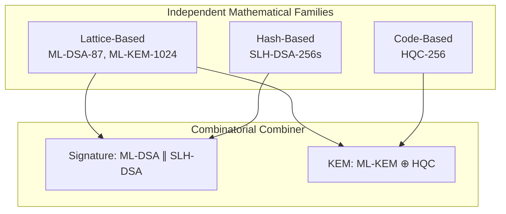

### Signature Scheme: Concurrent Dual-Sign

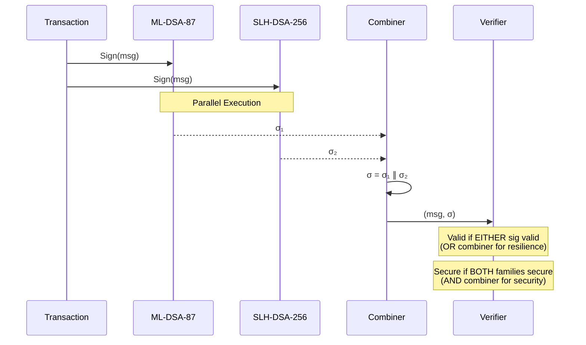

### Key Encapsulation: Hybrid KEM

```rust
// Hybrid KEM combining ML-KEM and HQC
struct HybridKEM {
    ml_kem: MlKem1024,
    hqc: Hqc256,
}

impl HybridKEM {
    fn encapsulate(&self, pk: &HybridPublicKey) -> (Ciphertext, SharedSecret) {
        // Parallel encapsulation
        let (ct1, ss1) = self.ml_kem.encapsulate(&pk.ml_kem);
        let (ct2, ss2) = self.hqc.encapsulate(&pk.hqc);
        
        // Combine shared secrets
        let combined_ss = HKDF::extract_and_expand(
            &[ss1.as_bytes(), ss2.as_bytes()].concat(),
            b"HybridKEM-v1"
        );
        
        (HybridCiphertext { ct1, ct2 }, combined_ss)
    }
}
```

### Algorithm Rotation Protocol

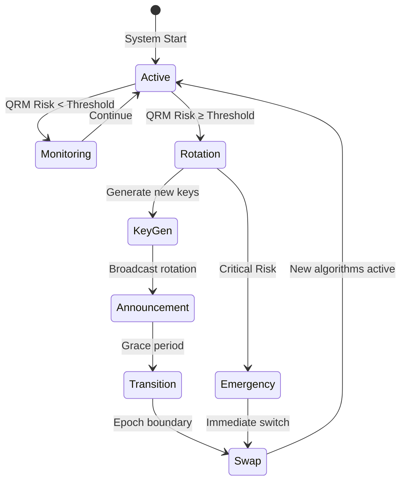

### Rotation Parameters

| Parameter | Value | Description |
|-----------|-------|-------------|
| `RISK_THRESHOLD_SCHEDULED` | 0.6 | Trigger scheduled rotation |
| `RISK_THRESHOLD_EMERGENCY` | 0.9 | Trigger emergency rotation |
| `GRACE_PERIOD_BLOCKS` | 1000 | Blocks for key transition |
| `KEY_OVERLAP_EPOCHS` | 2 | Epochs accepting both old/new |

---

## Component 3: TEE-Secured Sequencer

### Purpose

Trusted execution environment for transaction ordering, preventing MEV extraction and ensuring ordering fairness with quantum-resistant attestation.

### Architecture

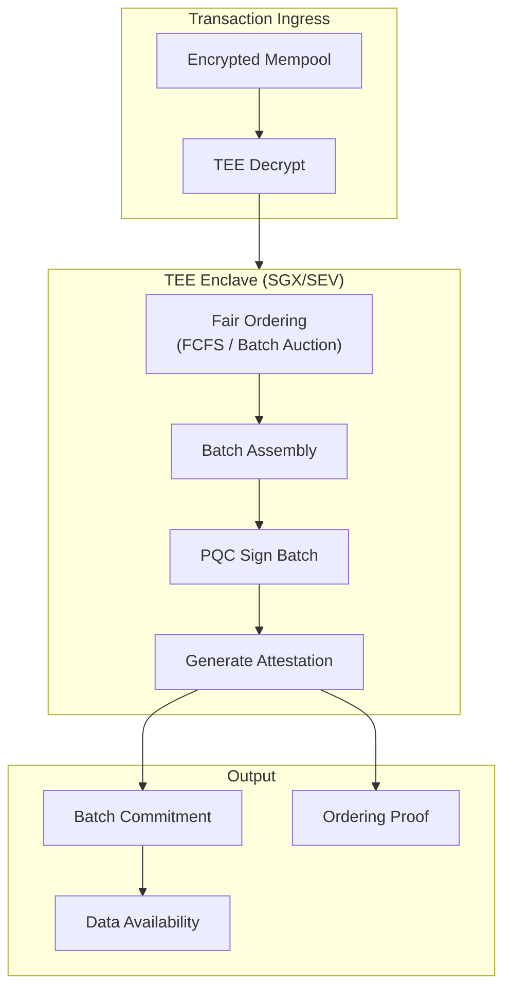

### Encrypted Mempool

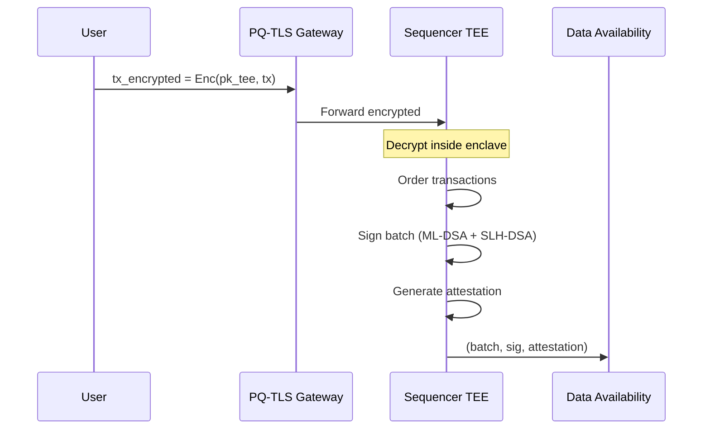

### TEE Attestation with PQC

```rust
struct TeeAttestation {
    // Platform attestation (SGX/TDX/SEV)
    platform_report: PlatformReport,
    
    // Enclave measurement
    mrenclave: [u8; 32],
    mrsigner: [u8; 32],
    
    // PQC signature over attestation
    pqc_sig: DualSignature, // ML-DSA + SLH-DSA
    
    // Timestamp and nonce
    timestamp: u64,
    nonce: [u8; 32],
}

impl TeeAttestation {
    fn verify(&self, expected_mrenclave: &[u8; 32]) -> Result<(), Error> {
        // 1. Verify platform report (Intel/AMD root of trust)
        self.platform_report.verify()?;
        
        // 2. Verify enclave measurement
        if &self.mrenclave != expected_mrenclave {
            return Err(Error::MeasurementMismatch);
        }
        
        // 3. Verify PQC signature
        self.pqc_sig.verify_dual(self.attestation_data())?;
        
        Ok(())
    }
}
```

### Ordering Modes

| Mode | Description | Properties |
|------|-------------|------------|
| **FCFS** | First-come-first-served | Simple, low latency |
| **Batch Auction** | Periodic batch with uniform price | MEV-resistant |
| **Threshold Decrypt** | MPC-based delayed decrypt | Strongest MEV protection |
| **VDF-Ordered** | Verifiable delay function | Deterministic fairness |

---

## Component 4: Chain Integration Layer

### Chain Development Kit Compatibility

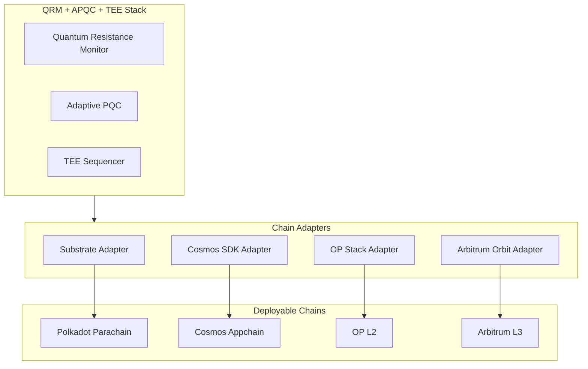

### Substrate Integration

```rust
// Substrate pallet for APQC
#[pallet]
pub mod pallet_apqc {
    use frame_support::pallet_prelude::*;
    
    #[pallet::config]
    pub trait Config: frame_system::Config {
        type RuntimeEvent: From<Event<Self>> + IsType<<Self as frame_system::Config>::RuntimeEvent>;
        type PqcProvider: PqcSigner + PqcVerifier;
        type QrmOracle: QrmRiskOracle;
    }
    
    #[pallet::storage]
    pub type ActiveAlgorithms<T> = StorageValue<_, AlgorithmSet, ValueQuery>;
    
    #[pallet::storage]
    pub type RiskScore<T> = StorageValue<_, u32, ValueQuery>; // 0-10000 basis points
    
    #[pallet::call]
    impl<T: Config> Pallet<T> {
        #[pallet::weight(10_000)]
        pub fn rotate_algorithms(
            origin: OriginFor<T>,
            new_set: AlgorithmSet,
            qrm_proof: QrmSignal,
        ) -> DispatchResult {
            ensure_root(origin)?;
            ensure!(qrm_proof.verify(), Error::<T>::InvalidQrmProof);
            ActiveAlgorithms::<T>::put(new_set);
            Self::deposit_event(Event::AlgorithmsRotated { new_set });
            Ok(())
        }
    }
}
```

### Cosmos SDK Integration

```go
// Cosmos SDK module for APQC
type APQCKeeper struct {
    storeKey   sdk.StoreKey
    pqcSigner  PQCSigner
    qrmOracle  QRMOracle
}

func (k APQCKeeper) VerifyPQCSignature(
    ctx sdk.Context,
    msg []byte,
    sig DualSignature,
    pubkey DualPublicKey,
) error {
    // Verify ML-DSA component
    if err := k.pqcSigner.VerifyMLDSA(msg, sig.MLDSA, pubkey.MLDSA); err != nil {
        // Check SLH-DSA as fallback (OR combiner for availability)
        if err := k.pqcSigner.VerifySLHDSA(msg, sig.SLHDSA, pubkey.SLHDSA); err != nil {
            return ErrInvalidSignature
        }
    }
    return nil
}

func (k APQCKeeper) CheckRotationNeeded(ctx sdk.Context) bool {
    risk := k.qrmOracle.GetCurrentRisk(ctx)
    threshold := k.GetRotationThreshold(ctx)
    return risk >= threshold
}
```

### OP Stack Integration

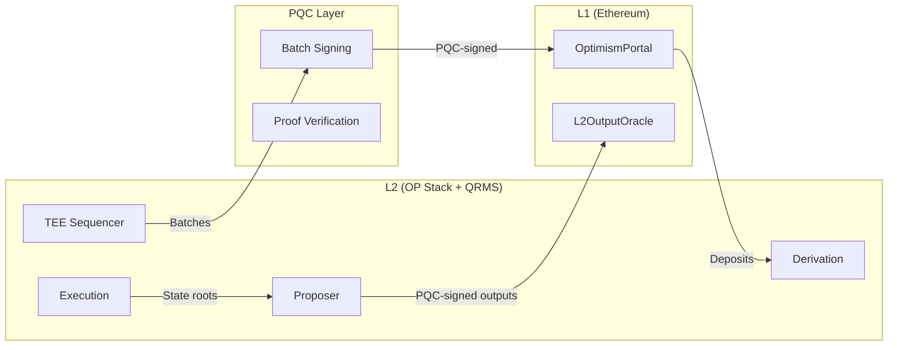

---

## Component 5: Deployment Architecture

### Node Architecture

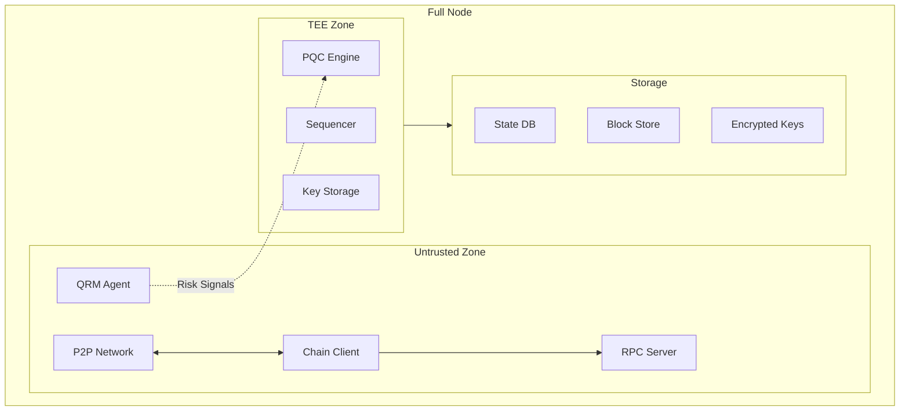

### Key Management

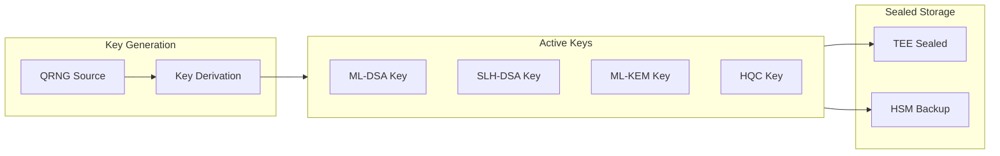

### High Availability

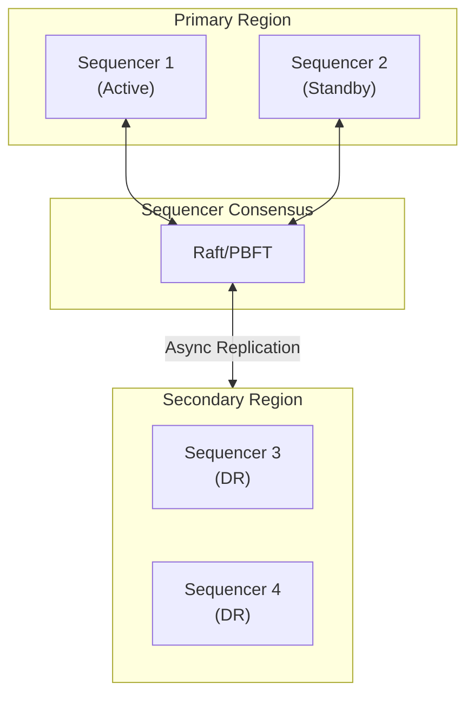

---

## Implementation Roadmap

### Phase 1: Foundation

| Component | Implementation | Dependencies |
|-----------|----------------|--------------|
| APQC Core | ML-DSA + SLH-DSA dual signing | liboqs, qp-rusty-crystals |
| Basic TEE | SGX enclave for sequencer | Intel SGX SDK |
| Chain Adapter | Substrate pallet | Substrate framework |

### Phase 2: Monitoring

| Component | Implementation | Dependencies |
|-----------|----------------|--------------|
| QRM Agent | arXiv/IACR monitoring | NLP pipeline |
| Risk Scorer | Threat classification model | ML framework |
| Rotation Protocol | On-chain governance for rotation | Chain adapter |

### Phase 3: Full Stack

| Component | Implementation | Dependencies |
|-----------|----------------|--------------|
| Hybrid KEM | ML-KEM + HQC combiner | Phase 1 |
| Multi-TEE | TDX + SEV support | Platform SDKs |
| Cross-Chain | Cosmos IBC / OP bridges | Phase 2 |

---

## Security Analysis

### Threat Model

| Threat | Mitigation |
|--------|------------|
| Quantum computer breaks ML-DSA | SLH-DSA (hash-based) remains secure |
| Side-channel on TEE | PQC rotation, constant-time impl |
| MEV extraction | Encrypted mempool, TEE ordering |
| Algorithm downgrade | On-chain minimum algorithm set |
| Key compromise | Threshold signatures, rotation |

### Security Guarantees

1. **Post-Quantum Secure**: Redundant PQC from independent mathematical families
2. **Forward Secrecy**: Hybrid KEM with ephemeral keys
3. **Ordering Fairness**: TEE-enforced with attestation proofs
4. **Algorithm Agility**: Runtime rotation without hard fork

### Formal Security Model

```
Security holds if:
  ∃ family F ∈ {Lattice, Hash, Code} : F is secure against QPT adversary
  
Where QPT = Quantum Polynomial Time

Advantage bound:
  Adv[A] ≤ Adv_MLDSA[A] × Adv_SLHDSA[A] × Adv_TEE[A]
  
For AND combiner (security), OR combiner for availability.
```

---

## Configuration Reference

### Environment Variables

```bash
# QRM Configuration
QRM_ARXIV_POLLING_INTERVAL=86400       # seconds
QRM_RISK_THRESHOLD_SCHEDULED=6000      # basis points (0.6)
QRM_RISK_THRESHOLD_EMERGENCY=9000      # basis points (0.9)

# APQC Configuration
APQC_PRIMARY_SIG=ML-DSA-87
APQC_SECONDARY_SIG=SLH-DSA-256s
APQC_PRIMARY_KEM=ML-KEM-1024
APQC_SECONDARY_KEM=HQC-256

# TEE Configuration
TEE_PLATFORM=SGX                        # SGX | TDX | SEV
TEE_ATTESTATION_REFRESH=3600           # seconds
TEE_SEALED_KEY_PATH=/sealed/keys

# Sequencer Configuration
SEQ_ORDERING_MODE=BATCH_AUCTION
SEQ_BATCH_SIZE=1000
SEQ_BATCH_TIMEOUT_MS=500
```

### Genesis Configuration

```json
{
  "quantum_resistance": {
    "apqc": {
      "signature_algorithms": ["ML-DSA-87", "SLH-DSA-256s"],
      "kem_algorithms": ["ML-KEM-1024", "HQC-256"],
      "combiner_mode": "dual_redundant",
      "rotation_governance": "council"
    },
    "qrm": {
      "enabled": true,
      "risk_threshold_scheduled": 6000,
      "risk_threshold_emergency": 9000,
      "grace_period_blocks": 1000
    },
    "tee": {
      "required": true,
      "platforms": ["SGX", "TDX", "SEV"],
      "attestation_required": true
    }
  }
}
```

---

## References

1. NIST FIPS 203-205: ML-KEM, ML-DSA, SLH-DSA Standards (2024)
2. HQC Specification: NIST PQC Round 4 (2025)
3. Intel TDX Architecture: Intel Trust Domain Extensions
4. AMD SEV-SNP: Secure Encrypted Virtualization
5. arXiv:2512.04429: Combined Q+PQ Security Analysis
6. arXiv:2511.22416: Adaptive Security Framework
7. Substrate Framework: https://substrate.io
8. Cosmos SDK: https://docs.cosmos.network
9. OP Stack: https://stack.optimism.io
