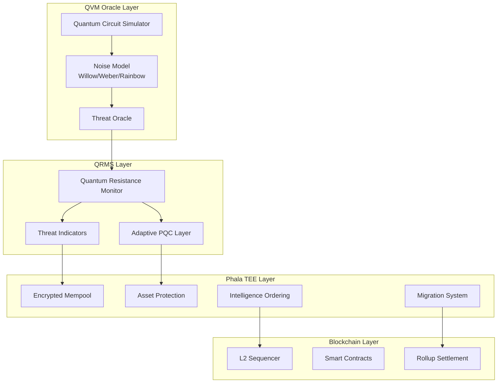
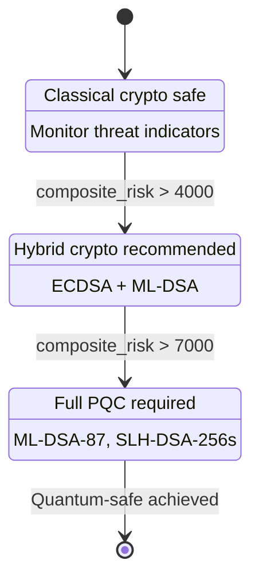
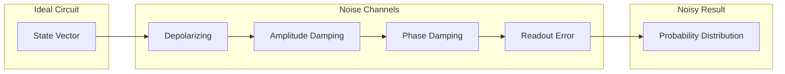
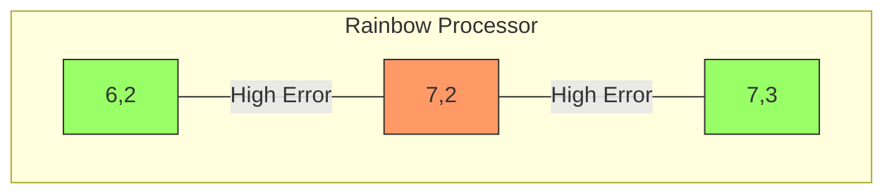
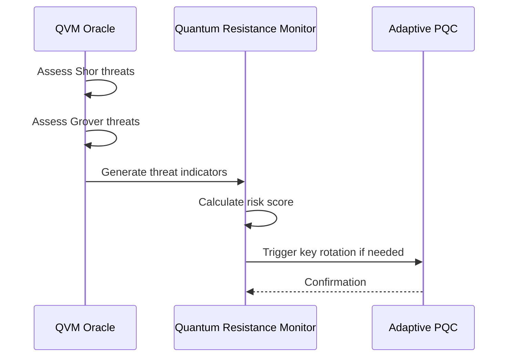
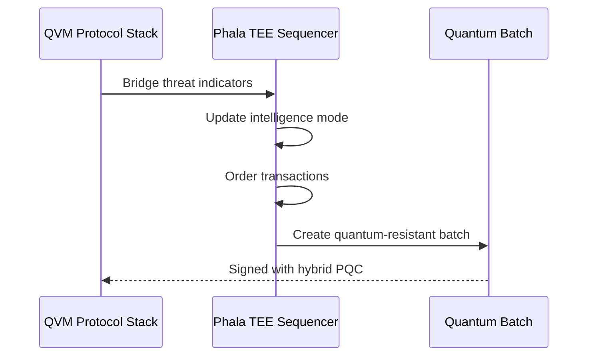

# Quantum Virtual Machine (QVM) Integration

QuantumAegis integrates Google's Quantum Virtual Machine as an oracle layer that sits between the TEE and sequencer, providing quantum-aware security decisions.

## Architecture Overview



## Protocol Stack Layers

### Layer 1: QVM Oracle

The topmost layer implements a virtual quantum processor for threat assessment.

| Component | Purpose |
|-----------|---------|
| Circuit Simulator | State vector simulation with noise |
| Noise Model | Hardware-accurate noise from calibration |
| Grover Oracle | Symmetric crypto threat assessment |
| Shor Oracle | Asymmetric crypto threat assessment |

### Layer 2: QRMS

Contains the Quantum Resistance Monitor and Adaptive PQC Layer.

| Component | Purpose |
|-----------|---------|
| QRM | 12-category threat monitoring |
| APQC | Hybrid ML-DSA + SLH-DSA + ECDSA |
| Threat Indicators | Real-time risk assessment |

### Layer 3: Phala TEE

Trusted execution environment for secure transaction processing.

| Component | Purpose |
|-----------|---------|
| Encrypted Mempool | MEV protection |
| Asset Protection | On/off-chain asset security |
| Migration System | State preservation during upgrades |
| Intelligence Ordering | Risk-aware transaction ordering |

### Layer 4: Blockchain

L2 sequencer and smart contract integration.

## Supported Quantum Processors

| Processor | Qubits | 2Q Error | T1 (μs) | Use Case |
|-----------|--------|----------|---------|----------|
| Willow Pink | 105 | 0.34% | 70 | Production simulation |
| Weber | 72 | 0.60% | 25 | Standard testing |
| Rainbow | 53 | 0.90% | 20 | Legacy testing |
| Custom | N | Configurable | - | Research |

## Threat Assessment

### Grover's Algorithm Threats

Grover provides quadratic speedup for unstructured search.

```mermaid
graph LR
    subgraph Classical["Classical Search"]
        C1[O(2^n) operations]
    end
    
    subgraph Quantum["Quantum Search"]
        Q1[O(2^n/2) operations]
    end
    
    C1 -->|Grover| Q1
```

**Assessment Formula:**

```
iterations = π/4 × √(2^n)
logical_qubits = n + overhead
physical_qubits = logical × error_correction_factor
time_years = total_gates / gates_per_second
```

**Assessed Algorithms:**

- AES-128: 128-bit → 64-bit effective
- AES-256: 256-bit → 128-bit effective
- SHA-256: 256-bit preimage
- Keccak-256: 256-bit preimage

### Shor's Algorithm Threats

Shor breaks public key cryptography based on factoring and discrete log.

```mermaid
graph TD
    subgraph Target["Target Algorithms"]
        RSA[RSA<br/>Factoring]
        ECDSA[ECDSA<br/>Discrete Log]
        BLS[BLS<br/>Pairing]
    end
    
    subgraph Requirements["Shor Requirements"]
        LQ[Logical Qubits<br/>2n-6n depending on algorithm]
        TG[T-Gates<br/>O(n³) for RSA]
        EC[Error Correction<br/>~1000× overhead]
    end
    
    Target --> Requirements
```

**Assessment Formula:**

```
logical_qubits (RSA) = 2n + 5
logical_qubits (ECDSA) = 6n + 10
t_gates (RSA) = n³
physical_qubits = logical × code_distance²
time_hours = t_gates × gate_time × magic_state_overhead
```

## Threat Levels

| Level | Score | Description | Action |
|-------|-------|-------------|--------|
| None | 0 | No realistic threat | Continue classical |
| Theoretical | 0-1000 | Possible in theory | Monitor |
| Long-term | 1000-3000 | >10 years | Plan migration |
| Medium-term | 3000-5000 | 5-10 years | Schedule rotation |
| Near-term | 5000-7500 | 2-5 years | Begin migration |
| Imminent | 7500-10000 | Current tech | Emergency rotation |

## Quantum Era Transitions



## Circuit Simulation

The QVM supports running quantum circuits for custom threat analysis.

### Supported Gates

**Single-Qubit:**
- X, Y, Z (Pauli gates)
- H (Hadamard)
- S, T (Phase gates)
- Rx, Ry, Rz (Rotation gates)

**Two-Qubit:**
- CZ (Controlled-Z)
- CNOT (Controlled-NOT)
- iSWAP, √iSWAP

### Pre-built Circuits

| Circuit | Purpose | Qubits |
|---------|---------|--------|
| Bell State | Entanglement testing | 2 |
| GHZ State | Multi-qubit entanglement | N |
| Grover Search | Threat simulation | N |

### Noise Model

The noise model applies hardware-accurate noise from calibration data.



**Noise Parameters (Willow):**

| Parameter | Value |
|-----------|-------|
| Single-qubit error | 0.025% |
| Two-qubit error | 0.34% |
| Readout error | 0.5% |
| T1 coherence | 70 μs |

## Qubit Picking

When running circuits on real hardware, qubit selection directly affects measurement reliability. The QVM includes a `QubitPicker` that analyzes calibration data to select optimal hardware qubits.

### Error Characterization Data

| Error Type | Description | Impact |
|------------|-------------|--------|
| Single-qubit Pauli | Decoherence in X/Y/Z channels | Accumulates with gate depth |
| Two-qubit Pauli | Entanglement errors | Critical for connectivity |
| FSim Error | Coherent two-qubit error | Requires Floquet calibration |
| Readout Error (0→1) | Random excitation | Usually smaller |
| Readout Error (1→0) | Decay to ground | Typically dominant |

### Picking Strategies

```rust
pub enum QubitPickingStrategy {
    MinimizeSingleQubitError,  // For single-qubit-heavy circuits
    MinimizeTwoQubitError,     // For entanglement-heavy circuits
    MinimizeReadoutError,      // For measurement-heavy circuits
    MaximizeCoherence,         // For deep circuits
    Balanced,                  // Weighted combination
    Custom { ... },            // User-defined weights
}
```

### Usage

```rust
use qrms::qvm::{QubitPicker, QubitPickingStrategy, QuantumProcessor};

let picker = QubitPicker::new(QuantumProcessor::Rainbow);

// Pick 5 qubits with balanced strategy
let result = picker.pick_qubits(5, &[], QubitPickingStrategy::Balanced);

// Pick with connectivity requirements (circuit qubits 0-1 and 1-2 need 2Q gates)
let connectivity = vec![(0, 1), (1, 2)];
let result = picker.pick_qubits(3, &connectivity, QubitPickingStrategy::MinimizeTwoQubitError);

// Transform circuit to use selected qubits
let transformed = picker.transform_circuit(&circuit, &result.qubit_mapping);
```

### Known Bad Qubits

The picker automatically identifies and avoids problematic qubits/pairs:



Based on calibration data:
- Qubit (7,2): High single-qubit Pauli error
- Qubit (4,1): Good 2Q gates, poor 1Q gates
- Pairs (6,2)-(7,2) and (7,2)-(7,3): High FSim error

## Configuration

```toml
[processor]
type = "willow_pink"

[simulation]
default_repetitions = 3000
enable_circuits = true
apply_noise = true

[oracle]
assessment_interval_blocks = 100
auto_era_transition = true
risk_threshold_scheduled = 6000
risk_threshold_emergency = 9000

[qubit_picking]
strategy = "balanced"
avoid_high_error_threshold = 0.1
prefer_sycamore_gateset = true
```

## API Usage

### Initialize Protocol Stack

```rust
use qrms::qvm::{QvmProtocolStack, QvmConfig, QuantumProcessor};

let config = QvmConfig {
    processor: QuantumProcessor::WillowPink,
    assessment_interval_blocks: 100,
    auto_era_transition: true,
    ..Default::default()
};

let mut stack = QvmProtocolStack::new(config);
```

### Perform Assessment

```rust
// Run oracle assessment and update QRMS
let risk = stack.assess_and_update();

println!("Current Era: {:?}", stack.current_era);
println!("Risk Score: {}", risk.score);
println!("Recommendation: {:?}", risk.recommendation);
```

### Run Custom Circuit

```rust
use qrms::qvm::build_bell_state_circuit;

let circuit = build_bell_state_circuit();
if let Some(result) = stack.run_quantum_circuit(&circuit) {
    println!("Fidelity: {:.2}%", result.fidelity_estimate * 100.0);
    println!("Histogram: {:?}", result.histogram);
}
```

### Bridge to TEE

```rust
use qrms::phala_tee::PhalaTeeSequencer;

let mut tee = PhalaTeeSequencer::default();

// Transfer threat indicators to TEE
stack.bridge_to_tee(&mut tee);
```

## Integration Points

### QVM → QRMS



### QVM → TEE



## Performance Characteristics

| Operation | Time | Notes |
|-----------|------|-------|
| Oracle Assessment | ~50ms | All algorithms |
| Circuit Simulation (10 qubits) | ~10ms | 3000 reps |
| Circuit Simulation (20 qubits) | ~500ms | 3000 reps |
| Threat Indicator Generation | ~1ms | Per indicator |
| TEE Bridge | ~5ms | All indicators |

## Security Considerations

1. **Noise Accuracy**: Noise models based on public calibration data; actual hardware may vary
2. **Assessment Validity**: Threat assessments are estimates; consult NIST for authoritative guidance
3. **Era Transitions**: Automatic transitions should be monitored; manual override available
4. **Circuit Execution**: Resource limits enforced to prevent DoS

## References

- [Google Cirq QVM Documentation](https://quantumai.google/cirq/simulate/quantum_virtual_machine)
- [Willow Processor Announcement](https://blog.google/technology/research/google-willow-quantum-chip/)
- [NIST Post-Quantum Cryptography](https://csrc.nist.gov/projects/post-quantum-cryptography)
- [Shor's Algorithm](https://arxiv.org/abs/quant-ph/9508027)
- [Grover's Algorithm](https://arxiv.org/abs/quant-ph/9605043)
