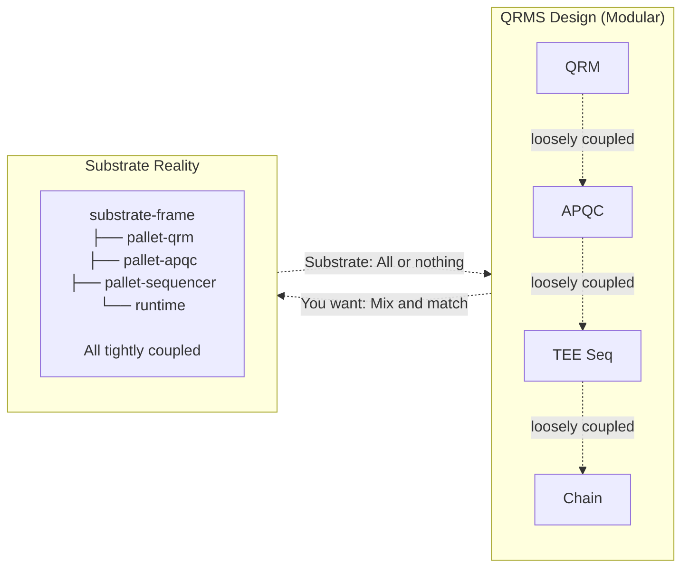
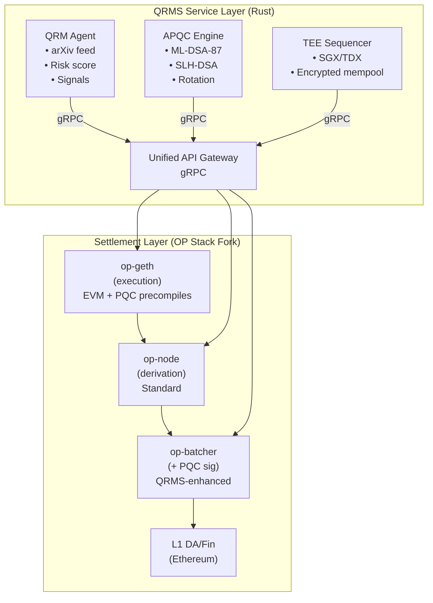
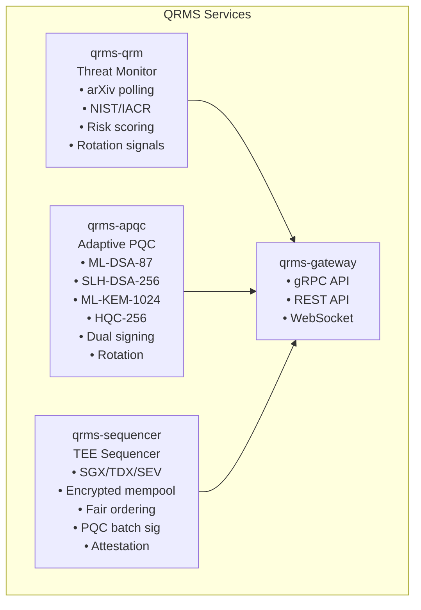
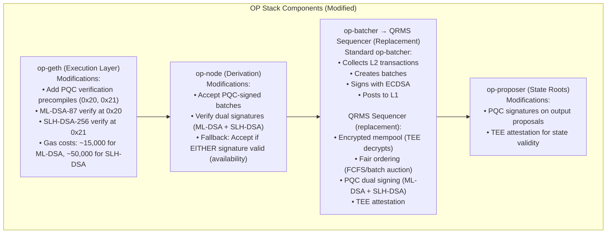
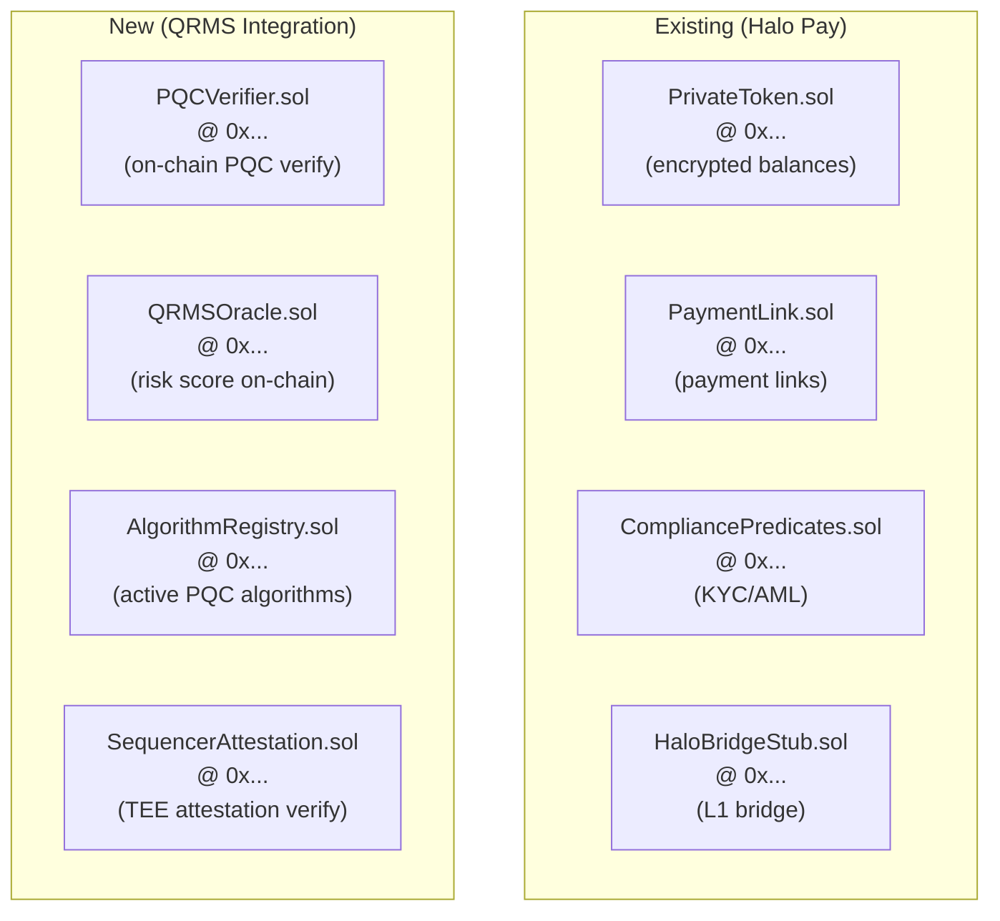
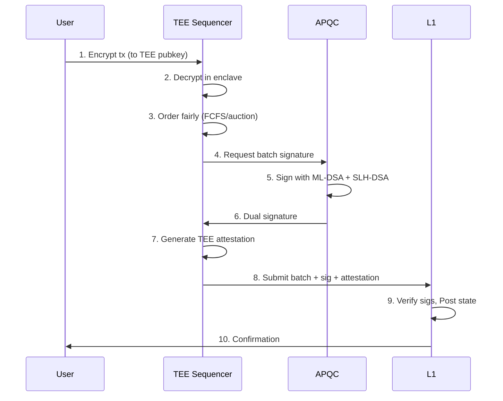
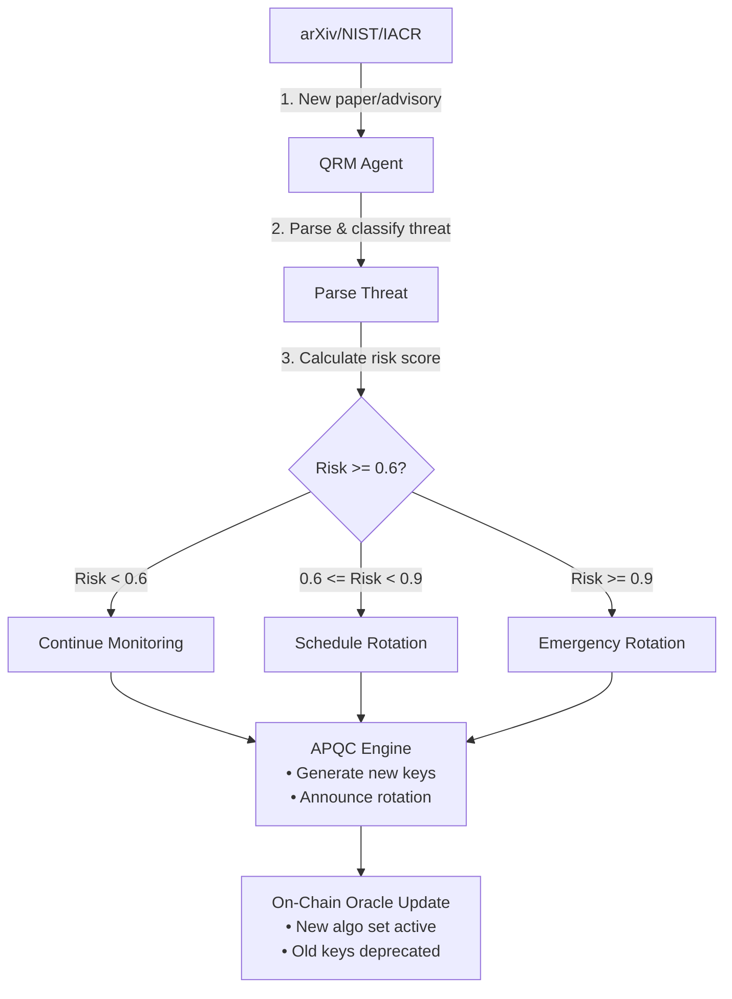
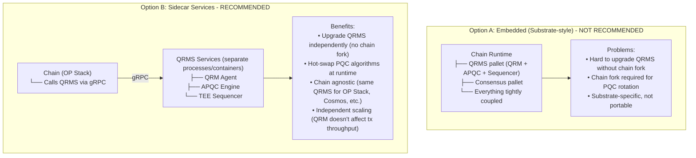
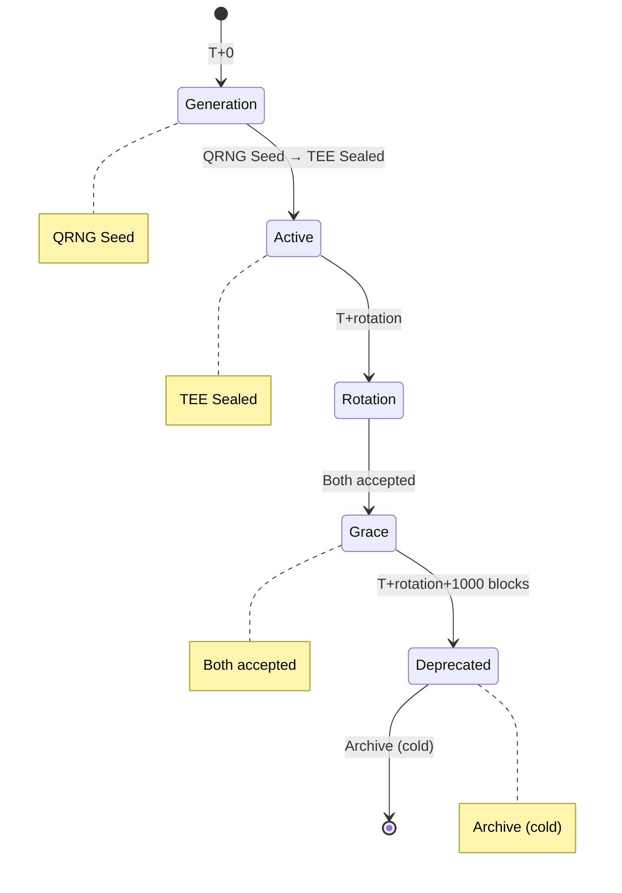
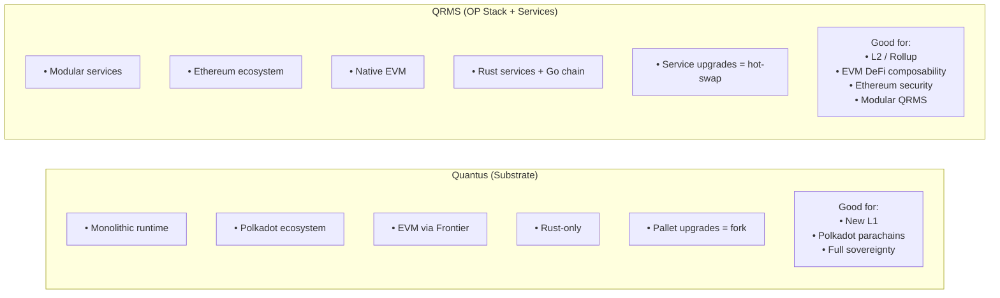

# QRMS Stack Architecture: Design Decisions & Recommendations

## Overview

This document analyzes chain framework options for the Quantum Resistance Model System (QRMS) and recommends an architecture optimized for modularity, EVM compatibility, and quantum-safe security.

---

## Executive Summary

**Recommendation**: Service-oriented QRMS + OP Stack settlement layer

| Decision | Choice | Rationale |
|----------|--------|-----------|
| **Chain Framework** | OP Stack (fork) | EVM native, Ethereum security, modular |
| **QRMS Deployment** | Standalone services | Chain-agnostic, independent scaling |
| **Language** | Rust (QRMS) + Go (OP Stack) | Performance + ecosystem compatibility |
| **PQC Integration** | Precompiles + sidecar | On-chain verification + off-chain signing |

---

## Architecture Comparison

### Why NOT Substrate (Quantus Approach)

Quantus Network chose Substrate for valid reasons:
- Building a new L1 from scratch
- Polkadot ecosystem (parachains, shared security)
- Rust-native development
- Custom runtime pallets

**However, for QRMS this creates problems:**



| Substrate Constraint | Impact on QRMS |
|---------------------|----------------|
| Monolithic runtime | Can't upgrade QRMS without chain fork |
| Polkadot-specific | Ecosystem lock-in, limited DeFi |
| EVM via Frontier | Second-class citizen, compatibility issues |
| Pallet coupling | QRM/APQC/Sequencer tightly bound |

### Stack Options Analysis

| Stack | EVM Native | Modularity | Rust | Quantum-Safe | Effort |
|-------|-----------|------------|------|--------------|--------|
| **OP Stack** ✓ | Native | High | Go core | Add QRMS | Medium |
| **Substrate + Frontier** | Bolted on | Monolithic | Native | Pallets | High |
| **Cosmos + Ethermint** | Bolted on | High | Go | Need modules | High |
| **Arbitrum Orbit** | Native | High | Go core | Add QRMS | Medium |
| **Custom Rollup** | Choice | Maximum | Choice | Full control | Very High |
| **Sovereign SDK** | Via adapter | Maximum | Native | Full control | High |

---

## Recommended Architecture

### High-Level Design



### Layer 1: QRMS Services (Rust)

Independent microservices deployed as containers:



**Cargo Workspace Structure:**

```toml
[workspace]
members = [
    "crates/qrms-core",        # Shared types, crypto primitives
    "crates/qrms-qrm",         # Threat monitoring service
    "crates/qrms-apqc",        # Adaptive PQC service
    "crates/qrms-sequencer",   # TEE sequencer
    "crates/qrms-gateway",     # API gateway
    "crates/qrms-contracts",   # Contract bindings (ethers-rs)
]
```

**Service Communication:**

| From | To | Protocol | Purpose |
|------|------|----------|---------|
| QRM | APQC | gRPC | Risk signals → rotation triggers |
| QRM | Gateway | gRPC | Risk score queries |
| APQC | Sequencer | gRPC | Signing requests |
| Sequencer | op-node | JSON-RPC | Batch submission |
| Gateway | All | gRPC | Unified API |

### Layer 2: Settlement (OP Stack Fork)



**PQC Precompile Implementation:**

```go
// op-geth/core/vm/contracts_pqc.go

package vm

import (
    "github.com/cloudflare/circl/sign/mldsa/mldsa87"
    "github.com/cloudflare/circl/sign/slhdsa"
)

// Precompiled contract addresses
// 0x20 = ML-DSA-87 verify
// 0x21 = SLH-DSA-256 verify

type mldsaVerify struct{}

func (c *mldsaVerify) RequiredGas(input []byte) uint64 {
    return 15000 // ~15k gas for ML-DSA verification
}

func (c *mldsaVerify) Run(input []byte) ([]byte, error) {
    // Input format: pubkey (2592 bytes) || signature (4595 bytes) || message
    if len(input) < 2592 + 4595 + 1 {
        return nil, ErrInvalidInput
    }
    
    pubkey := input[:2592]
    sig := input[2592:2592+4595]
    msg := input[2592+4595:]
    
    pk := new(mldsa87.PublicKey)
    if err := pk.UnmarshalBinary(pubkey); err != nil {
        return failResult, nil
    }
    
    valid := mldsa87.Verify(pk, msg, sig)
    if valid {
        return successResult, nil
    }
    return failResult, nil
}

type slhdsaVerify struct{}

func (c *slhdsaVerify) RequiredGas(input []byte) uint64 {
    return 50000 // ~50k gas for SLH-DSA verification (hash-based, slower)
}

func (c *slhdsaVerify) Run(input []byte) ([]byte, error) {
    // Input format: pubkey (64 bytes) || signature (29792 bytes) || message
    // Implementation similar to above
}
```

### Layer 3: Smart Contracts



**PQCVerifier.sol:**

```solidity
// SPDX-License-Identifier: MIT
pragma solidity ^0.8.20;

contract PQCVerifier {
    // Precompile addresses
    address constant MLDSA_VERIFY = address(0x20);
    address constant SLHDSA_VERIFY = address(0x21);
    
    // ML-DSA-87 sizes
    uint256 constant MLDSA_PUBKEY_SIZE = 2592;
    uint256 constant MLDSA_SIG_SIZE = 4595;
    
    // SLH-DSA-256s sizes
    uint256 constant SLHDSA_PUBKEY_SIZE = 64;
    uint256 constant SLHDSA_SIG_SIZE = 29792;
    
    struct DualPublicKey {
        bytes mldsa;   // 2592 bytes
        bytes slhdsa;  // 64 bytes
    }
    
    struct DualSignature {
        bytes mldsa;   // 4595 bytes
        bytes slhdsa;  // 29792 bytes
    }
    
    /// @notice Verify dual signature (AND combiner for security)
    function verifyDual(
        bytes calldata message,
        DualSignature calldata sig,
        DualPublicKey calldata pubkey
    ) external view returns (bool) {
        bool mldsaValid = _verifyMldsa(message, sig.mldsa, pubkey.mldsa);
        bool slhdsaValid = _verifySlhdsa(message, sig.slhdsa, pubkey.slhdsa);
        
        // AND combiner: both must be valid for security guarantee
        return mldsaValid && slhdsaValid;
    }
    
    /// @notice Verify dual signature (OR combiner for availability)
    function verifyDualOr(
        bytes calldata message,
        DualSignature calldata sig,
        DualPublicKey calldata pubkey
    ) external view returns (bool) {
        bool mldsaValid = _verifyMldsa(message, sig.mldsa, pubkey.mldsa);
        if (mldsaValid) return true;
        
        return _verifySlhdsa(message, sig.slhdsa, pubkey.slhdsa);
    }
    
    function _verifyMldsa(
        bytes calldata message,
        bytes calldata sig,
        bytes calldata pubkey
    ) internal view returns (bool) {
        bytes memory input = abi.encodePacked(pubkey, sig, message);
        (bool success, bytes memory result) = MLDSA_VERIFY.staticcall(input);
        return success && result.length > 0 && result[0] == 0x01;
    }
    
    function _verifySlhdsa(
        bytes calldata message,
        bytes calldata sig,
        bytes calldata pubkey
    ) internal view returns (bool) {
        bytes memory input = abi.encodePacked(pubkey, sig, message);
        (bool success, bytes memory result) = SLHDSA_VERIFY.staticcall(input);
        return success && result.length > 0 && result[0] == 0x01;
    }
}
```

**QRMSOracle.sol:**

```solidity
// SPDX-License-Identifier: MIT
pragma solidity ^0.8.20;

import "./PQCVerifier.sol";

contract QRMSOracle {
    PQCVerifier public immutable pqcVerifier;
    
    // Risk score (0-10000 basis points)
    uint256 public riskScore;
    uint256 public lastUpdate;
    
    // Algorithm set
    string[] public activeSignatureAlgorithms;
    string[] public activeKemAlgorithms;
    
    // Rotation state
    bool public rotationPending;
    uint256 public rotationBlock;
    
    // Authorized QRM updater (TEE-attested)
    address public qrmUpdater;
    PQCVerifier.DualPublicKey public qrmPublicKey;
    
    event RiskScoreUpdated(uint256 score, uint256 timestamp);
    event RotationScheduled(uint256 effectiveBlock);
    event RotationExecuted(string[] newAlgorithms);
    
    constructor(address _pqcVerifier, address _qrmUpdater) {
        pqcVerifier = PQCVerifier(_pqcVerifier);
        qrmUpdater = _qrmUpdater;
    }
    
    /// @notice Update risk score (called by QRM agent)
    function updateRiskScore(
        uint256 _score,
        bytes calldata attestation,
        PQCVerifier.DualSignature calldata sig
    ) external {
        require(msg.sender == qrmUpdater, "Unauthorized");
        
        // Verify PQC signature on attestation
        require(
            pqcVerifier.verifyDual(attestation, sig, qrmPublicKey),
            "Invalid signature"
        );
        
        riskScore = _score;
        lastUpdate = block.timestamp;
        
        emit RiskScoreUpdated(_score, block.timestamp);
        
        // Auto-trigger rotation if threshold exceeded
        if (_score >= 6000 && !rotationPending) {
            _scheduleRotation();
        }
        if (_score >= 9000) {
            _emergencyRotation();
        }
    }
    
    function _scheduleRotation() internal {
        rotationPending = true;
        rotationBlock = block.number + 1000; // Grace period
        emit RotationScheduled(rotationBlock);
    }
    
    function _emergencyRotation() internal {
        // Immediate algorithm rotation
        // Implementation depends on governance model
    }
}
```

---

## Data Flow Diagrams

### Transaction Flow



### Risk Signal Flow



---

## Deployment Model

### QRMS Deployment Options



### Container Architecture

```yaml
# docker-compose.yml
version: "3.8"

services:
  # QRMS Services
  qrms-qrm:
    build:
      context: .
      dockerfile: docker/Dockerfile.qrm
    environment:
      - QRM_ARXIV_POLLING_INTERVAL=86400
      - QRM_RISK_THRESHOLD_SCHEDULED=6000
      - QRM_RISK_THRESHOLD_EMERGENCY=9000
    volumes:
      - qrm_data:/data
    networks:
      - qrms-net

  qrms-apqc:
    build:
      context: .
      dockerfile: docker/Dockerfile.apqc
    environment:
      - APQC_PRIMARY_SIG=ML-DSA-87
      - APQC_SECONDARY_SIG=SLH-DSA-256s
      - APQC_PRIMARY_KEM=ML-KEM-1024
      - APQC_SECONDARY_KEM=HQC-256
    depends_on:
      - qrms-qrm
    networks:
      - qrms-net

  qrms-sequencer:
    build:
      context: .
      dockerfile: docker/Dockerfile.sequencer
    devices:
      - /dev/sgx_enclave:/dev/sgx_enclave
      - /dev/sgx_provision:/dev/sgx_provision
    environment:
      - TEE_PLATFORM=SGX
      - SEQ_ORDERING_MODE=BATCH_AUCTION
      - SEQ_BATCH_TIMEOUT_MS=500
    volumes:
      - sealed_data:/sealed
    depends_on:
      - qrms-apqc
    networks:
      - qrms-net

  qrms-gateway:
    build:
      context: .
      dockerfile: docker/Dockerfile.gateway
    ports:
      - "8080:8080"   # REST API
      - "9090:9090"   # gRPC
      - "8081:8081"   # WebSocket
    depends_on:
      - qrms-qrm
      - qrms-apqc
      - qrms-sequencer
    networks:
      - qrms-net

  # OP Stack Components
  op-geth:
    image: us-docker.pkg.dev/oplabs-tools-artifacts/images/op-geth:latest
    # Modified with PQC precompiles
    volumes:
      - geth_data:/data
    ports:
      - "8545:8545"
    networks:
      - qrms-net

  op-node:
    image: us-docker.pkg.dev/oplabs-tools-artifacts/images/op-node:latest
    depends_on:
      - op-geth
      - qrms-sequencer
    networks:
      - qrms-net

volumes:
  qrm_data:
  sealed_data:
  geth_data:

networks:
  qrms-net:
    driver: bridge
```

---

## Migration Path

### Phase 1: QRMS Core (Current State)

```
- QRM threat monitoring (qrms-rust/src/qrm/)
- APQC dual signatures (qrms-rust/src/apqc/)
- TEE sequencer simulation (qrms-rust/src/sequencer/)
- WebSocket dashboard (qrms-rust + frontend)
- Threat taxonomy (12 categories)
```

### Phase 2: OP Stack Integration

```
□ Fork optimism monorepo
□ Add PQC precompiles to op-geth
  □ ML-DSA-87 verify (0x20)
  □ SLH-DSA-256 verify (0x21)
□ Modify op-node for PQC batch verification
□ Replace op-batcher with QRMS sequencer
□ Add PQC signatures to op-proposer
□ Deploy Halo contracts to L2
□ Integration tests
```

### Phase 3: Production Deployment

```
□ Deploy L2 to testnet (OP Sepolia fork)
□ Migrate Halo Pay MVP
□ Security audits
  □ QRMS services (Trail of Bits / OtterSec)
  □ PQC precompiles (Cryptography specialists)
  □ Smart contracts (Existing audit scope)
□ Bug bounty program
□ Mainnet launch
```

### Phase 4: Multi-Chain Expansion

```
□ Cosmos SDK adapter
  □ x/qrms module (Go)
  □ IBC-enabled risk sharing
□ Substrate adapter (if needed for Polkadot ecosystem)
  □ pallet-qrms
  □ Cross-chain QRMS via XCM
□ Shared threat intelligence network
  □ Multiple chains share QRM data
  □ Decentralized risk scoring
```

---

## Security Considerations

### Threat Model

| Threat | Mitigation |
|--------|------------|
| Quantum computer breaks ML-DSA | SLH-DSA (hash-based) remains secure |
| Side-channel on TEE | Constant-time PQC impl, key rotation |
| MEV extraction | Encrypted mempool, TEE ordering |
| Algorithm downgrade attack | On-chain minimum algorithm set |
| Key compromise | Threshold signatures, rotation |
| QRM data poisoning | Multiple sources, anomaly detection |

### Security Guarantees

```
Security holds if:
  ∃ family F ∈ {Lattice, Hash, Code} : F is secure against QPT adversary
  
Where QPT = Quantum Polynomial Time

Signature Security (AND combiner):
  Adv[A] ≤ Adv_MLDSA[A] × Adv_SLHDSA[A]
  
Availability (OR combiner):
  System available if EITHER algorithm functioning
```

### Key Management



---

## Performance Estimates

### Gas Costs

| Operation | Gas | Cost @ 30 gwei |
|-----------|-----|----------------|
| ML-DSA-87 verify (precompile) | 15,000 | $0.0009 |
| SLH-DSA-256 verify (precompile) | 50,000 | $0.003 |
| Dual verify (both) | 65,000 | $0.004 |
| Private transfer (Halo) | 67,000 | $0.004 |
| Private transfer + PQC | 132,000 | $0.008 |

### Throughput

| Component | Throughput | Bottleneck |
|-----------|------------|------------|
| TEE Sequencer | 10,000 tx/s | TEE decrypt/encrypt |
| APQC Signing | 5,000 sig/s | ML-DSA + SLH-DSA parallel |
| op-geth | 2,000 tx/s | EVM execution |
| L1 DA | ~15 MB/s | Ethereum blob space |

**Effective TPS**: ~2,000 (limited by EVM execution)

---

## Comparison Summary



---

## References

1. OP Stack Specifications: https://specs.optimism.io/
2. NIST FIPS 203-205: PQC Standards
3. Intel SGX Developer Reference
4. Cloudflare CIRCL (Go PQC): https://github.com/cloudflare/circl
5. RustCrypto PQC: https://github.com/RustCrypto/signatures
6. Halo Pay Architecture: `/mvp/ARCHITECTURE.md`
7. QRMS Implementation: `/docs/quantumlit/qrms_implementation.md`

---

*Stack Architecture Version: 1.0*  
*Last Updated: January 2026*
