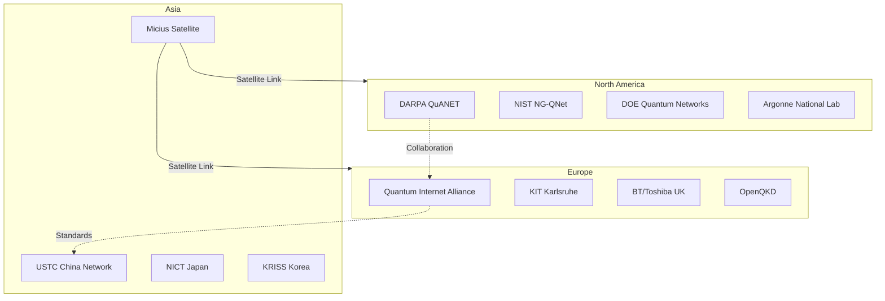
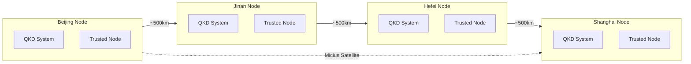
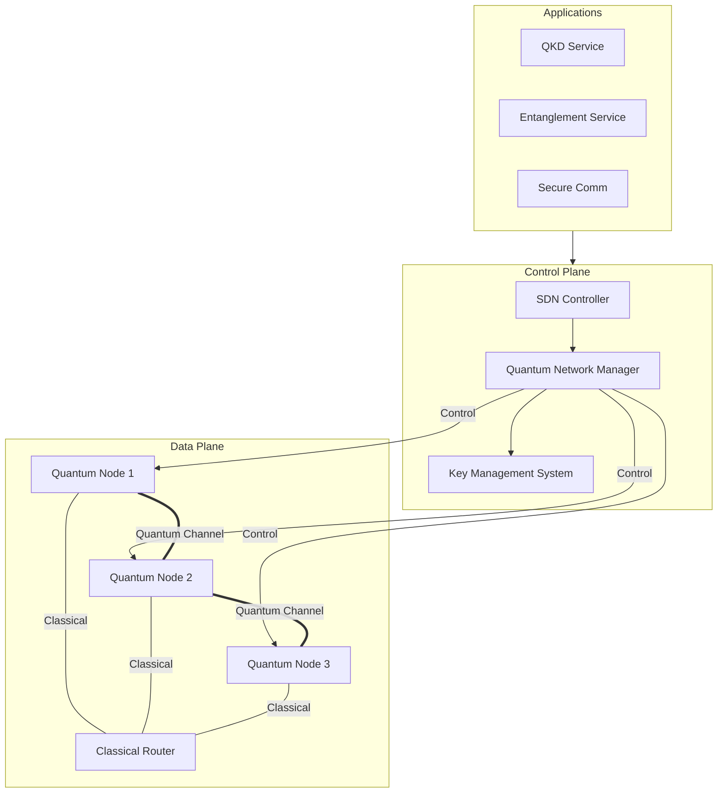
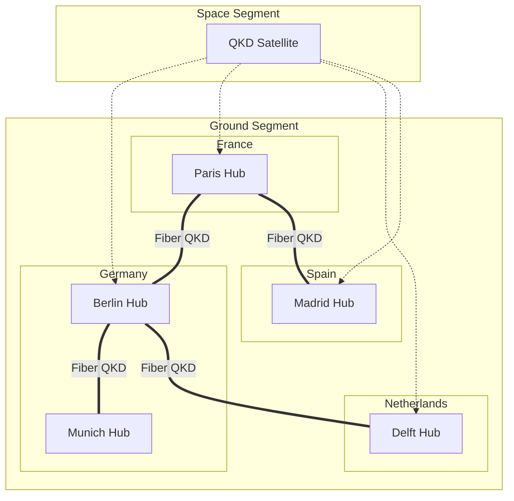
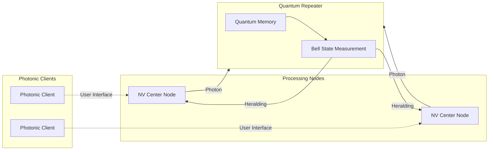
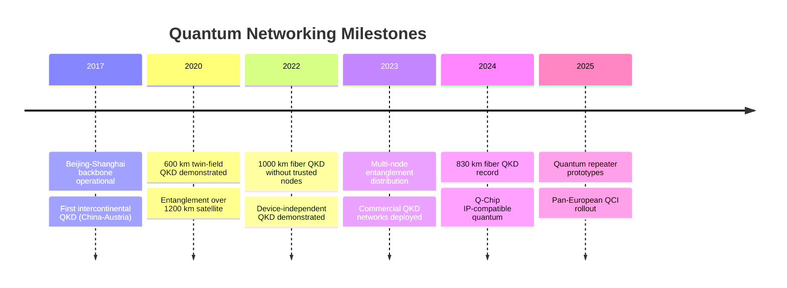
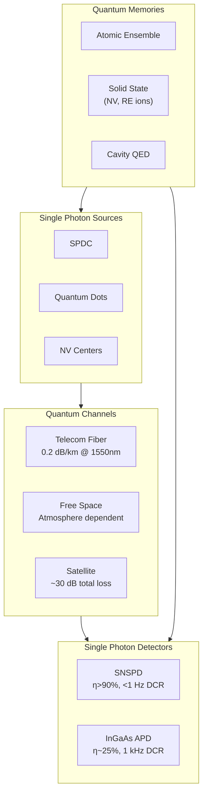
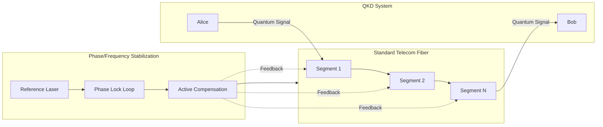
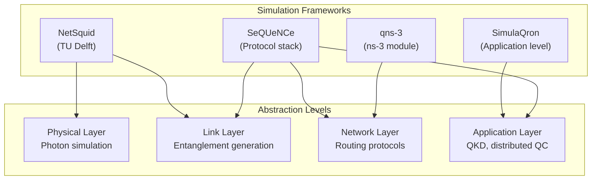

# Quantum Network Testbeds and Demonstrations

## Global Testbed Infrastructure

## Beijing-Shanghai Backbone

**Specifications**:
- Total distance: 2,000+ km
- 32 trusted relay nodes
- Key rate: ~10 kbps average
- Operational since 2017
- Extended to 4,600 km network (2021)

## DARPA QuANET Architecture

**Program Goals**:
- Hybrid quantum-classical networking
- IP-compatible quantum protocols
- Real-world deployment validation
- Metrics: throughput, latency, security

## European Quantum Communication Infrastructure

## Quantum Internet Alliance Prototype

**Components**:
- NV center processing nodes (TU Delft)
- Photonic clients for user access
- Software stack for protocol execution
- Classical control infrastructure

## Demonstration Milestones

## Performance Metrics Comparison

| Testbed | Distance | Key Rate | Technology | Status |
|---------|----------|----------|------------|--------|
| Beijing-Shanghai | 2000 km | 10 kbps | Trusted nodes | Operational |
| Micius Satellite | 7600 km | 0.1 kbps | Satellite QKD | Operational |
| NIST NG-QNet | 100 km | 1 Mbps | Direct fiber | Development |
| QuTech Delft | 25 km | Variable | NV centers | Research |
| DARPA QuANET | Variable | TBD | Hybrid | Prototype |

## Hardware Technology Stack

## PhotonSync Technology

**Capability**:
- Converts standard fiber to quantum-grade
- Active phase drift compensation
- Enables TF-QKD over 1000+ km
- Real-time feedback system

## Simulation Tools Architecture

## Recent Experimental Advances (2025-2026)

### Teleported Quantum Gates
- **Paper**: arXiv:2601.04848
- **Achievement**: Unconditionally teleported gates between remote solid-state qubit registers
- **Significance**: First demonstration of deterministic remote gate operations

### Deterministic Entanglement Distribution
- **Paper**: arXiv:2601.08581
- **Method**: Entanglement-swapping measurements for deterministic distribution
- **Improvement**: Moves beyond probabilistic entanglement generation

### Experimental COW-QKD
- **Paper**: arXiv:2601.06772
- **Published**: Science Advances 2026
- **Achievement**: Practical coherent one-way QKD with simplified setup

### Source-Independent Protocols
| Paper | Protocol | Achievement |
|-------|----------|-------------|
| arXiv:2512.20038 | SI-QCKA | Efficient source-independent conference key agreement |
| arXiv:2512.18325 | SI-QSS | Source-independent secret sharing against coherent attacks |

### Gate-Based Microwave Quantum Repeater
- **Paper**: arXiv:2512.19896
- **Approach**: Grid-state encoding with autonomous error correction
- **Type**: Second-generation repeater architecture

### Hybrid Quantum Repeater Chains
- **Paper**: arXiv:2512.21655
- **Components**: Atom-based quantum processing units + quantum memory multiplexers
- **Focus**: Practical implementation challenges

---

## References

1. "Beijing-Shanghai quantum backbone" Nature 2021
2. DARPA QuANET program documentation
3. Quantum Internet Alliance technical reports
4. "PhotonSync: Long-distance quantum communication" 2025
5. NetSquid, SimulaQron, SeQUeNCe documentation
6. Experimental COW-QKD: arXiv:2601.06772, Sci. Adv. 2026
7. Teleported Quantum Gates: arXiv:2601.04848
8. Deterministic Swapping: arXiv:2601.08581
9. Gate-Based MW Repeater: arXiv:2512.19896
10. Hybrid Repeater Chains: arXiv:2512.21655