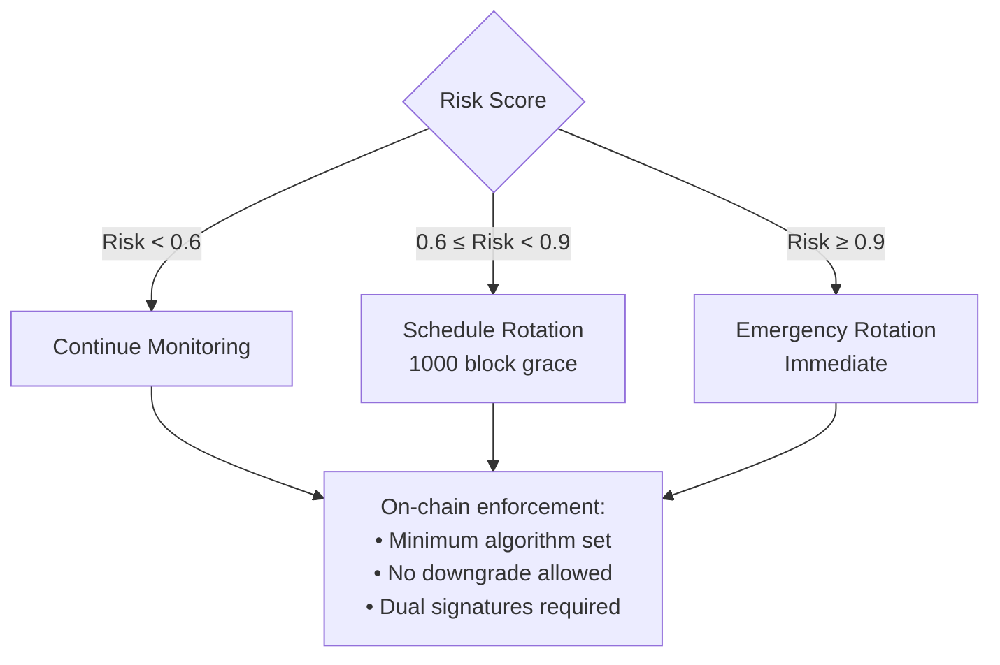

# Quantum Threat Taxonomy for Blockchain Finance

## Overview

This document expands the quantum threat landscape for blockchain systems beyond the traditional four categories, providing granular sub-categories aligned with the QRMS threat detection framework.

---

## Threat Category Summary

| # | Category | Sub-Categories | Severity (FT-QC) |
|---|----------|----------------|------------------|
| 1 | Digital Signatures | 6 | CRITICAL |
| 2 | Zero-Knowledge Proofs | 6 | CRITICAL |
| 3 | Decryption & HNDL | 8 | CRITICAL |
| 4 | Hash Functions | 6 | LOW |
| 5 | Consensus Mechanisms | 5 | CRITICAL |
| 6 | Cross-Chain & Bridges | 6 | HIGH |
| 7 | Key Management | 6 | CRITICAL |
| 8 | Network Layer | 6 | HIGH |
| 9 | MEV & Ordering | 5 | HIGH |
| 10 | Smart Contracts | 5 | CRITICAL |
| 11 | Side-Channel Attacks | 5 | HIGH |
| 12 | Migration & Agility | 5 | HIGH |

**Severity Legend:**
- **CRITICAL**: Direct fund loss or protocol compromise
- **HIGH**: Significant security degradation
- **MEDIUM**: Exploitable under specific conditions
- **LOW**: Theoretical or mitigated by design

---

## Category 1: Forging Digital Signatures

**Quantum Attack**: Shor's algorithm on discrete logarithm problem (DLP)

### Sub-Categories

| Sub-Category | Target | Attack Vector | Impact |
|--------------|--------|---------------|--------|
| **ECDSA/secp256k1** | Bitcoin, Ethereum tx signatures | Shor's on ECDLP | Transaction forgery, fund theft |
| **EdDSA (Ed25519)** | Solana, Cosmos validator sigs | Shor's on Edwards curves | Validator impersonation |
| **BLS Signatures** | Ethereum 2.0 consensus | Pairing-based crypto | Consensus manipulation |
| **Multi-sig/Threshold** | Gnosis Safe, MPC wallets | Combined attacks on shares | Quorum bypass |
| **HD Wallet Derivation** | BIP-32/39/44 wallets | Master→child key recovery | Full wallet compromise |
| **Hardware Wallet** | Ledger, Trezor signing | Side-channel + Shor | Secure element bypass |

### Technical Details

**ECDSA (secp256k1):**
```
Public Key: Q = dG (where d = private key, G = generator)
Attack: Given Q and G, find d using Shor's algorithm
Complexity: O(log³ n) quantum vs O(√n) classical (Pollard's rho)
Qubits Required: ~2,330 logical qubits for 256-bit curve
```

**BLS Signatures:**
```
Based on: Bilinear pairings e: G₁ × G₂ → Gₜ
Attack: Shor's on the pairing-based DLP
Impact: Aggregate signature forgery, committee attacks
```

### Mitigation

| Algorithm | Replacement | Standard |
|-----------|-------------|----------|
| ECDSA | ML-DSA-87 | FIPS 204 |
| EdDSA | ML-DSA-65/87 | FIPS 204 |
| BLS | SLH-DSA-256 (conservative) | FIPS 205 |

---

## Category 2: Forging Zero-Knowledge Proofs

**Quantum Attack**: Shor's algorithm on EC-based commitments and pairings

### Sub-Categories

| Sub-Category | Target | Attack Vector | Impact |
|--------------|--------|---------------|--------|
| **zk-SNARKs (Groth16)** | Zcash, zkSync | DLP on BN254 curve | Proof forgery |
| **Plonk/Kate** | Polygon zkEVM | EC-based commitments | Commitment forgery |
| **zk-Rollup State** | Scroll, Linea | L2→L1 proofs | False state claims |
| **Private Transactions** | Tornado Cash, Aztec | Shield pool proofs | Double-spend, inflation |
| **Identity Proofs** | Polygon ID, WorldCoin | Credential proofs | False identity |
| **Recursive Proofs** | Plonky2 recursion | Proof chain integrity | Cascading failures |

### Technical Details

**Groth16 SNARK:**
```
Relies on:
- Knowledge of Exponent (KOE) assumption
- Pairing-based crypto on BN254
- Discrete log hardness in G₁, G₂, Gₜ

Shor's breaks: All three assumptions
Result: Forge valid proofs without witness
```

**Safe Alternatives:**
```
zk-STARKs: Hash-based (Poseidon, Rescue)
- No elliptic curve assumptions
- Post-quantum secure by design
- Larger proofs (~100KB vs ~200 bytes)

Plonky2 with Poseidon2:
- Uses ZK-friendly hash
- No EC commitments in inner proofs
- Quantum-resistant when properly configured
```

### Mitigation Strategy

| Vulnerable | Quantum-Safe | Trade-off |
|------------|--------------|-----------|
| Groth16 | STARKs | 100x proof size |
| Plonk (EC) | Plonky2 (hash) | Different prover |
| KZG commitments | FRI-based | Larger proofs |

---

## Category 3: Decrypting Secret Information

**Quantum Attack**: Shor's algorithm on key exchange; Grover on symmetric

### Sub-Categories

| Sub-Category | Target | Attack Vector | Impact |
|--------------|--------|---------------|--------|
| **Encrypted Mempools** | Flashbots, MEV Blocker | ECDH key recovery | Pre-execution visibility |
| **P2P Communication** | Gossip protocols | TLS/ECDHE broken | Message interception |
| **Validator Comms** | Consensus channels | Channel encryption | Vote manipulation |
| **Cross-chain Bridges** | Relay encryption | Inter-chain messages | Bridge compromise |
| **Sealed Bids (Auctions)** | Commit-reveal | Bid decryption | MEV/front-running |
| **Private State Channels** | Lightning, Raiden | Channel secrets | Off-chain theft |
| **TEE Attestation Keys** | SGX/TDX remote attest | Attestation bypass | Enclave impersonation |
| **Harvest Now, Decrypt Later** | Historical ciphertext | Store→decrypt future | Retroactive exposure |

### Technical Details

**HNDL (Harvest Now, Decrypt Later):**
```
Threat Model:
1. Adversary records encrypted traffic TODAY
2. Stores ciphertext (cheap storage)
3. Quantum computer available in 10-15 years
4. Decrypt historical data

At Risk:
- All RSA/ECC encrypted communications
- HTTPS traffic with ephemeral ECDH
- Encrypted blockchain data

Timeline:
- Data sensitivity: 10+ years → URGENT
- Data sensitivity: 5-10 years → HIGH
- Data sensitivity: <5 years → MEDIUM
```

**TLS 1.3 Vulnerability:**
```
Current: ECDHE-P256 + AES-256-GCM
Attack: Shor's on P256 → recover session key
Mitigation: Hybrid TLS (X25519 + ML-KEM-768)
```

### Mitigation

| Channel | Current | Quantum-Safe |
|---------|---------|--------------|
| TLS | ECDHE | X25519 + ML-KEM |
| P2P | libp2p ECDH | qp-libp2p-identity |
| Bridge msgs | ECDH | Hybrid KEM |
| TEE attestation | ECDSA | ML-DSA |

---

## Category 4: Reversing Hash Functions

**Quantum Attack**: Grover's algorithm (quadratic speedup on search)

### Sub-Categories

| Sub-Category | Target | Attack Vector | Risk Level |
|--------------|--------|---------------|------------|
| **SHA-256 (PoW)** | Bitcoin mining | Grover preimage | LOW |
| **Keccak/SHA-3** | Ethereum state | Collision search | LOW |
| **Poseidon/Poseidon2** | ZK circuits | Algebraic attacks | LOW |
| **Address Generation** | hash(pubkey) | Preimage attack | LOW-MEDIUM |
| **Merkle Roots** | State proofs | Collision | LOW |
| **IPFS CIDs** | Content addressing | Integrity attacks | LOW |

### Technical Details

**Grover's Algorithm:**
```
Classical preimage: O(2ⁿ)
Quantum preimage: O(2^(n/2))

For SHA-256 (n=256):
- Classical: 2²⁵⁶ operations (infeasible)
- Quantum: 2¹²⁸ operations (still infeasible)

Mitigation: Double output length (SHA-512) or use as-is
```

**Why Low Risk:**
```
1. Grover gives √N speedup, not exponential
2. 256-bit hashes → 128-bit quantum security (sufficient)
3. Collision attacks require 2⁶⁴ quantum ops (hard)
4. Hash-based signatures (SPHINCS+) rely on hash security
```

### Mitigation

| Hash | Action Required |
|------|-----------------|
| SHA-256 | None (128-bit quantum security) |
| SHA-3/Keccak | None (128-bit quantum security) |
| Poseidon | None (designed for large fields) |
| MD5/SHA-1 | Already deprecated (not quantum issue) |

---

## Category 5: Consensus Mechanism Attacks

**Quantum Attack**: Signature forgery on validator/proposer keys

### Sub-Categories

| Sub-Category | Target | Attack Vector | Impact |
|--------------|--------|---------------|--------|
| **PoS Validator Keys** | Ethereum, Cosmos validators | ECDSA/BLS forgery | Validator impersonation |
| **Finality Signatures** | GRANDPA, Tendermint | Aggregate sig forgery | Finality manipulation |
| **VRF (Randomness)** | Leader election | EC-VRF DLP | Predictable leaders |
| **Slashing Evidence** | Fraud proofs | Signature forgery | False slashing |
| **Committee Selection** | Random beacon | VRF manipulation | Committee prediction |

### Technical Details

**PoS Validator Attack:**
```
Ethereum 2.0:
- Validator key: BLS12-381
- Attestation: BLS signature
- Attack: Forge attestations → double-vote without slashing

Cosmos:
- Validator key: Ed25519
- Attack: Sign conflicting blocks → consensus failure
```

**VRF Manipulation:**
```
Typical VRF: EC-based (e.g., ECVRF)
Attack: Compute VRF outputs for any input
Impact: Predict leader schedule → targeted attacks
```

### Mitigation

| Component | Current | Quantum-Safe |
|-----------|---------|--------------|
| Validator sigs | BLS12-381 | ML-DSA-87 |
| VRF | ECVRF | Hash-based VRF |
| Committee | Randao | Threshold hash-VRF |

---

## Category 6: Cross-Chain & Bridge Attacks

**Quantum Attack**: Forgery of relay/oracle signatures and light client proofs

### Sub-Categories

| Sub-Category | Target | Attack Vector | Impact |
|--------------|--------|---------------|--------|
| **Light Client Proofs** | SPV, header sync | Header sig forgery | False chain state |
| **Relay Authentication** | Bridge relayers | Relayer key forgery | Unauthorized relay |
| **Lock/Mint Operations** | Token bridges | Cross-chain msg forgery | Unbacked minting |
| **Oracle Signatures** | Price feeds | Oracle attestation | Price manipulation |
| **IBC (Cosmos)** | Inter-blockchain comm | IBC packet sigs | Cross-chain takeover |
| **Rollup Sequencer** | L2→L1 batches | Batch sig forgery | Invalid state roots |

### Technical Details

**Bridge Attack Scenario:**
```
Typical bridge:
1. User locks tokens on Chain A
2. Relayer signs attestation
3. Bridge mints tokens on Chain B

Quantum attack:
1. Attacker forges relayer signature
2. Claims tokens never locked
3. Mints unbacked tokens on Chain B

Historical: Ronin bridge ($600M) - key compromise
Quantum: Same attack, but break keys mathematically
```

**IBC Attack:**
```
IBC packet = (data, commitment_proof, signatures)
Attack: Forge IBC client update → false state

Impact:
- Cross-chain token theft
- Governance manipulation
- State corruption
```

### Mitigation

Per arXiv:2512.18488 (QLink architecture):

| Bridge Component | Quantum-Safe |
|------------------|--------------|
| Relayer sigs | ML-DSA + SLH-DSA dual |
| Light client | Hash-based state proofs |
| Oracle attestation | Threshold PQC |

---

## Category 7: Key Management & Derivation

**Quantum Attack**: Recovery of master keys, threshold shares, or derived keys

### Sub-Categories

| Sub-Category | Target | Attack Vector | Impact |
|--------------|--------|---------------|--------|
| **BIP-32/39/44 HD Wallets** | Seed→child derivation | EC operations | Full wallet |
| **MPC/TSS Key Shares** | Threshold secrets | Partial reconstruction | Threshold bypass |
| **Key Rotation Ceremonies** | Transition periods | ECDH during handoff | Key interception |
| **Custodial Hot Wallets** | Exchange wallets | Centralized keys | Mass theft |
| **Smart Contract Ownership** | Admin/owner keys | Privileged functions | Protocol takeover |
| **Multi-tenant Isolation** | Shared infrastructure | Cross-tenant leakage | Key exposure |

### Technical Details

**BIP-32 Vulnerability:**
```
HD Derivation:
- Master seed → master key (m)
- Child key: m/44'/60'/0'/0/i

EC-based:
- child_pubkey = parent_pubkey + point(child_chaincode)
- Shor's attack on EC math → derive any child from parent

Impact: Compromise master seed → all derived keys
```

**MPC/TSS Attack:**
```
Threshold: t-of-n shares needed
Attack: Recover t shares via Shor's

Scenario (2-of-3):
1. Recover share 1 (Shor's)
2. Recover share 2 (Shor's)
3. Reconstruct full key
4. No share 3 needed
```

### Mitigation

| Key Type | Quantum-Safe Alternative |
|----------|--------------------------|
| HD derivation | PQC-based KDF (CRYSTALS) |
| MPC | Lattice-based MPC |
| Rotation | PQC key exchange |

---

## Category 8: Network Layer & Infrastructure

**Quantum Attack**: Node identity forgery, P2P encryption bypass

### Sub-Categories

| Sub-Category | Target | Attack Vector | Impact |
|--------------|--------|---------------|--------|
| **Node Discovery (Discv5)** | Peer discovery | Node ID forgery | Sybil attacks |
| **Gossip Protocol** | Message propagation | Peer auth bypass | Message injection |
| **TLS/QUIC Channels** | P2P encryption | ECDHE key exchange | MITM |
| **DNS & ENS** | Name resolution | DNSSEC signatures | Domain hijack |
| **BGP Routing** | Internet routing | Traffic interception | MITM setup |
| **Libp2p Identity** | Peer identification | PeerID forgery | Impersonation |

### Technical Details

**Libp2p PeerID:**
```
Current:
- PeerID = hash(public_key)
- Public key: Ed25519, secp256k1, or RSA

Attack:
1. Shor's recovers private key from PeerID
2. Attacker generates valid signatures
3. Impersonate any peer

Mitigation: qp-libp2p-identity (PQC-based)
```

**Gossip Attack:**
```
Blockchain gossip:
1. Receive message
2. Verify sender signature
3. Forward if valid

Quantum attack:
1. Forge any sender's signature
2. Inject arbitrary messages
3. Eclipse attacks, tx manipulation
```

### Mitigation

| Component | Current | Quantum-Safe |
|-----------|---------|--------------|
| PeerID | Ed25519 | ML-DSA-87 |
| TLS | ECDHE | X25519 + ML-KEM |
| DNSSEC | RSA/ECDSA | ML-DSA |

---

## Category 9: MEV & Transaction Ordering

**Quantum Attack**: Bypass encrypted mempools and sealed auctions

### Sub-Categories

| Sub-Category | Target | Attack Vector | Impact |
|--------------|--------|---------------|--------|
| **Encrypted Mempool Bypass** | Flashbots Protect | Threshold decryption | Front-running |
| **PBS Manipulation** | Proposer-Builder Sep | Builder key compromise | MEV collusion |
| **Intent Decryption** | Intent-based protocols | Solver encryption | Intent front-running |
| **Sealed Bid Auctions** | On-chain auctions | Bid commitment break | Auction manipulation |
| **Time-Lock Puzzles** | VDF, timelock crypto | Quantum speedup | Early solution |

### Technical Details

**Encrypted Mempool:**
```
Current (threshold encryption):
1. User encrypts tx to committee public key
2. Committee decrypts after ordering
3. Security: t-of-n threshold ECDH

Quantum attack:
1. Recover committee shares (Shor's)
2. Decrypt before ordering
3. Classic front-running restored

Mitigation: QRMS TEE Sequencer
- Hardware isolation (SGX/TDX)
- PQC encryption (ML-KEM)
- No threshold to break
```

**VDF/Time-Lock:**
```
Typical: Squaring in RSA group
Attack: Shor's factoring → bypass delay
Impact: Solve "future" puzzles immediately
```

### Mitigation

| MEV Protection | Current | QRMS Solution |
|----------------|---------|---------------|
| Encrypted mempool | Threshold ECDH | TEE + ML-KEM |
| Sealed bids | Commit-reveal | TEE commit |
| Ordering | PBS | TEE fair ordering |

---

## Category 10: Smart Contract & State Attacks

**Quantum Attack**: Signature verification bypass in contracts

### Sub-Categories

| Sub-Category | Target | Attack Vector | Impact |
|--------------|--------|---------------|--------|
| **ecrecover Bypass** | On-chain sig verify | ECDSA forgery | Auth bypass |
| **CREATE2 Predictions** | Deterministic deploy | Address manipulation | Contract replacement |
| **Access Control** | Owner/admin roles | Key forgery | Privilege escalation |
| **Upgradeable Proxies** | UUPS, Transparent | Admin key attack | Malicious upgrade |
| **Governance Signatures** | DAO voting | Vote authorization | Governance takeover |

### Technical Details

**ecrecover Attack:**
```solidity
// Common pattern in contracts
function execute(bytes memory data, bytes memory sig) external {
    address signer = ecrecover(hash(data), sig);
    require(signer == owner, "Invalid signer");
    // Execute privileged action
}

// Quantum attack:
// 1. Observe owner's public key (from any tx)
// 2. Shor's algorithm → recover owner's private key
// 3. Sign arbitrary data as owner
// 4. Call execute() with forged signature
```

**Proxy Admin Attack:**
```
UUPS Proxy:
- Admin can call upgradeToAndCall()
- Admin key secured by ECDSA

Attack:
1. Recover admin private key
2. Upgrade to malicious implementation
3. Drain all funds
```

### Mitigation

| Contract Pattern | Mitigation |
|------------------|------------|
| ecrecover | PQC precompile (0x20, 0x21) |
| Access control | PQC-signed admin actions |
| Governance | PQC voting signatures |

---

## Category 11: Side-Channel & Implementation Attacks

**Attack**: Combine quantum capabilities with implementation weaknesses

### Sub-Categories

| Sub-Category | Target | Attack Vector | Impact |
|--------------|--------|---------------|--------|
| **Timing Attacks on PQC** | Lattice operations | Non-constant-time | Key extraction |
| **Power Analysis** | KEM decapsulation | ML-KEM decryption | Key recovery |
| **Cache Timing** | Hash computations | SPHINCS+ tree | Key/state leakage |
| **Fault Injection** | Crypto operations | Induced errors | Key extraction |
| **TEE Side-Channels** | SGX/SEV enclaves | Memory access patterns | Enclave secrets |

### Technical Details

Per arXiv:2512.22301 (Timing side-channels):

**Lattice Timing Attack:**
```
ML-KEM decapsulation:
1. Decode ciphertext
2. Decrypt
3. Re-encrypt and compare

Timing variance in steps 2-3 leaks information:
- Different polynomial coefficients → different timing
- Statistical analysis → key recovery

Mitigation: Constant-time implementation
```

**TEE Side-Channel:**
```
SGX attacks (historical):
- Foreshadow (L1TF)
- Plundervolt
- Load Value Injection

With quantum + side-channel:
1. Leak partial key via cache timing
2. Use quantum search to complete recovery
3. Faster than full Shor's attack
```

### Mitigation

| Side-Channel | Defense |
|--------------|---------|
| Timing | Constant-time crypto |
| Power | Masking, shuffling |
| Cache | Memory access obfuscation |
| Fault | Redundant computations |
| TEE | Intel microcode, design isolation |

---

## Category 12: Cryptographic Agility & Migration

**Attack**: Exploit transition periods or force algorithm downgrade

### Sub-Categories

| Sub-Category | Target | Attack Vector | Impact |
|--------------|--------|---------------|--------|
| **Algorithm Downgrade** | Hybrid protocols | Force legacy use | Bypass PQC |
| **Hybrid Mode Bypass** | Combined schemes | Attack weaker component | Security reduction |
| **Key Migration** | PQC transition | Compromise during rotation | Key interception |
| **Incomplete Migration** | Legacy endpoints | Partial upgrade | Entry point |
| **Parameter Confusion** | Security levels | Wrong parameters | Reduced security |

### Technical Details

**Downgrade Attack:**
```
Hybrid TLS:
- Offer: X25519 + ML-KEM-768
- Downgrade: Force X25519 only
- Attack: Shor's on X25519

Defense: Minimum algorithm requirements on-chain
```

**Key Migration Window:**
```
Rotation process:
T+0: Generate new PQC keys
T+1: Announce new keys
T+2: Grace period (both accepted)
T+3: Old keys deprecated

Attack window: T+0 to T+1
- New keys generated but not deployed
- If intercepted, attacker has future keys

QRMS Defense: TEE-sealed key generation
```

### Mitigation

QRMS rotation protocol addresses this:



---

## Threat Severity Matrix

### By Quantum Era

```
                        │ Pre-Quantum │ NISQ Era  │ Fault-Tolerant QC │
────────────────────────┼─────────────┼───────────┼───────────────────┤
1. Digital Signatures   │     Low     │  Medium   │     CRITICAL      │
2. ZK Proof Forgery     │     Low     │  Medium   │     CRITICAL      │
3. Decryption/HNDL      │   ACTIVE*   │   High    │     CRITICAL      │
4. Hash Reversal        │     Low     │   Low     │       Low         │
5. Consensus Attacks    │     Low     │  Medium   │     CRITICAL      │
6. Bridge/Cross-chain   │     Low     │  Medium   │       High        │
7. Key Management       │     Low     │  Medium   │     CRITICAL      │
8. Network Layer        │     Low     │  Medium   │       High        │
9. MEV/Ordering         │     Low     │  Medium   │       High        │
10. Smart Contracts     │     Low     │  Medium   │     CRITICAL      │
11. Side-Channel + Q    │   Medium    │   High    │       High        │
12. Migration/Agility   │     Low     │   High    │       High        │
────────────────────────┴─────────────┴───────────┴───────────────────┘

* HNDL is actively occurring - adversaries storing encrypted data today
```

### QRMS Risk Scoring Weights

```rust
impl ThreatCategory {
    fn weight(&self) -> f64 {
        match self {
            // Direct cryptographic threats (highest weight)
            Self::DigitalSignatures => 0.20,
            Self::ZkProofForgery => 0.15,
            Self::DecryptionHndl => 0.15,
            
            // Infrastructure threats
            Self::ConsensusAttacks => 0.10,
            Self::CrossChainBridges => 0.08,
            Self::KeyManagement => 0.08,
            
            // Secondary threats
            Self::NetworkLayer => 0.05,
            Self::MevOrdering => 0.05,
            Self::SmartContracts => 0.05,
            
            // Implementation/operational
            Self::SideChannel => 0.04,
            Self::MigrationAgility => 0.03,
            
            // Lower impact (defense exists)
            Self::HashFunctions => 0.02,
        }
    }
}
```

---

## Integration with QRMS

### Threat Classification Matrix

| Category | QRM Indicator Type | Auto-Response |
|----------|-------------------|---------------|
| Digital Signatures | `CryptanalysisLattice` | Scheduled rotation |
| ZK Proof Forgery | `CryptanalysisLattice` | Scheduled rotation |
| Decryption/HNDL | `QuantumHardware` | Monitoring escalation |
| Hash Functions | `CryptanalysisHash` | Monitor only |
| Consensus | `CryptanalysisLattice` | Emergency if validator keys |
| Bridges | `CryptanalysisLattice` | Pause bridge if critical |
| Key Management | `CryptanalysisLattice` | Key rotation |
| Network | `SideChannel` | Infrastructure alert |
| MEV | `SideChannel` | TEE hardening |
| Smart Contracts | `CryptanalysisLattice` | Contract pause |
| Side-Channel | `SideChannel` | Implementation patch |
| Migration | `StandardsGuidance` | Policy update |

### QRM Agent Configuration

```rust
// qrms-rust/src/qrm/threat.rs

#[derive(Debug, Clone, Copy, Serialize, Deserialize)]
pub enum ThreatCategory {
    // Primary cryptographic
    DigitalSignatures,
    ZkProofForgery,
    DecryptionHndl,
    HashFunctions,
    
    // Consensus/infrastructure
    ConsensusAttacks,
    CrossChainBridges,
    KeyManagement,
    NetworkLayer,
    
    // Execution layer
    MevOrdering,
    SmartContracts,
    
    // Implementation
    SideChannel,
    MigrationAgility,
}

impl ThreatCategory {
    pub fn from_paper_keywords(keywords: &[String]) -> Option<Self> {
        // Map arXiv/IACR paper keywords to categories
        if keywords.contains(&"ECDSA".into()) || 
           keywords.contains(&"signature".into()) {
            return Some(Self::DigitalSignatures);
        }
        if keywords.contains(&"zk-SNARK".into()) ||
           keywords.contains(&"zero-knowledge".into()) {
            return Some(Self::ZkProofForgery);
        }
        // ... etc
        None
    }
}
```

---

## References

1. Shor, P. "Algorithms for quantum computation" (1994)
2. Grover, L. "A fast quantum mechanical algorithm for database search" (1996)
3. NIST "Post-Quantum Cryptography Standardization" (2024-2025)
4. arXiv:2512.22301 - Timing side-channels in lattice PQC
5. arXiv:2512.10020 - zk-SNARKs vs zk-STARKs comparative analysis
6. arXiv:2512.18488 - QLink quantum-safe bridge architecture
7. arXiv:2512.04429 - Combined Q+PQ security analysis
8. Quantus Network - Reference quantum-secure blockchain

---

*Threat Taxonomy Version: 1.0*  
*Last Updated: January 2026*  
*Aligned with: QRMS v0.1.0 threat classification*
