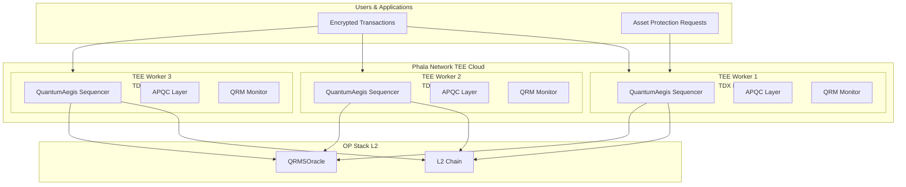
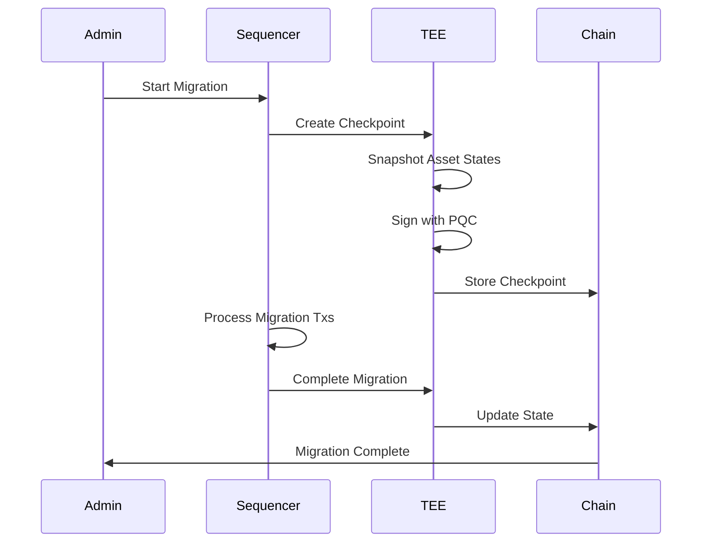

# Phala Network TEE Deployment Guide (Redundancy Layer)

## Overview

**Note**: This guide describes deploying Phala Network as a **redundancy/fallback layer** for Aegis-TEE. The primary TEE implementation is Aegis-TEE (see [Aegis-TEE Architecture](../architecture/aegis_tee.md)).

When configured as redundancy, Phala Network TEE Cloud provides:

- **Redundancy attestation**: Backup verification for each batch
- **Distributed security**: Cross-validation with Aegis-TEE
- **Fallback support**: Backup in case of Aegis-TEE issues
- **Hardware-backed security**: Intel TDX or AMD SEV enclaves
- **Quantum-resistant sequencing**: ML-DSA-87 + SLH-DSA-256s dual signatures

## Architecture



## Prerequisites

1. **Phala Network Account**
   - Register at [Phala Network](https://phala.network)
   - Obtain PHA tokens for deployment

2. **Development Environment**
   ```bash
   # Install Phala CLI
   cargo install phala-cli
   
   # Install Rust toolchain
   rustup toolchain install stable
   ```

3. **Configuration**
   - Copy `phala.toml` and customize
   - Set network (mainnet/testnet)
   - Configure worker requirements

## Deployment Steps

### 1. Build Contract

```bash
cd services/qrms

# Build for Phala TEE
cargo build --release --target x86_64-unknown-linux-gnu

# Verify build
cargo test --features phala
```

### 2. Configure Deployment

Edit `phala.toml`:

```toml
[phala]
network = "testnet"  # Start with testnet

[worker]
id = "quantumaegis-sequencer"
enclave_type = "TDX"
min_workers = 3
max_workers = 10

[quantum]
signature_algorithms = ["ML-DSA-87", "SLH-DSA-256s"]
hybrid_ecdsa = true
risk_scheduled = 6000
risk_emergency = 9000
```

### 3. Deploy to Phala Cloud

```bash
# Generate deployment script
cargo run --bin phala-deploy -- --config phala.toml

# Execute deployment
./deploy.sh

# Verify deployment
phala-cli contract status --contract QuantumAegisSequencer
```

### 4. Register Assets

```bash
# Register on-chain asset
curl -X POST https://phala-api.example.com/assets/register \
  -H "Content-Type: application/json" \
  -d '{
    "asset_id": "token_001",
    "asset_type": "OnChainToken",
    "chain_id": 16584,
    "contract_address": "0x...",
    "access_policy": {
      "requires_pqc": true,
      "requires_tee": true,
      "risk_threshold": 5000
    }
  }'
```

## Intelligence-Based Ordering

### Ordering Modes

| Mode | Description | Use Case |
|------|-------------|----------|
| `risk_aware` | Order by QRM risk score | High-risk transactions first |
| `asset_protection` | Prioritize protected assets | Critical asset operations |
| `migration_aware` | Group migration transactions | During state migration |
| `hybrid` | Combine all strategies | Production default |

### Configuration

```toml
[intelligence]
mode = "hybrid"
enable_asset_protection = true
enable_migration = true
```

## Asset Protection

### Supported Asset Types

**On-Chain:**
- ERC-20 tokens
- ERC-721 NFTs
- Smart contract data
- Cross-chain bridge assets

**Off-Chain:**
- Database records
- File storage
- Data streams
- API endpoints

### Protection Features

1. **Encryption**: All asset data encrypted with TEE keys
2. **Access Control**: Policy-based operation restrictions
3. **Risk Thresholds**: Automatic protection activation
4. **Migration Support**: State preservation during upgrades

### Example: Register Token Protection

```rust
use qrms::aegis_tee::{AegisTeeSequencer, AssetProtection, AssetType, AccessPolicy};

// Recommended: Use Aegis-TEE with Phala redundancy
let mut sequencer = AegisTeeSequencer::new(
    "aegis_worker_0".to_string(),
    "aegis_enclave_0".to_string(),
    "TDX".to_string(),
    Some((
        "phala_worker_0".to_string(),  // Phala redundancy
        "phala_enclave_0".to_string(),
    )),
);

let asset = AssetProtection {
    asset_id: "token_001".to_string(),
    asset_type: AssetType::OnChainToken,
    chain_id: Some(16584),
    contract_address: Some("0x72FC1db108e68afBFe8c251829CeFeeFf109B7D4".to_string()),
    encryption_key: vec![], // Set by TEE
    access_policy: AccessPolicy {
        allowed_operations: vec!["transfer".to_string(), "approve".to_string()],
        requires_pqc: true,
        requires_tee: true,
        risk_threshold: 5000,
    },
    migration_state: MigrationState::Active,
};

sequencer.register_asset(asset);
```

## State Migration

### Migration Process



### Checkpoint Structure

```rust
pub struct MigrationCheckpoint {
    pub checkpoint_id: String,
    pub block_number: u64,
    pub state_hash: String,
    pub asset_snapshots: Vec<AssetSnapshot>,
    pub timestamp: DateTime<Utc>,
    pub pqc_signature: String,  // ML-DSA signature
}
```

### Migration Commands

```bash
# Start migration
curl -X POST https://phala-api.example.com/migration/start

# Check migration status
curl https://phala-api.example.com/migration/status

# Complete migration
curl -X POST https://phala-api.example.com/migration/complete \
  -d '{"checkpoint_id": "checkpoint_12345"}'

# Rollback if needed
curl -X POST https://phala-api.example.com/migration/rollback \
  -d '{"checkpoint_id": "checkpoint_12345"}'
```

## Quantum-Resistant Batching

### Batch Structure

```rust
pub struct QuantumResistantBatch {
    pub batch_id: String,
    pub block_number: u64,
    pub transactions: Vec<DecryptedTransaction>,
    pub ml_dsa_sig: String,           // ML-DSA-87 signature
    pub slh_dsa_sig: String,           // SLH-DSA-256s signature
    pub attestation: PhalaAttestation,
    pub risk_assessment: RiskAssessment,
    pub asset_protections: Vec<AssetProtection>,
    pub migration_checkpoint: Option<MigrationCheckpoint>,
    pub timestamp: DateTime<Utc>,
}
```

### Verification

All batches are verified on-chain:

1. **PQC Signatures**: ML-DSA-87 + SLH-DSA-256s dual verification
2. **TEE Attestation**: Phala quote verification
3. **Risk Assessment**: QRM score validation
4. **Asset Protection**: Access policy enforcement

## Monitoring

### Metrics

```bash
# Get sequencer status
curl https://phala-api.example.com/sequencer/status

# Get recent batches
curl https://phala-api.example.com/batches/recent?count=10

# Get asset protection status
curl https://phala-api.example.com/assets/protection/token_001

# Get QRM risk score
curl https://phala-api.example.com/qrm/risk
```

### Logs

```bash
# View TEE worker logs
phala-cli worker logs --worker-id quantumaegis-sequencer

# View contract logs
phala-cli contract logs --contract QuantumAegisSequencer
```

## Security Considerations

### TEE Attestation

- All batches include Phala TEE attestation
- Quote verification ensures code integrity
- MRENCLAVE verification prevents tampering

### Quantum Resistance

- Dual PQC signatures (ML-DSA-87 + SLH-DSA-256s)
- Hybrid ECDSA for backward compatibility
- Automatic algorithm rotation based on risk

### Asset Protection

- Encryption keys stored only in TEE
- Access policies enforced at sequencer level
- Migration checkpoints preserve state

## Troubleshooting

### Common Issues

1. **Deployment Fails**
   - Check PHA balance
   - Verify network connectivity
   - Review worker availability

2. **Attestation Verification Fails**
   - Ensure TEE hardware support
   - Check quote format
   - Verify Phala network status

3. **Migration Errors**
   - Check checkpoint validity
   - Verify PQC signatures
   - Review asset state snapshots

## References

- [Phala Network Documentation](https://docs.phala.network)
- [Phat Contract Guide](https://phala.network/phat-contract)
- [TEE Architecture](https://docs.phala.network/network/references/advanced-topics/sidevm)
- [QuantumAegis Architecture](../architecture/phase3_tee.md)
