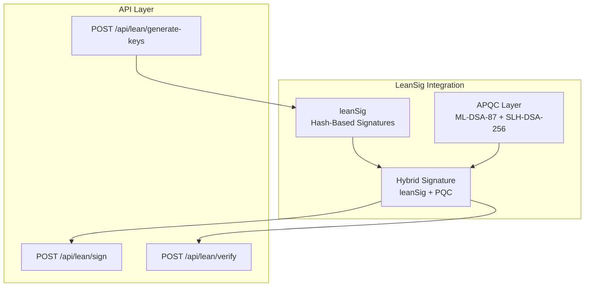

# LeanSig Integration for QuantumAegis

This document describes the early integration of leanSig with QuantumAegis, providing hybrid post-quantum signatures combining leanSig (hash-based) with ML-DSA-87 and SLH-DSA-256.

## Overview

LeanSig is a synchronized hash-based signature scheme using Poseidon2, designed for post-quantum Ethereum consensus. This integration provides:

- **leanSig Signatures**: Hash-based post-quantum signatures with epoch synchronization
- **Hybrid Signatures**: Combines leanSig with ML-DSA-87 and SLH-DSA-256 for enhanced security
- **API Endpoints**: REST API for signing, verification, and key generation
- **Integration with APQC**: Seamless integration with QuantumAegis Adaptive PQC Layer

## Architecture



## Current Implementation Status

**Note**: This is an **early integration** with placeholder implementations. The actual leanSig crate will be integrated when available.

### What's Implemented

- ✅ leanSig key generation (placeholder)
- ✅ leanSig signing (placeholder)
- ✅ leanSig verification (placeholder)
- ✅ Hybrid signatures (leanSig + ML-DSA-87 + SLH-DSA-256)
- ✅ REST API endpoints
- ✅ Integration with APQC layer

### What's Pending

- ⏳ Actual leanSig crate integration (when available from leanEthereum)
- ⏳ Real Poseidon2 hashing (currently using SHA-256 placeholder)
- ⏳ Epoch synchronization and key advancement
- ⏳ Production-ready verification

## API Endpoints

### 1. Generate Keys

**POST** `/api/lean/generate-keys`

Request:
```json
{
  "epoch": 0,
  "lifetime": 1000000
}
```

Response:
```json
{
  "success": true,
  "public_key": "0x...",
  "epoch": 0,
  "lifetime": 1000000
}
```

### 2. Sign Message

**POST** `/api/lean/sign`

Request:
```json
{
  "message": "Hello, QuantumAegis!",
  "epoch": 0,
  "include_pqc": true
}
```

Response:
```json
{
  "signature": {
    "lean_sig": {
      "signature": "...",
      "epoch": 0,
      "size_bytes": 32
    },
    "ml_dsa": "...",
    "slh_dsa": "...",
    "combined_size_bytes": 34319
  },
  "public_key": "0x...",
  "epoch": 0,
  "sign_time_ms": 15.23
}
```

### 3. Verify Signature

**POST** `/api/lean/verify`

Request:
```json
{
  "message": "Hello, QuantumAegis!",
  "signature": {
    "lean_sig": {
      "signature": "...",
      "epoch": 0,
      "size_bytes": 32
    },
    "ml_dsa": "...",
    "slh_dsa": "..."
  },
  "lean_public_key": "0x...",
  "ml_dsa_public_key": "0x...",
  "slh_dsa_public_key": "0x..."
}
```

Response:
```json
{
  "valid": true,
  "lean_sig_valid": true,
  "ml_dsa_valid": true,
  "slh_dsa_valid": true,
  "verify_time_ms": 8.45
}
```

## Usage Examples

### Using cURL

```bash
# Generate keys
curl -X POST http://localhost:5050/api/lean/generate-keys \
  -H "Content-Type: application/json" \
  -d '{"epoch": 0, "lifetime": 1000000}'

# Sign a message
curl -X POST http://localhost:5050/api/lean/sign \
  -H "Content-Type: application/json" \
  -d '{
    "message": "Test message",
    "epoch": 0,
    "include_pqc": true
  }'

# Verify signature
curl -X POST http://localhost:5050/api/lean/verify \
  -H "Content-Type: application/json" \
  -d '{
    "message": "Test message",
    "signature": {...},
    "lean_public_key": "0x...",
    "ml_dsa_public_key": "0x...",
    "slh_dsa_public_key": "0x..."
  }'
```

### Using Rust Code

```rust
use qrms::lean_sig::LeanSigIntegration;
use qrms::apqc::AdaptivePqcLayer;
use std::sync::Arc;
use tokio::sync::Mutex;

#[tokio::main]
async fn main() {
    // Create APQC layer
    let apqc = Arc::new(Mutex::new(AdaptivePqcLayer::new()));
    
    // Create leanSig integration
    let lean_sig = LeanSigIntegration::new(apqc);
    
    // Generate keys
    let keys = lean_sig.generate_keys(0, 1000000).await.unwrap();
    
    // Sign message
    let message = b"Hello, QuantumAegis!";
    let signature = lean_sig.sign_hybrid(message, 0).await.unwrap();
    
    // Verify signature
    let public_key = lean_sig.export_public_key().await.unwrap();
    let valid = lean_sig.verify_hybrid(
        message,
        &signature,
        &public_key,
        None,
        None
    ).await.unwrap();
    
    println!("Signature valid: {}", valid);
}
```

## Integration with QuantumAegis

The leanSig integration is automatically initialized when the QRMS service starts. It's available through:

1. **AppState**: `state.lean_sig` - Access to LeanSigIntegration
2. **API Routes**: `/api/lean/*` - REST endpoints
3. **APQC Integration**: Automatic hybrid signing with ML-DSA-87 and SLH-DSA-256

## Future Integration

When the actual leanSig crate becomes available:

1. **Add Dependency**: Add `leanSig` crate to `Cargo.toml`
2. **Update Implementation**: Replace placeholder implementations in `lean_sig.rs`
3. **Poseidon2**: Integrate real Poseidon2 hashing
4. **Epoch Management**: Implement proper epoch synchronization

### Planned Changes

```toml
# Cargo.toml
[dependencies]
lean-sig = { git = "https://github.com/leanEthereum/leanSig.git" }
poseidon2 = "..." # When available
```

## Testing

Run the leanSig integration tests:

```bash
cd services/qrms
cargo test lean_sig
```

## References

- [leanSig Repository](https://github.com/leanEthereum/leanSig)
- [LeanSig Technical Paper](https://eprint.iacr.org/2025/1332)
- [Quantum Co-Processing PRD](../docs/architecture/QUANTUM_COPROCESSING_PRD.md)

## Status

**Current Version**: 0.1.0 (Early Integration)  
**Last Updated**: January 26, 2026  
**Status**: ✅ Compiles and runs with placeholder implementations

---

For questions or issues, please refer to the main [QuantumAegis README](./README.md).
