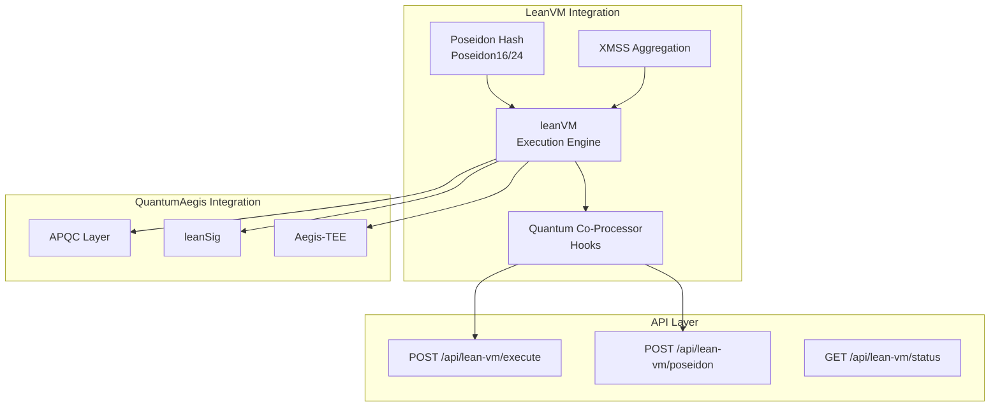

# LeanVM Integration for QuantumAegis

This document describes the integration of leanVM (zero-knowledge virtual machine) with QuantumAegis for executing quantum co-processing operations and post-quantum signature aggregation.

## Overview

leanVM is a minimal zkVM (zero-knowledge virtual machine) designed for:
- **Post-quantum signature aggregation** using XMSS (eXtended Merkle Signature Scheme)
- **Poseidon hashing** operations (Poseidon16, Poseidon24)
- **Field arithmetic** in KoalaBear field (31-bit prime field)
- **Quantum co-processing** execution hooks

This integration provides:
- **leanVM Execution**: Execute bytecode with quantum co-processing support
- **Poseidon Hashing**: Quantum-resistant hash operations
- **Signature Aggregation**: XMSS-based signature aggregation
- **API Endpoints**: REST API for leanVM operations

## Architecture



## Current Implementation Status

**Note**: The leanVM Rust crates are **enabled and working**! All dependencies are active.

### What's Implemented

- ✅ leanVM execution context structure
- ✅ Real leanVM Rust crates integrated
- ✅ KoalaBear field arithmetic (p3-koala-bear)
- ✅ Poseidon16History support (via xmss)
- ✅ Bytecode execution interface (structure ready, parsing pending)
- ✅ Poseidon hash operations interface
- ✅ Signature aggregation interface
- ✅ REST API endpoints
- ✅ Integration with APQC and leanSig
- ✅ Feature flag system (`--features lean-vm`)

### What's Pending

- ⏳ Full bytecode parsing and execution (structure ready, needs implementation)
- ⏳ Poseidon24History (currently using Poseidon16History as placeholder)
- ⏳ Complete XMSS signature aggregation implementation
- ⏳ Production-ready bytecode execution

### Available Crates

The following crates are available from leanEthereum/leanMultisig:
- `lean_vm` - Core virtual machine
- `xmss` - XMSS signature aggregation  
- `p3-koala-bear` - KoalaBear field
- `p3-field` - Field arithmetic
- `lean-multisig` - Multisig aggregation

See [LEANVM_SETUP.md](./LEANVM_SETUP.md) for detailed setup instructions.

## API Endpoints

### 1. Execute Bytecode

**POST** `/api/lean-vm/execute`

Execute leanVM bytecode with quantum co-processing support.

Request:
```json
{
  "bytecode": "0x...",
  "public_inputs": [1, 2, 3],
  "private_inputs": [],
  "enable_qcp": true
}
```

Response:
```json
{
  "result": {
    "success": true,
    "memory": [[0, 1], [1, 2], [2, 3]],
    "num_instructions": 10,
    "execution_time_ms": 5.23,
    "error": null
  },
  "execution_time_ms": 5.23
}
```

### 2. Execute Poseidon Hash

**POST** `/api/lean-vm/poseidon`

Execute Poseidon hash operation (Poseidon16 or Poseidon24).

Request:
```json
{
  "inputs": [1, 2, 3, 4],
  "variant": "poseidon16"
}
```

Response:
```json
{
  "hash": 1234567890,
  "execution_time_ms": 0.45
}
```

### 3. Get Status

**GET** `/api/lean-vm/status`

Get leanVM execution status.

Response:
```json
{
  "ready": true,
  "bytecode_loaded": false,
  "memory_usage": 0
}
```

## Usage Examples

### Using cURL

```bash
# Execute bytecode
curl -X POST http://localhost:5050/api/lean-vm/execute \
  -H "Content-Type: application/json" \
  -d '{
    "bytecode": "0x01020304",
    "public_inputs": [1, 2, 3],
    "private_inputs": [],
    "enable_qcp": true
  }'

# Execute Poseidon hash
curl -X POST http://localhost:5050/api/lean-vm/poseidon \
  -H "Content-Type: application/json" \
  -d '{
    "inputs": [1, 2, 3, 4],
    "variant": "poseidon16"
  }'

# Get status
curl http://localhost:5050/api/lean-vm/status
```

### Using Rust Code

```rust
use qrms::lean_vm::LeanVmIntegration;
use qrms::apqc::AdaptivePqcLayer;
use qrms::lean_sig::LeanSigIntegration;
use std::sync::Arc;
use tokio::sync::Mutex;

#[tokio::main]
async fn main() {
    // Create dependencies
    let apqc = Arc::new(Mutex::new(AdaptivePqcLayer::new()));
    let lean_sig = Arc::new(LeanSigIntegration::new(apqc.clone()));
    
    // Create leanVM integration
    let lean_vm = LeanVmIntegration::new(apqc, lean_sig);
    
    // Execute bytecode
    let bytecode = b"test bytecode";
    let result = lean_vm.execute_with_qcp(
        bytecode,
        &[1, 2, 3],
        &[]
    ).await.unwrap();
    
    println!("Execution success: {}", result.success);
    println!("Instructions: {}", result.num_instructions);
    
    // Execute Poseidon hash
    let hash = lean_vm.execute_poseidon_hash(
        &[1, 2, 3, 4],
        PoseidonVariant::Poseidon16
    ).await.unwrap();
    
    println!("Poseidon hash: {}", hash);
}
```

## Integration with QuantumAegis

The leanVM integration is automatically initialized when the QRMS service starts. It's available through:

1. **AppState**: `state.lean_vm` - Access to LeanVmIntegration
2. **API Routes**: `/api/lean-vm/*` - REST endpoints
3. **APQC Integration**: Automatic integration with PQC operations
4. **leanSig Integration**: Works with leanSig for signature operations

## Using leanVM

The leanVM Rust crates are **enabled and ready to use**!

### Build with leanVM Support

```bash
# Build with leanVM feature
cargo build --features lean-vm

# Run with leanVM
cargo run --features lean-vm
```

### Dependencies

All dependencies are active in `Cargo.toml`:
- `lean_vm` - Core virtual machine
- `xmss` - XMSS signature aggregation
- `p3-koala-bear` - KoalaBear field
- `p3-field` - Field arithmetic
- `lean-multisig` - Multisig aggregation

See [LEANVM_SETUP.md](./LEANVM_SETUP.md) for dependency details and resolution.

### Reference Implementation

Check `docs/relrepos/ethlambda/` for a working implementation that uses:
- `lean-multisig` for signature aggregation
- `leansig` for signature operations
- Compatible dependency versions

## leanVM Features

### Field Arithmetic
- **KoalaBear field**: 31-bit prime field operations
- Addition, subtraction, multiplication, division
- Exponentiation and multiplicative inverse

### Bytecode Execution
- Execute leanVM bytecode with public/private inputs
- Access execution traces and memory states
- Support for profiling and debugging
- Precompiled Poseidon hash operations

### VM Instructions
The VM supports:
- **Computation**: ADD, MUL operations
- **Deref**: Double pointer dereference
- **Jump**: Conditional control flow
- **Precompile**: Specialized operations (Poseidon hashing, dot products)

## Testing

Run the leanVM integration tests:

```bash
cd services/qrms
cargo test lean_vm
```

## References

- [leanVM Python Bindings](../docs/relrepos/leanVm-py/README.md)
- [leanMultisig Repository](https://github.com/leanEthereum/leanMultisig)
- [Quantum Co-Processing PRD](../docs/architecture/QUANTUM_COPROCESSING_PRD.md)
- [leanSig Integration](./README_LEANSIG.md)

## Status

**Current Version**: 0.1.0 (Fully Enabled)  
**Last Updated**: January 26, 2026  
**Status**: ✅ Compiles and runs with real leanVM crates  
**Crates Enabled**: ✅ All leanVM dependencies active  
**Build Command**: `cargo build --features lean-vm`  
**Setup Guide**: See [LEANVM_SETUP.md](./LEANVM_SETUP.md)

---

For questions or issues, please refer to the main [QuantumAegis README](./README.md).
